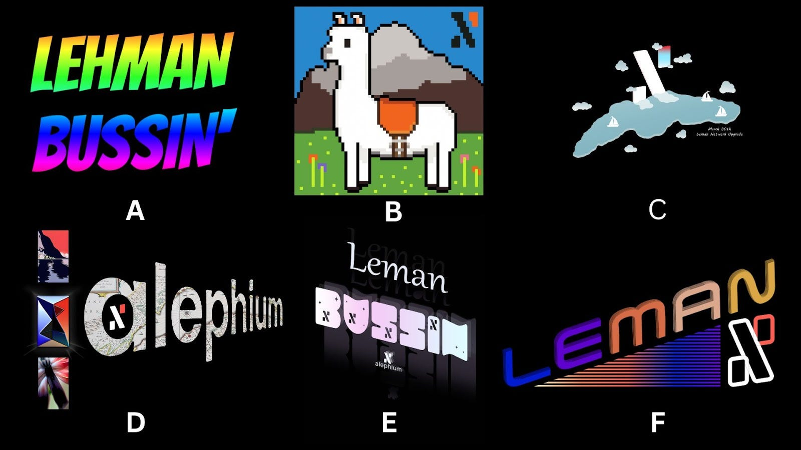
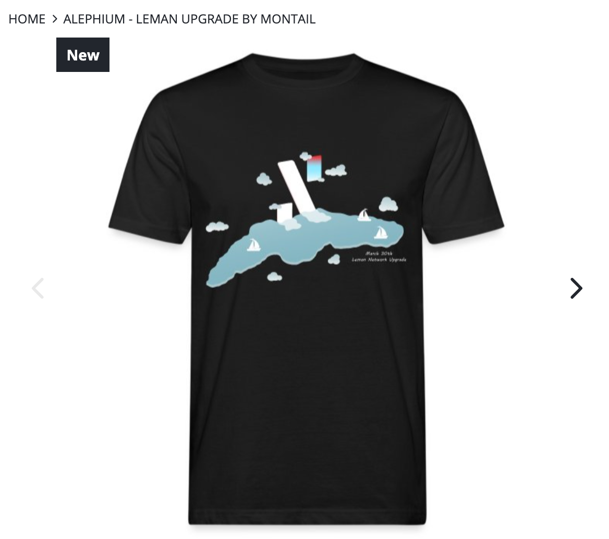
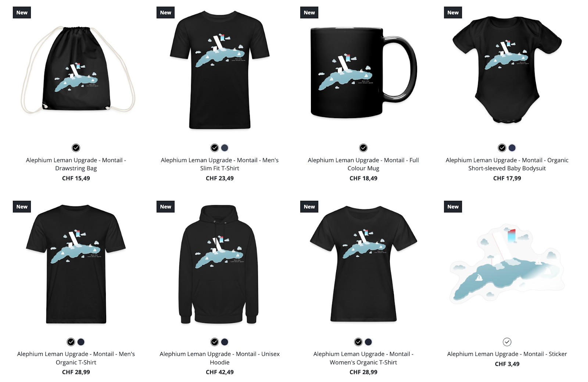

The winning design is already featured in Alephium’s SWALPH shop!

THE RESULTS ARE IN! Alephium invited its community to a design contest to celebrate the <a href="https://medium.com/@alephium/the-leman-network-upgrade-is-live-f52c89b7dd6a" >Leman Network Upgrade activation</a>! The community answered the call and came up with some fantastic entries.

### Creative sparks ignited!

Design contests are always a fun experience, and Alephium’s community did not disappoint!

Before diving into the results, let’s look at some contest entries that caught our eyes and sparked debate amongst the jury.

There was a lot of creativity in the entries! While the selection below only includes the top 6 picks, rest assured the jury appreciated every single entries, even the ones not featured here.

- “A” featured the “Leman Bussin” expression in a 00’s vibes, with big letters and many colors. By the way, “bussin” means really good!😉.
- “B” took a different approach with an 8-bit Baby Alpaca: Ultimate cuteness in the Swiss hills!
- “C” has a peaceful tone, with the Alephium logo and a placid Leman lake with a few sailboats and a clouded sky.
- “D” Brought back the 90s, with the Leman Lake map inside the “alephium” letters with three images on the left: one of the lake, a mirror version of the logo, and possibly a local flower, who knows! But it is an exciting composition.
- “E” has the “Leman Bussin” motto too, with the alephium logo everywhere (make a sticker?).
- “F” encompasses the Leman upgrade with vibrant colors and a nostalgic 80s vibe, featuring dynamic rays reminiscent of the Swiss mountains, leading the eyes toward the alephium logo.

### 🥁 And the winner is…. 🥁

The winning design chosen by the jury was submitted by MontaiL. It has a polished, endearing, and atemporal design that really stood out between all entries and was able to blend, in a seamless way, the Alephium logo and the Leman Lake.

Congratulations Montail! Your creativity won the jury’s heart, and Alephium is happy to add your design to its SWALPH shop.

You can find MontaiL’s design now in the shop: <a href="https://alephium.myspreadshop.ch/Leman" ><strong>https://alephium.myspreadshop.ch/Leman</strong></a>

