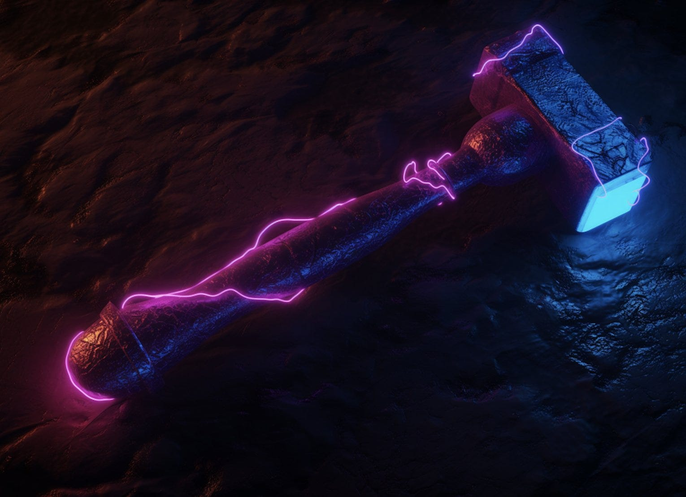
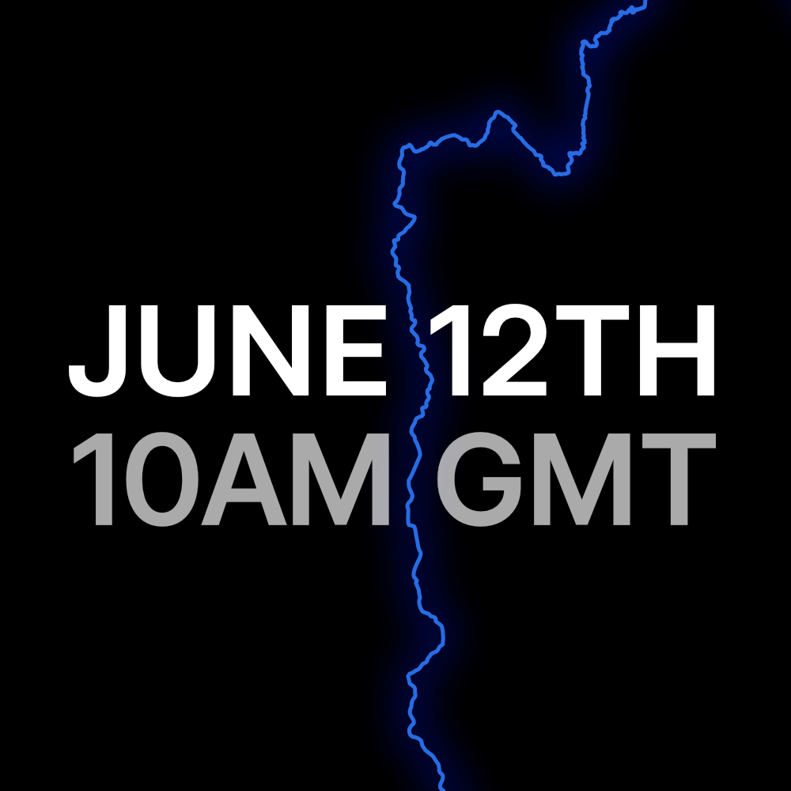

_After over one year of building and testing new features, Alephium is excited to announce that the Rhône Network Upgrade was successfully activated at 10:00 AM GMT on June 12th, 2024. Introducing significant improvements in user and developer experience, the Rhône upgrade will facilitate the growth of the ecosystem being built with energy on top of Alephium._

_Tl-dr — Why the Rhône Network Upgrade — What’s in the Rhône upgrade? — FAQ on the Rhône upgrade_

### Thank you!

The Rhône Network Upgrade was activated on mainnet at 10:00 AM GMT on June 12th, 2024. The chain is running smoothly (and fast!). Most observable nodes are on an <a href="https://www.alephium.world/" >upgraded full node version</a> (if you didn’t, <a href="https://github.com/alephium/alephium/releases" >upgrade now</a>!). The core devs will continue to monitor the network closely, but it’s high time to thank the community, node runners & service providers for their incredible support.

This network upgrade, which started with a less ambitious roadmap ended up being a very significant one. It is the culmination of a year of hard work and dedication from many contributors and represents an important milestone for our ecosystem. On top of the very visible changes for users such as the blocktime reduction (from 64 to 16 seconds), it introduces significant changes to the developer experience, based both on dogfooding and feedback from the fast-growing group of projects & dapps builders!

### **Why the Rhône Network Upgrade?**

The stack is constantly upgraded to increase performance, security, user experience & devX. New features and improvements can usually be done in a backwards-compatible way. Sometimes they can’t (eg. Blocktime reduction), hence the need for a Network Upgrade.

Since the <a href="https://medium.com/@alephium/the-leman-network-upgrade-is-live-f52c89b7dd6a" >Leman Upgrade</a>, all the tech stack has been updated, worked on, and optimized. The <a href="https://bridge.alephium.org/" >bridge</a> was launched, major improvements to SDK & devX have been implemented, and a lot of new features for the full node were shipped, as well as multiple dApps proof-of-concepts. More integrations, a new [Extension wallet](/wallets) &amp; multiple versions of the [mobile wallet](/wallets) & explorer have been released.

This is Alephium’s third Network Upgrade! The first one happened on December 9th, 2021, and the second one on April 30th, 2022. Network upgrades are the sign of a healthy, active, and **consistently improving technical community.**

Why the name? The Rhône river originates where some of Alephium’s roots are: in Switzerland! It fills the Leman lake with fresh water from the glaciers and flows through France towards the Mediterranean. From the highest summits of Europe to the cradle of commerce of the world. At times, tumultuous & agitated, at other times calm & wide, ever flowing, it’s a vital river for navigation, irrigation & energy! It also indicates continuity with the previous Network Upgrade activated in April ’23 and opens up exciting naming possibilities for future ones!

### **What’s in the Rhône Upgrade?**

The Rhône Network Upgrade gives both users and developers access, among other innovations, to the following improvements. It keeps true to the tagline of Alephium: **_“Scalable for devs, secure for users, decentralized for all”_**. But what’s in there?

#### **User Experience Enhancements**

_Blocktime Reduction (from 64 to 16 seconds)_

Alephium is reducing its block time from 64 seconds to 16 seconds.   
This change aims to speed up transaction inclusion for users while carefully managing the increased load on node operators and miners. The reduction will be implemented using a GHOST-like protocol, enhancing security and efficiency, without changing either TPS or issuance parameters. This adjustment significantly improves the user experience and supports the growth of decentralized applications within the Alephium ecosystem by making it easier & faster to interact with them. (and we might go <a href="https://x.com/wachmc/status/1773344856745837006" >further</a> in the future!) <a href="https://x.com/alephium/status/1738220571832594612" >More</a>.

_Gasless Transactions_

The introduction of programmable gasless transactions will make it easier for users to interact with dApps without holding \$ALPH tokens. This feature allows a smart contract to cover the gas fees for transactions. Implemented through a new VM instruction called PayForGas, this enhancement offers flexibility for developers to create diverse transaction fee models, such as subsidizing gas fees for specific activities or users. This also markedly enhances the user experience and gives developers a powerful tool to easily onboard new users onto their apps! <a href="https://x.com/alephium/status/1752376284754420186" >More</a>.

_90% Contract Storage Reduction_

The Upgrade will reduce the contract storage rent fee by 90%, lowering the cost from 1 \$ALPH to 0.1 \$ALPH. This fee is required when deploying smart contracts to prevent <a href="https://x.com/wachmc/status/1779042373344895449" >state bloating</a>. The reduction will facilitate the deployment of more smart contracts, supporting things like NFT collections which require numerous contracts & many more. Existing contracts will remain unaffected. This update aims to balance cost and functionality, encouraging the creation and destruction of contracts to optimize network efficiency. <a href="https://x.com/alephium/status/1776255506849599836" >More</a>.

#### **Developer Experience Improvements**

_Introduction of Mapping_

Alephium’s Rhône Network Upgrade will introduce the mapping feature, enhancing data storage and access on the blockchain. Mapping works like a spreadsheet with a search filter, using key-value pairs for efficient data management. This feature prevents blockchain state bloat by using subcontracts for each map entry, encouraging optimized code and reducing costs. This upgrade aims to improve the developer experience, making it easier to build powerful decentralized applications (dApps) on Alephium. <a href="https://x.com/alephium/status/1778800481940459707" >More</a>.

_Multiple Inheritance & Dynamic Method Dispatch_

Added support for multiple inheritance for Smart contracts, improving code organization and reusability. Methods can be dynamically dispatched based on signatures.

_Function-level reentrancy protection_

One of the major changes is the introduction of function-level reentrancy protection, which allows multiple functions from the same contract to spend assets as long as each function is called at most once. This upgrade shifts from a global contract-level lock to a function-level read-write lock, making secure smart-contract writing more intuitive and efficient.

_Sequential Transactions_

Transactions within the same block now support sequential execution from the same address across inter-group chains for a better user experience. For example, if Alice sends money to Bob, Bob can send money to Charlie inside the same block. Previously, Bob would have had to wait until the first transaction had been mined.

_New address type for PoLW mining_

With the surge in global network hashrate due to the emergence of ASICs, the Rhône upgrade introduces a new address type for PoLW mining. This allows miners to specify signatures and burn ALPH using config files, enabling the use of cold wallets for mining rewards. While still one order of magnitude away from the activation of PoLW, we’re already preparing for its activation.

_Modified Reorg Depth_

With the reduced block time (from 64 to 16 seconds), the maximum reorg depth changed. As the Ghost algorithm enhances the security of the chain, it will go down from 106 to 53 minutes, improving the user experience for dapps like the bridge.

_And_ <a href="https://x.com/alephium/status/1785312194889994733" ><em>more</em></a>_!_

*Permissioned Testnet Mining — *This change ensures stable mining difficulties on the testnet.  
*Receiving-Only Mode* — Methods can receive payments multiple times in a single transaction.  
*Zero Amount Token Functions* — Token functions can now efficiently handle zero amounts.  
*Mutable New Contracts* — Newly created contracts can utilize fields in the same transaction.  
_New Built-In Functions _— Added minimalContractDeposit, mapEntryDeposit, and more.  
*Increased Limits* — Expanded gas and bytecode size limits to enable the creation of heavier applications.

<a href="https://github.com/alephium/alephium/blob/master/docs/rhone-upgrade.md" >See the full changelog here</a>.

### **What comes now?**

Now that the network upgrade happened smoothly… we’re already working on the next one! From Passkey support to cross-group communication, we have a lot of ideas already.

We’ll also be working on more full-nodes optimizations, and more tools to ease devs work. The wallets are all <a href="https://x.com/alephium/status/1778454039367459093" >getting heavy work</a> done on them, and of course, we’re working on hardware wallets further integrations, and more bridges!

Also, as mentioned, <a href="https://x.com/wachmc/status/1773344856745837006" >we might get further on blocktime reduction</a>… But that’s for another day!

### **Rhône FAQ**

We’ve assembled here the most asked question about the Rhône Upgrade!

**Q: Will the Rhone Network Upgrade change \$ALPH emission/issuance?**

A: No. The Upgrade will also reduce the reward for each block mined, so the <a href="https://medium.com/@alephium/alephium-block-rewards-72d9fb9fde33" >current emission schedule</a> will not change.

**Q. Will the Rhone Upgrade Network increase the** <a href="https://x.com/alephium/status/1797311071121772903" ><strong>Transactions Per Second (TPS)</strong></a>**?**

A: No. The Upgrade will reduce the <a href="https://x.com/alephium/status/1792305753677549677" >block size</a>, meaning the blocks will contain fewer transactions. The TPS will remain the same after the Rhône Network Upgrade.

**Q: I’m a regular user, do I need to do anything?**

A: No. If you are a regular user (have a wallet, interact with dApps and sends transactions), there is nothing to change/do.

**Q: I’m running a node, do I need to do anything?**

A: If you are running a node, please upgrade to <a href="https://github.com/alephium/alephium/releases/latest" >3.1.x</a> (see instructions <a href="https://x.com/alephium/status/1793682101684130099" >here</a>).  
If you are a service provider (exchange, wallet provider, or other), please upgrade to 3.x.x (see instructions <a href="https://x.com/alephium/status/1793682101684130099" >here</a>).

If you’re running a node with dappnode, there is nothing if auto-update is activated. If not, please go to the Alephium package and click the upgrade/update button.

If you’re running a node with Flux, no action is required.

**Q: I’m running a mining pool, do I need to do anything?**

Yes, If you are a mining pool, please upgrade your node to <a href="https://github.com/alephium/alephium/releases/latest" >3.1.x</a> & implement the new <a href="https://github.com/alephium/mining-pool/pull/63/commits/5e0a9ea25616bba986883940c73aef34d547f35f" >reference pool upgrade</a> (This release also fixes a bug in contract creation that resulted in unexpected orphan blocks).  
<a href="https://docs.alephium.org/integration/mining/#rhone-upgrade" >Here’s a quick doc</a> about the impact of the Rhone upgrade on mining pools.

**Q: Will the Rhone Network Upgrade lower confirmation time on the exchanges or on the Bridge?**

A: The <a href="https://bridge.alephium.org/" >Alephium Bridge</a> confirmation time will be reduced to 53 minutes or 200 blocks (whichever takes longer). Each exchange is free to decide the amount of time/blocks it wants to use in its process.

### **Questions & Feedback?**

You can find extra information about the upgrade on our <a href="http://docs.alephium.org" >docs</a>!

If you have feedback or questions, please reach out to us on [Discord](/discord) or <a href="https://t.me/alephiumgroup" >Telegram</a>. Follow <a href="https://twitter.com/alephium" >@alephium</a> on Twitter to stay up-to-date!

