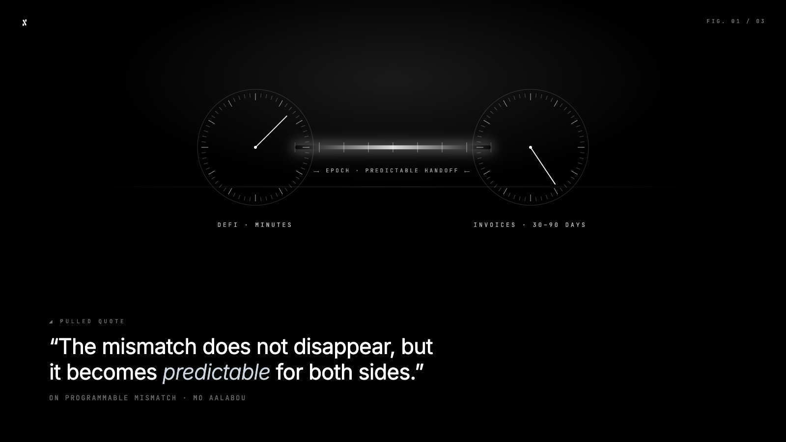
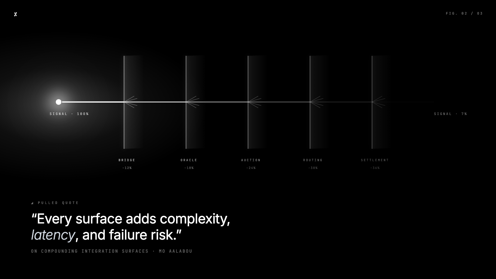
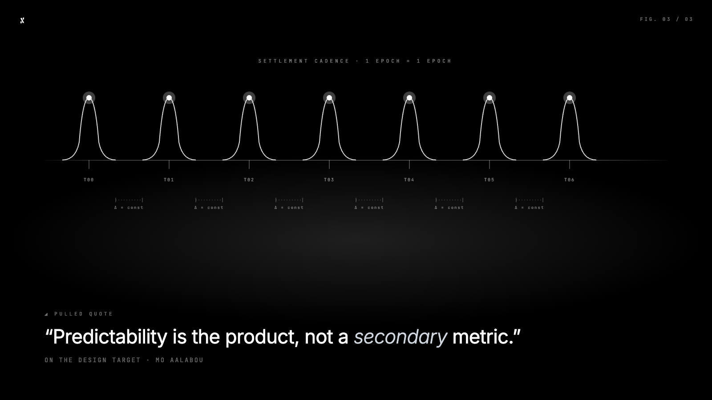

*Op-ed by Mo Aalabou, Founder of [Factor](https://www.factor.cx/) & [1450 Digital](1450.digital)*

There is a version of the RWA narrative that treats tokenization as the finish line. Get the asset on-chain, make it tradable, call it a success. I understand why that framing took hold. In the early days, simply proving that a tokenized bond or a credit instrument could exist on a public blockchain felt like meaningful progress.

Building Factor has taught me that tokenization is actually just the starting point. The harder problem, the one that determines whether institutional capital takes this space seriously, is what happens at settlement. Specifically, what happens at settlement under stress.

That question is shaping everything we build, and I think it should be shaping how the industry evaluates infrastructure decisions at every layer of the stack.

## The Mismatch That Tokenization Did Not Fix

### Months versus minutes

DeFi liquidations operate on a timescale of minutes. Invoice receivables, for example (the core asset class Factor is built around), carry payment cycles of 30 to 90 days. Tokenization did not change that fundamental reality, but it did make that mismatch programmable. That’s useful, but it did not make the problem disappear entirely.

What this means in practice is that the moment you use a tokenized receivable as collateral in a DeFi protocol, you have introduced a structural timing gap between what the smart contract expects and what the underlying invoice can actually deliver. At Factor, we made a deliberate architectural choice to make that gap explicit rather than hide it: epoch-based withdrawals. 

Crypto investors know their withdrawal schedule upfront. Factoring companies know their receivable cycle. 

The mismatch does not disappear, but it becomes predictable for both sides; and predictability, not speed, is what institutional confidence actually requires.

### Patching the gap with more layers

The natural response to this problem has been to build compensating mechanisms. On-chain auction systems, specialized liquidity providers, routing paths between networks, dedicated settlement layers designed to bridge the gap between real-world redemption timelines, and DeFi's demand for instant finality.

Each of these additions is, in isolation, technically reasonable. The problem is what they add up to. If every new asset class requires its own settlement add-on, we are not really scaling financial infrastructure, but multiplying integration surfaces. And remember, every surface adds complexity, latency, and failure risk that sophisticated capital will identify and price accordingly.  

## Fragmented Settlement Creates Hidden Leverage

### Correlation in a drawdown

One of the less visible risks in multi-layer settlement architecture is that the components are not actually independent. Bridging assumptions, oracle dependencies, auction liquidity pools, each one looks discrete on a diagram. I guess that what most people don’t realize is that under market stress, they become correlated.

A liquidation event that triggers elevated bridge demand, oracle latency, and thin auction liquidity simultaneously is not a contrived scenario. It is precisely the condition that stress events produce. The system that looked highly diversified in calm conditions suddenly reveals its correlations… exactly when you need isolation the most. Disaster strikes.

### What institutional capital prices in

Institutional capital does not just price credit risk and market risk. It prices operational risk and infrastructure risk. A settlement path that involves three external dependencies, two network hops, and an auction mechanism with variable liquidity depth is not a settlement path that institutions can underwrite with confidence.

The RWA opportunity is still enormous. However, capturing it requires building infrastructure that behaves predictably under the conditions that matter most, which are not the average conditions, but the tail conditions. Throughput benchmarks are less relevant to institutional treasury teams than consistency of execution at the moment their risk engine needs to act.

## What a Credible RWA Stack Actually Looks Like

### Fewer moving parts as a design principle

At Factor, the architecture decisions that have aged best are the ones that reduced the number of things that could fail independently. That is not a novel engineering principle we are implementing. It is standard systems thinking applied to a fairly new domain.

The practical implications for RWA infrastructure:

* **Minting, trading, and settling should share an execution environment.** For invoice receivables, this means the moment a factoring company uploads and verifies a receivable, the path to a funded pool should involve as few handoffs as possible. Every boundary between systems is a place where a 30-day invoice can become a 45-day settlement.
* **Settlement behavior should be deterministic, especially at the pool level.** Factor pools carry a fixed yield and epoch-based withdrawal schedules. That only works as a promise to crypto investors if the underlying settlement path behaves the same way every time, not just under normal conditions, but when a debtor delays or a receivable is contested.
* **Bridge dependencies should be entry points, not load-bearing architecture.** If cross-chain routing sits inside your core settlement path, you have embedded someone else's incident response into your product. For a factoring company trying to unlock working capital in days rather than months, that is not an acceptable dependency.
* **Predictability is the product, not a secondary metric.** An investor allocating stablecoins into a receivables pool is not chasing throughput. They are underwriting a yield against a real cash flow cycle. The infrastructure underneath needs to honor that contract consistently; particularly at the moments when credit conditions tighten and the temptation to reach for yield elsewhere is highest.

### The north star for RWA credibility

If we want tokenized debt and credit instruments to function as credible collateral at institutional scale, the design target is simpler architecture. Fewer layers, fewer bridges, and a settlement environment that behaves the same way every time, particularly during the moments when everything else is volatile.

This is not an argument against innovation at the infrastructure layer. It is an argument for directing that innovation toward reduction rather than addition. The most valuable engineering work in this space over the next few years will be collapsing surfaces… *not adding them*.

## Why Infrastructure Choice Is a Founder Decision

Building Factor has made me think carefully about where in the stack these problems can actually be solved. Some of them are application-layer problems, and we address those directly in how we structure instruments and manage redemption flows. But some of them are infrastructure problems, and no amount of clever application design resolves a fragmented settlement environment underneath.

The builders coming into the RWA space now have the advantage of learning from the first generation of deployments. The lesson that I would want them to absorb is to choose your infrastructure the way you would choose your legal jurisdiction. It sets the rules under which everything you build will eventually be tested.

The question worth asking early is not which chain has the most bridges or the most integrations. It is which environment lets you build the fewest critical dependencies into the path between an asset and its settlement. That is where the real product lives.
