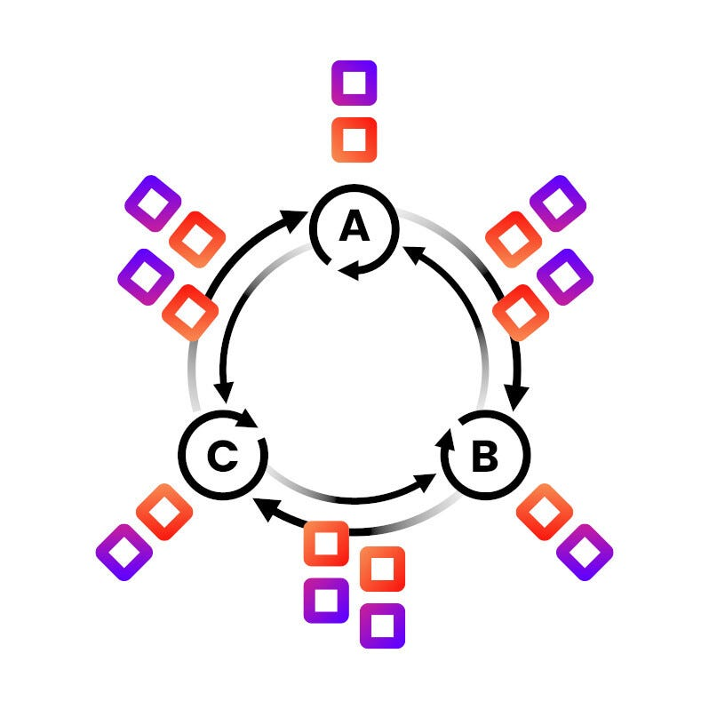

A Technical Promenade, part 4

_This is part of a series of regular articles on key concepts for understanding [Alephium](/) in particular and blockchains in general. If you’re pondering on which chain to build your dApps, if you’re a curious crypto-traveler, or a fellow decentralization enthusiast, welcome! You can find the previous articles in the series here. (_[#1](/news/post/block-time-and-block-size-16e37292444f)_,_ [#2](/news/post/transactions-per-second-tps-f13217a49e39)_,_ [#3](/news/post/time-to-finality-17d64eeffd25)_)_

In the last post, we explored the Time To Finality metric, a key value for the financial transfer aspect of blockchain transactions. Now we will dive into a method to increase the throughput of a blockchain: Sharding!

### What is Sharding?

In simpler terms, a [blockchain](https://www.synopsys.com/glossary/what-is-blockchain.html#:~:text=Definition,a%20timestamp%2C%20and%20transaction%20data.) is a list of data records ordered linearly, a sequence that contains transactions and blocks “in a chain,” even if there is no direct relationship (or dependency) between a previous transaction/block and the next one. This list of data records in one long chain is similar to a [single-core processor](https://en.wikipedia.org/wiki/Single-core#:~:text=A%20single%2Dcore%20processor%20is,than%20a%20multi%2Dcore%20system.), which can only process one instruction per time. This setup doesn’t scale well, **creating a bottleneck** when the number of transactions increases and all processing has to wait for the completion of the current block with a [limited size or not-so-fast processing time](/news/post/block-time-and-block-size-16e37292444f).

For this reason, newer blockchains have adopted a process called **sharding**. Sharding is a mechanism for distributing the workload across multiple nodes. The term originates from database systems, which refer to splitting a database into smaller parts, called shards, to improve scalability and performance. Think of it as a [multi-core processor](https://www.techtarget.com/searchdatacenter/definition/multi-core-processor) capable of executing several instructions in parallel, scaling the transaction output exponentially!

### Sharded Blockchain: A performance boost!

To be able to increase performance securely, a sharded blockchain has to have extra (or improved) processes over a regular blockchain to guarantee its correct functioning, like the following:

**Consensus mechanism:** A robust consensus mechanism is crucial for ensuring the security and integrity of a sharded blockchain. It can be Proof-of-Work (PoW), proof-of-stake (PoS), Byzantine Faut Tolerance (BFT), [or one of the other available options](https://www.developcoins.com/blockchain-consensus-algorithms). It is important that it allows for a scalable and secure validation process.

**Cross-shard communication and synchronization:** Sharded blockchains require effective and secure cross-shard communication to coordinate the validation of transactions and blocks across multiple shards, to ensure that each shard is synchronized with the others in terms of its state and the validated transactions and blocks. This requires using synchronization protocols with a robust set of rules to enforce the correct processing.

**Security against malicious nodes:** Sharded blockchains are vulnerable to attacks by malicious nodes on a single shard, which can manipulate the validation of transactions and blocks. One approach to prevent this in PoS is to [assign validators to different shards randomly](https://vitalik.ca/general/2021/04/07/sharding.html). This method was initially considered for scaling the Ethereum network, but discussions have shifted to a similar concept called “[DankSharding](https://www.rootstrap.com/blog/danksharding-what-is-it-and-how-does-it-work).”

### Sharding in Alephium: A New Paradigm

Alephium created the [stateful UTXO](/news/post/an-introduction-to-the-stateful-utxo-model-8de3b0f76749) (sUTXO) as its accounting model and [Proof of Less Work](/news/post/tech-talk-1-the-ultimate-guide-to-proof-of-less-work-the-universe-and-everything-ba70644ab301) (PoLW) as its consensus mechanism to act as building blocks of its sharding algorithm, called **Blockflow**. The stateful UTXO model is used because it is an immutable data structure. This means that it doesn’t change until it is consumed (spent) in a transaction. There is no update/change and no possible mutable state.

Alephium’s mainnet is currently divided into four groups, which four shards in each group. These 16 shards allow the blockchain to process 400 [transactions per second](/news/post/transactions-per-second-tps-f13217a49e39) (TPS). Every shard is built as a blockchain to guarantee its internal transaction ordering. It can process blocks and transactions in parallel with other shards, leveraging the UTXOs’ immutability, as long as the order does not violate the basic dependencies between them.

Blockflow Algorithm — Source: [alephium.org](/)

These dependencies are related to the creation and consumption of the UTXOs. They form a structure resembling a [directed acyclic graph (DAG)](https://en.wikipedia.org/wiki/Directed_acyclic_graph), with the transactions as nodes and dependencies as edges. The Blockflow sharding algorithm uses this structure to create a series of rules to ensure that **cross-shard synchronization** is maintained when creating a new block on a shard. The PoLW is used as the **consensus mechanism** to reach finality for all blocks produced by the shards, following similar rules.

At Alephium blockchain, all the shards are similar, so users don’t have to switch between different interfaces, bridges, or blockchains to transfer assets between them. The token transfers are done atomically, in a single-step, meaning that the transfer is either completed successfully or not at all. If a transfer is successful, a new UTXO is created on the destination shard, and the original UTXO is spent on the source shard. This is secure and resistant to double spending because the BlockFlow algorithm will validate the dependencies between cross-shard transactions.

Alephium’s unique sUTXO model allows it to run smart contracts in conjunction with the assets UTXOs. However, as a sharded blockchain, while the tokens from the UTXO can be sent cross-chain, the data and logic from the smart contracts are kept within the group. The result is that the state of the smart contracts is sharded, with the data and logic not being shared between all the shards. This approach provides Alephium with the benefits of both cross-chain interoperability and the scalability of sharding while ensuring that the data and logic remain secure and private.

### What is next? “Who is responsible for running the blockchain?”

Someone must apply all these rules and do all computational work. Receive the transactions, verify their correctness, broadcast them, etc… the task list is huge! In the next article, we will learn more about the component responsible for it all: the full node!

Stay tuned on our [Twitter](https://twitter.com/alephium), [Discord](https://discord.gg/h7cXXy4FEY), [Telegram](https://t.me/Alephium_Announcement), or [Reddit](https://www.reddit.com/r/Alephium/) to see it fresh off the press!
