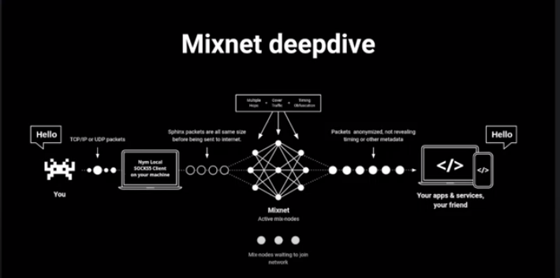
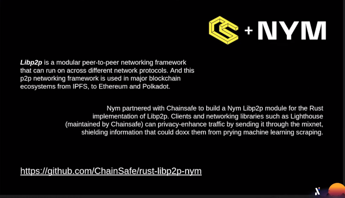
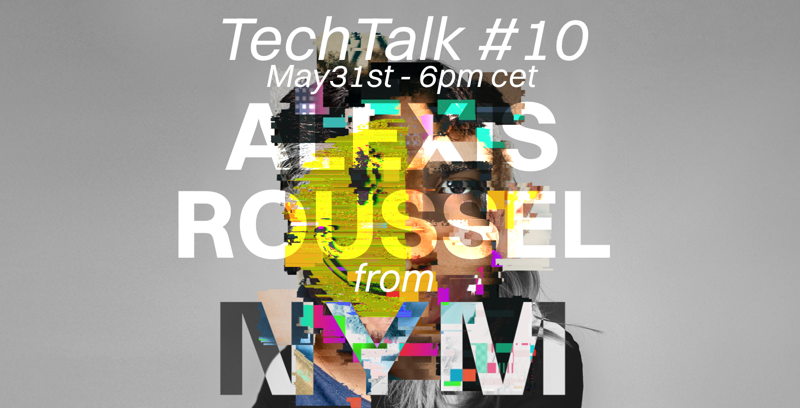

_This article follows_ [Alephium’s Tech Talk #10](https://www.youtube.com/watch?v=pImANSvO6WQ)_, where Alexis Roussel from_ [NYM](https://nymtech.net/) _delves into the fascinating realm of_ [mix networks](https://en.wikipedia.org/wiki/Mix_network) _and their crucial role in enhancing privacy, specifically in the context of cryptocurrency transactions. You’ll find first a little recap of what mix networks are, why they are useful and how NYM is bringing privacy to the masses, and then an edited version of the Q&A Alexis Roussel had with the community._

`video: https://www.youtube.com/watch?v=pImANSvO6WQ`

[Alexis Roussel](https://twitter.com/alexis_roussel) is an accomplished technology and privacy advocate, currently COO of NYM. With a deep understanding of technology and its impact on society, Alexis has dedicated his career to championing digital integrity and empowering individuals to maintain control over their personal data. He is a former president of the [Pirate Party of Switzerland](https://www.partipirate.ch/), and the co-founder of [Bity](https://bity.com/), one of the first crypto brokers in Switzerland.

He is a co-author of the book “[Our Precious Digital Integrity,](https://www.slatkine.com/fr/editions-slatkine/74977-book-07211052-9782832110522.html)” written with [Grégoire Barbey](https://twitter.com/GregoireBarbey), and firmly believes that crypto technology, with its emphasis on user control and public infrastructure, plays a pivotal role in shaping a responsible and human-centric digital society.  
[Thanks to their advocacy, Digital Integrity was actually voted into law (at 94%!) in the canton of Geneva last weekend!](https://euro.dayfr.com/local/395852.html)

## The Importance of Privacy in the Digital Age

In the context of heavy data collection and surveillance, privacy has emerged as a fundamental human right. Individuals and organizations alike face threats to their personal data, ranging from state surveillance to data breaches by malicious actors.

The [Cambridge Analytica](https://en.wikipedia.org/wiki/Facebook%E2%80%93Cambridge_Analytica_data_scandal) scandal and other high-profile data incidents have heightened public awareness regarding the vulnerability of personal information. Consequently, there is a growing consensus on the need for robust privacy solutions to empower individuals and protect their digital identities.

## Understanding Mixnets and Their Role in Privacy Enhancement*

[Mixnets](https://en.wikipedia.org/wiki/Mix_network), a concept rooted in the pioneering work of [David Chaum](https://en.wikipedia.org/wiki/David_Chaum) in the 1980s, are a crucial tool for enhancing privacy in digital communications. At their core, mixnets are decentralized networks that employ a series of anonymizing relays to obfuscate the origin and destination of data packets.

By shuffling and encrypting packets, mixnets introduce significant noise, making it nearly impossible for adversaries to trace and monitor communication patterns. Mixnets provide a powerful defense against traffic analysis and enable individuals to communicate privately and anonymously.

## The Technical Framework of NYM’s Mixnet Solution

NYM’s mixnet solution employs a sophisticated technical framework to maximize privacy and scalability. Central to this framework are Sphinx packets, standardized packets that carry encrypted data and routing information. Mix nodes receive packets, shuffle them (and mix them with fake — but identical, dummy packets) to obfuscate their original sources, and then forward them to their destinations with intentional delays, rendering traffic analysis nearly impossible.

One key advantage of NYM’s approach is the scalability potential of mixnets. Unlike traditional anonymization methods that can slow down network throughput as the number of participants increases, mixnets exhibit linear scalability. As the network expands, adding additional mix nodes enables higher throughput without compromising privacy.

## Alephium + NYM: An Opportunity for Increased Privacy in Transactions

Cryptocurrencies present a unique context where privacy is essential (and hard to achieve). While traditional financial systems rely on trusted intermediaries such as banks, they operate on decentralized networks, offering new possibilities for financial autonomy and privacy.

NYM introduced a client inside the [Libp2p framework](https://github.com/ChainSafe/rust-libp2p-nym), allowing network participants (like node operators) to participate in the network consensus without revealing their IP or physical location to the rest of the network.

In the same way, crypto wallets can also take advantage of NYM mixnets when sending transactions to the network. Nym provides software called [NYM Connect](https://shipyard.nymtech.net/nym-connect/) that makes their integration easier and abstracts away complexity from the user.

[(and guess who’s considering adding this as a feature?)](https://github.com/alephium/desktop-wallet/issues/496)

## The Road Ahead: Privacy, Democracy, and Technological Progress

Privacy is not a matter of personal preference but a basic item of democracy and human rights. Projects like NYM are at the forefront of empowering individuals with greater control over their personal data and online interactions, ushering in a more private, secure, and democratic network.

## Q&A Session

_After the NYM project presentation, a Q&A session was held, and a few of these questions are listed below. You can watch all of them in the_ [TT#10 video](https://www.youtube.com/watch?v=pImANSvO6WQ)_. (the Q&A has been edited (& chatGPT’d) for concision and reading pleasure)_

**Q: You are clearly an activist at heart, you clearly have a vision for data in society. So my first question would be: what is the use case? Why do you think this is important?**

A: It’s crucial because, in my opinion, the only way to create a genuinely democratic or humanistic society in the digital realm is by empowering individuals to make their own decisions. The dynamics of the digital world are quite different. In the physical world, it’s challenging to manipulate your environment. People must converse with you to persuade or coerce you. However, in the digital realm, your environment can be altered based on your profile, and you might not even be aware of it. This changes your perception of the world and influences your decisions.

Cambridge Analytica is a case in point. To remain in control in this context, it’s not just about controlling your data. The way to stay in control is to have a baseline of total anonymity online. You, as a human being, shouldn’t be providing any data. Only when you want to interact with people should you selectively disclose what you want to share. A government or any new type of social infrastructure we have in the future must ensure they know the least data about you to respect you as a human being and your decision-making ability.

So when we talk about the right of digital integrity, one of the elements that come with it is the right to use cryptography, the right not to be surveilled, not to be analyzed, and not to be measured. Because, just like quantum physics, the moment you observe something, its state changes. This applies to your privacy and your ability to make your own decisions and participate in society. If you’re being watched, you’ll behave differently.

**Q: What do you think is the first use case, very briefly?**

A: Our first use case is cryptocurrency transactions because a considerable amount of work is being done by companies like Chain Analysis, selling data to agencies. Financial agencies and even tax departments preemptively use data analytics to try to detect anomalies in society, and then they create, through algorithms, profiles to investigate. So our first use case is on financial transactions because it’s a simple message you’re broadcasting.

**Q: How much does it cost to send a simple message via NYM’s mix net today?**

A: Right now, the network is free to use. However, it is intended to be a paid service eventually. That doesn’t mean the users will have to pay directly. There could be use cases where users are subsidized by someone. For instance, if I design an app like Signal and I buy those credits beforehand, I can push them to the client, and they don’t see it. They benefit from NYM but don’t have to pay directly.

**Q: How do you handle the ideal number of mixing nodes versus the network’s throughput? How do you preserve decentralization, anonymity sets, and scale simultaneously?**

That’s a question tied to future development. As of now, the current number of mixed nodes is manually fixed within the system. However, this can be altered; we can decrease or increase it. A model has been devised by [Claudia](https://twitter.com/claudsdayz) to measure the level of anonymity in a network, based on the volume of traffic, available bandwidth, and delay placed on the packet. The more traffic inside, the more we can reduce the delay, making the network speedier while still maintaining the same level of anonymity. If there are only a few people using the mixed nodes, then you need to slow down significantly to ensure adequate mixing.

The same goes for the size of the bandwidth. If you have too much bandwidth, it’s like a large river; you can see bits of water everywhere. Therefore, you need to maintain a consistent level of ‘water.’ As traffic increases, you can widen the network by adding layers of nodes or computers to each layer. Conversely, if the traffic decreases, you could reduce the nodes to maintain sufficient traffic levels. We have this concept of the active set of computers and the non-active set ready to jump in when needed. Right now, this number is fixed manually, but eventually, it will be automatically adjusted by the system based on the actual volume of traffic.

**Q: What are some ways people who are building or mining on Alephium could leverage NYM or contribute to it?**

A: The simplest way to leverage NYM is to create service providers. Essentially, you would run an Alephium node and an NYM client next to it. You could expose the RPC of the node through NYM. This would either allow the node to communicate with other nodes through NYM or, very simply, if you add the functionality of the NYM client in the wallet, it could talk to the node. With either option, you could create an anonymous network of Alephium nodes. What we’ve done with Monero is we have one dedicated service provider, and you can connect the Monero daemon through NYM connect to the NYM network to a server on the other side.

**Q: As a Bitcoin OG, what’s your vision of proof of work-based layer ones versus Bitcoin-based layer 2s?**

A: Everything has its place. Bitcoin core, the core of Bitcoin’s mainnet, is a very specific tool. It is based on an industrial process where you’re transforming energy into hashing power and have this link with energy. This is something very specific that only Bitcoin can do. On top of Bitcoin, you’re building the value industry and you can scale Bitcoin in different ways. Ethereum, even though it’s now based on proof of stake, is still an extension of Bitcoin because you can represent things there that maybe wouldn’t make sense to represent in Bitcoin.

Bitcoin brought something essential; it’s a new accounting system, a triple entry accounting system. It’s a completely underrated invention. If you stay in the transaction-based system and interact with Bitcoin, then you can still build and continue to make that main triple entry accounting system better. You can gain efficiency and do cooler things, and maybe have other tokens using that core system.

**Q: Could you discuss your views on EVMs (Ethereum Virtual Machines)?**

EVMs are built on the logic of Bitcoin but don’t have the same rules. They’re not a pure triple-entry accounting system. Right now, the amount of hacks or misconfigurations of those EVMs is very high. In Bitcoin, hacks are possible, but it’s at the user level, getting your seed compromised, for instance. This is a different kind of risk. People who master UTXO-based systems will be stronger in the economy of the future.

**Q: Are privacy coins at risk of being delisted from exchanges due to regulatory reasons, and if so, how can this be prevented? Is NYM a privacy coin?**

Many exchanges have indeed started to delist privacy coins like Monero. But to clarify, NYM is not a privacy coin. It’s a standard Cosmos token which is very transparent. The network provides anonymity, not the token itself.

**Q: How do you manage privacy if, for some reason, some states decide that NYM mixnet is bad and they want to squeeze it out?**

The risk of governments trying to control privacy-focused projects like NYM is definitely there. At NYM, we have strategies in place to protect ourselves. Primarily, we make it clear that we operate on the infrastructure side, focusing on communication-level privacy. Many other communication networks provide good levels of privacy, and they haven’t been banned — think of Tor and VPNs. The argument that Tor isn’t banned because it’s observable could be raised, but it has proven useful in maintaining privacy in many instances.

One way we intend to protect the system is to make privacy systems commonplace. If a large number of people use privacy systems regularly — say, to visit a website or send a message to a friend — it becomes the norm, and it’s then very difficult to target or ban. This is similar to the shift towards using HTTPS in the early 2000s. Initially, some governments were concerned they wouldn’t be able to surveil everyone. But, as more websites switched to HTTPS, it became the norm, and now no one questions the need for HTTPS. We aim to create a similar culture around privacy systems like NYM. As more people start using digital financial systems, they will naturally need privacy protections like NYM offers.

**Q: With your ten years of experience in crypto, what’s your view on decentralization? Are you worried, or do you think we’re heading the right way?**

I’m generally an optimist. If I wasn’t, I wouldn’t be building things. But two things have become much clearer in recent years. One is the time it takes to build all of this; it’s a generational change. We are just the first generation building this world that’s going to use crypto. We’re just 10 years in and mass adoption will take around 60 years. The reason for this is simple: while we’re part of a group that grew up with the internet, none of us grew up with cryptocurrencies. That concept didn’t exist for us in school or university. However, today’s children are growing up with Bitcoin. They don’t know a world before it. As these children grow up, they’ll start to use, and build upon, these concepts.

The second thing is the disruption caused by these technologies. It’s exciting but also terrifying. Just look at how much disruption the internet is causing after 60 years. Now imagine the disruption when you add the concept of decentralized value to that. That can lead to radical societal changes, and it could get really bad before it gets good. That’s why we need to build privacy systems as quickly as possible.

**Q: Do you have any final thoughts?**

I feel that being part of this movement and pushing it in the right direction, allows me to remain sane. It’s a personal motivation to know I’m trying to do something right. I hope we’ll see the benefits of our work sooner rather than later, but I’m prepared for the long journey.

**Thank you, Alexis! We hope to see you soon again! Thanks to everyone involved in preparing this discussion and for making the event happen.**

**At Alephium, we have plenty to discuss in the coming weeks — the hackathon, the ambassador program, the bridge, the mobile wallet, and much more.**

**We’ll keep you updated through** [Discord](https://discord.gg/XsGpZ5VDTM)**,** [Telegram](https://t.me/alephiumgroup) **and** [Twitter](https://twitter.com/alephium)**. Stay tuned, and thank you for your support!**

