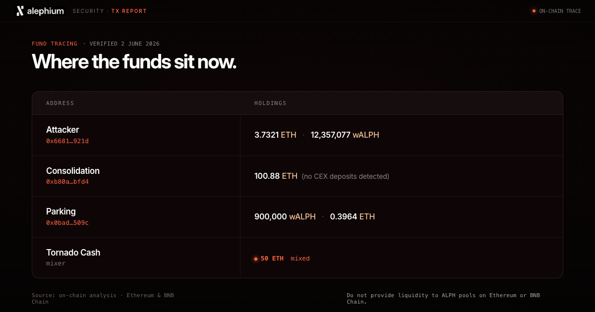

Every transaction executed during the May 30th Alephium Bridge attack is publicly verifiable on-chain. We wish to share these findings with you, as we believe greater transparency will lead to more people watching and tracking wallets, improving our odds of catching the attacker. All addresses have already been reported to the relevant authorities

This post consolidates the full sequence in one place, for the community, for researchers, and for the record. 

*Please note: this is not a postmortem. That will be shared as soon as possible, and will be a much more detailed account of the attack, its impact, and our response.*

## Acquiring ALPH and Deploying the Fake Contract

To execute the exploit, the attacker needed native ALPH on Alephium to deploy a contract whose only purpose was to emit a forged Wormhole message. The process to obtain it began on Ethereum in the early hours of 30 May, well before the drain.

1. At 02:36:23 UTC, the attacker[ bought 485.19 wALPH](https://etherscan.io/tx/0xdebbeddc6958e25f8eda1d0d22360fa3818cc0a36cc770efe19fd62eab98a2c0) on Ethereum via the Uniswap Universal Router, spending 0.01 ETH. 
2. They immediately[ approved the wALPH allowance](https://etherscan.io/tx/0x8455a5fd2bf4927eceaca218a079ff168ec81a8e64afc6cefdb9b131abd3e2fb) for the TokenBridge contract, then[ bridged the full amount to Alephium](https://etherscan.io/tx/0xb44c2d786cb47c53e034ec8dbb7b26ed74fb7c46996e4dd7d17bfa1e8ec70a5d) via transferTokens, burning the wALPH on Ethereum and designating Alephium as the destination chain.
3. On Alephium, the bridge[ minted 485.19 ALPH](https://explorer.alephium.org/transactions/83a0f84d5a2c68e723bec36f3bbd2a27410d6ca61c3838fb9640e41933f34169) to the attacker's receiving address. 
4. That ALPH was then forwarded to the contract deployer wallet across three separate transactions:[ ](https://explorer.alephium.org/transactions/9ea9a35a3ab36546e2c390819a83c0815045c90c2edf657609d380c1a75afcb7)

   * [5 ALPH](https://explorer.alephium.org/transactions/9ea9a35a3ab36546e2c390819a83c0815045c90c2edf657609d380c1a75afcb7) at 03:52:06 UTC
   * [150 ALPH](https://explorer.alephium.org/transactions/e8ee8a60703bf29423c3e770cf3c5325d2530ef0b4686d3a8e08cbb7a4425609) at 06:23:13 UTC
   * [130 ALPH](https://explorer.alephium.org/transactions/5956997306e24fb946db5255f0c52f9ffc4ef77db46de0cfa2881a8586c061aa) at 06:24:19 UTC.

At 06:30:47 UTC, almost three hours before the main drain, the deployer wallet [funded and deployed the fake-event contract](https://explorer.alephium.org/transactions/d89bbcd333de6f7fec4efeb618d9e144d5529f3405a0e5b8b9f7d0a6eaab239e) with 0.1 ALPH. The contract contains a single function whose only purpose is to execute LOG7 and emit fake VAA. The VAA payloads are provided by the transaction script. It is this mechanism that fed false data to the bridge's legitimate guardians, who signed the resulting VAAs without knowing the underlying event was fabricated. Those VAAs were then redeemed on Ethereum and BSC to drain real collateral and mint unbacked wALPH.

## The Drain: 64 Seconds

Between 07:00 and 09:00 UTC, the attacker disrupted bridge node connectivity, forcing the backend onto its fallback validation path. 

At 09:16:59 UTC, the drain began.

**Ethereum**: Five transactions in 60 seconds:

* [200,967.31 USDT](https://etherscan.io/tx/0x928e369e6e857c93f237356b201c97ddac31ba777e2a942928272f962c02bc40) - 09:16:59
* [0.33531483 WBTC](https://etherscan.io/tx/0x293c3062a133b089bc31eba910daeb6b2d508ad26e045e439b1339793f51237e) - 09:17:23
* [17,594.63 USDC](https://etherscan.io/tx/0x8a719311d4304ea3d1c1235eece0cf9591c2a43864ce8aa70e9ea9443aff6c37) - 09:17:35
* [5.18192421 WETH](https://etherscan.io/tx/0xb5b3f089a745394d736615e9a11ea40a1ad020678e466a6f95b3a9f4d321a98f) - 09:17:47
* [13,757,076.37 wALPH minted](https://etherscan.io/tx/0x06cc0f36159d7094359d88fe1d43cda601e8644282ba305c5ffbd013b524c6b4) - 09:17:59

**BSC**: Just three seconds later:

* [36,750.106 USDT](https://bscscan.com/tx/0xa3e8572fe524b28bce9765fcbd0b737cd6289c692970b5a1a1289b6edf95d06f) - 09:18:02
* [24.38620961 WBNB](https://bscscan.com/tx/0xe38e870a3aceb8e1189d21e0734170a69fe9bfd7355d0ccb4209588ab77f0b1e) - 09:18:03

## Liquidation: Ethereum

The stablecoins and WBTC were immediately converted to WETH via Uniswap X:

* [200,967.31 USDT → 99.685 WETH](https://etherscan.io/tx/0xa606c5ce9d79aacf62758752d8d01ea3e4c1e2f704f3ed0609d24e1db012a8d1)
* [0.33531483 WBTC → 12.209 WETH](https://etherscan.io/tx/0xa2852377e6a4c6ae1236b470b646d0f5a67f6edd3cc19a45064aba92ad8f01e2)
* [17,594.63 USDC → 8.741 WETH](https://etherscan.io/tx/0xb2dbe60f2b3d6659bf87a83f7e9a368256694f29bde5a446374b1383ff2f953d)

400,000 wALPH was dumped into the wALPH/ETH Uniswap V3 pool across four transactions:[ 1](https://etherscan.io/tx/0xa9ae386df9b3e977469ea735cb94d79067bb46d4da8684ea0da8c02ca2108c4e),[ 2](https://etherscan.io/tx/0xe696994886f7e5b7d597d64b60f18d45b6a66281bc01c42a04082638fcb53784),[ 3](https://etherscan.io/tx/0xc1597549e75e695fb9b57fd93e99cb4c1bc69c4832ed2dd60bb9f7edfc648fe4),[ 4](https://etherscan.io/tx/0x433e15d6fc8b71db3d3efe42d72cd55443fc834d846cd82382e470f7fdc29e3e). 

A further[ 1,000,000 wALPH](https://etherscan.io/tx/0x04128aee33a43ad4062720908c114a1416885abc9ece31eab9cc56beac4bb38b) was sent to a parking address, which received[ gas funding](https://etherscan.io/tx/0x0b3e0ee60c1aeb17caa45fa07f171aa115a6b08f7573b06f835de14e83b92568),[ approved Permit2](https://etherscan.io/tx/0xdbad85b98b6328eacaf4ea789d88f3da1439ea7fd904c28fb1429731f583a8f5), and[ sold 100,000 wALPH](https://etherscan.io/tx/0x7e0096bf49c140e25adb68937e302007eabb9a5792459dc425abc6a23f9d5db5), leaving 900,000 wALPH parked.

## Liquidation: BSC

The drained USDT was[ swapped to 54.676 WBNB via PancakeSwap](https://bscscan.com/tx/0x51a7fe73e66d30e56a3ce4bbdc1f2bd0e9cc978610051fd72b4fb2ddd1248272),[ approved](https://bscscan.com/tx/0x6f696ff07be41f4b2bb8fd18f716ae6e5366de88fe51ff7231e806d5080535a9), then[ unwrapped to BNB](https://bscscan.com/tx/0xa36985b79c58396e84b05af83449e93c8ca0eb34db576a3aed83a03281c440c1). 

The combined 79.12517 BNB was[ bridged to Ethereum via deBridge](https://bscscan.com/tx/0x87cb66e65f4061a4824bbb12fdc36d748c53e6629f19c1691f9a56914e097488),[ arriving 13 seconds later](https://etherscan.io/tx/0x07b2e6dc413bbc38655cc5f4d862b544d886ea18cca8496b69f45665c2a823d0) as 26.287 ETH.

## Consolidation and Tornado Cash

ETH flows were consolidated into a single address across four transactions:[ 20 ETH](https://etherscan.io/tx/0x8b9d96ccac41f6bd866e91a8d0ea956a967ad6f31b405fb9a8791e8babf426d7),[ 36 ETH](https://etherscan.io/tx/0x93551c8124bb45af81b8abf50c734606bf273c7e8b54d3db64c59878e46a052d),[ 30 ETH](https://etherscan.io/tx/0x0a31a83534216a1c6bd0c81dbcf2d5ca0f2e1fae3975da848ea57b9ea9dcaa00),[ 40.88 ETH](https://etherscan.io/tx/0x86c098256ade4a9b52ba0c299c178e04699a0a36f973d1ee381c8be8460c972d). 26 ETH was returned to the attacker:[ 1 ETH](https://etherscan.io/tx/0x24c5fc4ebabed884e66ba86d4e07afd02dbe986e044e2404b64b3156d9d0fe75),[ 15 ETH](https://etherscan.io/tx/0xa9b9acbae1fe9ad622f9b5342fd2783953e56f6bf7e65c301db6bcb7fb5c2f20),[ 10 ETH](https://etherscan.io/tx/0x5ba5d4a79001714220efbcf4c56478d7fa9ed15e3a58099855767b04fd98f058). 50 ETH was deposited into Tornado Cash in five transactions:[ 1](https://etherscan.io/tx/0x1c1e0128305e82542ba9b046eac7c97f01d63fd26ac277475241bcd095cff78e),[ 2](https://etherscan.io/tx/0x892d32d97fa582e38be983a6e3688fb29356300c384a4c9acd99b3f6a9d48cbd),[ 3](https://etherscan.io/tx/0x04565f574b09a3cabfe730ae55976e103df2abc8958691b4d3056b559611a702),[ 4](https://etherscan.io/tx/0x7c70538bd9960255715e2d61b5b3ed84d9799e18d53e9a58a3508b1dc74d5671),[ 5](https://etherscan.io/tx/0x86e88ac2c9f985f7196e3d2856c57ea6a067136cc79c6fc15779a0db76cab968).

## wALPH Burn Update

On 2 June 2026, the bridge guardians, with support from security partners, executed an authorised recovery procedure to invalidate the unbacked wrapped ALPH held in the attacker's wallets. 

The governance action invoked the TokenBridge upgrade function (upgrade(bytes encodedVM), method ID 0x25394645), burning the unbacked wALPH supply in a single[ on-chain transaction](https://etherscan.io/tx/0xade2846a20169aa23d53203e1c3c509474694710a9f4674307c220528d27a4b1) at block 25,230,400 (14:49:35 UTC).

This action applied exclusively to unbacked wrapped ALPH created through the exploit and held in the attacker’s wallet. It did not affect native ALPH, legitimately backed wrapped ALPH held by users, or addresses that unknowingly acquired unbacked wALPH through secondary trading activity. The Alephium L1 consensus rules were unaffected at all times.

## Burn Summary

**Main attacker**

[0x6681ebC8…921d](https://etherscan.io/address/0x6681ebC82551fE52fDB48E65872e85a3ae06921d)

12,357,077.37295

~$428,600

\-

**Parking EOA**

[0x0baD8f95…509c](https://etherscan.io/address/0x0baD8f95a996DeADe828d21DAd765b60c2b2509c)

900,000.00000

~$31,200

\-

**Total**

13,257,077.37295

~$459,800

Of the 13,757,077.37 wALPH minted through forged VAAs, 13,257,077.37 (96.4%) has been burned on-chain. The remaining 500,000 wALPH exited the response window before the bridge was paused and was sold into Uniswap liquidity pools. Recovery options for the escaped portion remain under active review.

## Fund Locations as of June 2nd, 2026

**Address and Holdings**

[Attacker 0x6681…921d](https://etherscan.io/address/0x6681ebC82551fE52fDB48E65872e85a3ae06921d) -3.7321 ETH · 12,357,077 wALPH (burned)

[Consolidation 0xb80a…bfd4](https://etherscan.io/address/0xb80a7d612480d121696be6dfe062f5e6d984bfd4) - 100.88 ETH — no CEX deposits detected

[Parking 0x0bad…509c](https://etherscan.io/address/0x0baD8f95a996DeADe828d21DAd765b60c2b2509c) - 900,000 wALPH (burned) · 0.3964 ETH

Tornado Cash - 50 ETH mixed

## Attacker addresses

**Role and Address**

Attacker (ETH + BSC) [0x6681ebC82551fE52fDB48E65872e85a3ae06921d](https://etherscan.io/address/0x6681ebC82551fE52fDB48E65872e85a3ae06921d)

Attacker Consolidation EOA [0xb80a7d612480d121696be6dfe062f5e6d984bfd4](https://etherscan.io/address/0xb80a7d612480d121696be6dfe062f5e6d984bfd4)

Attacker wALPH parking EOA [0x0baD8f95a996DeADe828d21DAd765b60c2b2509c](https://etherscan.io/address/0x0baD8f95a996DeADe828d21DAd765b60c2b2509c)

Attacker fake-event contract (log7) [24ZjqcvV8vVCn29zd1TThqAtaS8pMvJ4Co1MK5zncPcAB](https://explorer.alephium.org/addresses/24ZjqcvV8vVCn29zd1TThqAtaS8pMvJ4Co1MK5zncPcAB)

Attacker bridge receiving wallet [3cUr7y3DuEkkYJj6G7tehG8R21XTMEGXWcUcsu7BxsaR2vKh5twVm](https://explorer.alephium.org/addresses/3cUr7y3DuEkkYJj6G7tehG8R21XTMEGXWcUcsu7BxsaR2vKh5twVm)

Attacker:  log7 contract deployer wallet [14etamDofb3XmupQyuFQN6c1szQYAduqxjzPq4YjwnPPv](https://explorer.alephium.org/addresses/14etamDofb3XmupQyuFQN6c1szQYAduqxjzPq4YjwnPPv)

## Other key addresses

**Role and Address**

ETH TokenBridge (drained) [0x579a3bDE631c3d8068CbFE3dc45B0F14EC18dD43](https://etherscan.io/address/0x579a3bDE631c3d8068CbFE3dc45B0F14EC18dD43)

BSC TokenBridge (drained) [0x2971F580C34d3D584e0342741c6a622f69424dD8](https://bscscan.com/address/0x2971F580C34d3D584e0342741c6a622f69424dD8)

wALPH / ALPH token (ETH) [0x590f820444fa3638e022776752c5eef34e2f89a6](https://etherscan.io/address/0x590f820444fa3638e022776752c5eef34e2f89a6)

Tornado.Cash Router [0xd90e2f925DA726b50C4Ed8D0Fb90Ad053324F31b](https://etherscan.io/address/0xd90e2f925DA726b50C4Ed8D0Fb90Ad053324F31b)

Uniswap Universal Router [0x4C82D1fBFe28C977cBB58D8C7FF8FCF9F70a2cCA](https://etherscan.io/address/0x4C82D1fBFe28C977cBB58D8C7FF8FCF9F70a2cCA)

ALPH/USDT Uniswap V3 pool (buy route) [0xa344855388c9f2760e998eb2207b58de6e7d0360](https://etherscan.io/address/0xa344855388c9f2760e998eb2207b58de6e7d0360)

Uniswap X: Rizzolver router [0x225a38bc71102999Dd13478BFaBD7c4d53f2DC17](https://etherscan.io/address/0x225a38bc71102999Dd13478BFaBD7c4d53f2DC17)

Uniswap X: settler [0x51C72848c68a965f66FA7a88855F9f7784502a7F](https://etherscan.io/address/0x51C72848c68a965f66FA7a88855F9f7784502a7F)

UniswapX V2DutchOrderReactor (inferred) [0x00000011F84B9aa48e5f8aA8B9897600006289Be](https://etherscan.io/address/0x00000011F84B9aa48e5f8aA8B9897600006289Be)

wALPH/ETH Uniswap V3 pool [0x9628105808292699874f20d77d50a09bc26850c5](https://etherscan.io/address/0x9628105808292699874f20d77d50a09bc26850c5)

Uniswap V4 Pool Manager [0x000000000004444c5dc75cB358380D2e3dE08A90](https://etherscan.io/address/0x000000000004444c5dc75cB358380D2e3dE08A90)

Uniswap Permit2 [0x000000000022D473030F116dDEE9F6B43aC78BA3](https://etherscan.io/address/0x000000000022D473030F116dDEE9F6B43aC78BA3)

deBridge DlnDestination (ETH delivery) [0xE7351Fd770A37282b91D153Ee690B63579D6dd7f](https://etherscan.io/address/0xE7351Fd770A37282b91D153Ee690B63579D6dd7f)

deBridge Crosschain Forwarder Proxy (BSC) [0x663DC15D3C1aC63ff12E45Ab68FeA3F0a883C251](https://bscscan.com/address/0x663DC15D3C1aC63ff12E45Ab68FeA3F0a883C251)

Alephium — bridge (token custody) contract [226T1XspViny5o6Ce1jQR6UCGrDXuq5NBVoCFNufMEWBZ](https://explorer.alephium.org/addresses/226T1XspViny5o6Ce1jQR6UCGrDXuq5NBVoCFNufMEWBZ)

## What This On-Chain Data Means

The bulk of the stolen funds have not moved. 

* 100.88 ETH remains parked in the consolidation address with no CEX deposits detected.
* The headline "$815K" counts the full notional wALPH mint at pre-crash prices. The more accurate framing is \~$305K of backed collateral stolen and 13.76M unbacked wALPH minted (of which only \~500K wALPH was realized, while the remaining 13.26M has been burned)

To realize the value of the ETH, the attacker will need to move it. Every address in this report is public, permanent, and now in front of a significantly larger audience. More eyes on these wallets means less room for error.

If you observe any movement on the addresses listed here, report it immediately in the Alephium Telegram or Discord channels. The investigation is active, and we are coordinating with law enforcement and blockchain security teams.

We will share a fuller postmortem covering the exploit, the guardian process, the scope of affected assets, and the remaining recovery steps.

**Further updates will follow.**
