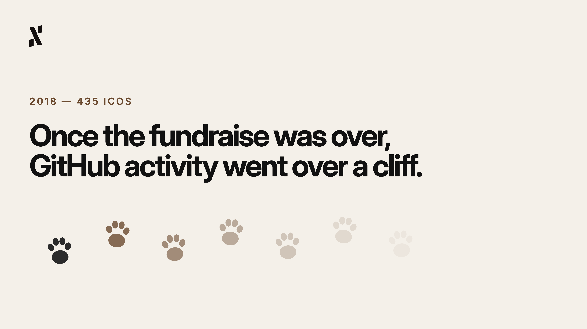
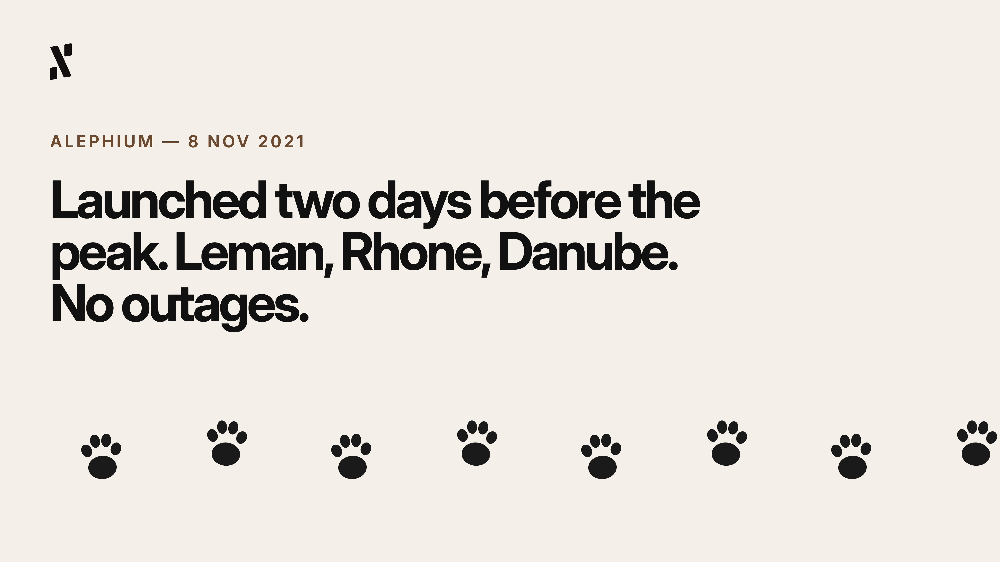

**By Pepper, Head of Marketing at Alephium**

*The opinions and views expressed in this article are those of the author and may not represent the official views of Alephium.*

—

This current bear market has been going on for much longer than I’d like… than any of us would like. However, for those of you reading who have been through multiple cycles, bull runs, and bear runs, you already know that the situation can quickly change (for better or worse). 

I remember back in 2017, when a reported 435 projects were able to successfully raise funds through ICOs (whether they actually had some tech or not). Their pitches were pretty ambitious (sometimes outrageous), their whitepapers usually offered quantity over quality (wordstuffing), and everybody wanted a piece of the action. Billions moved from “retail investors”, which is another word for regular people, into projects that promised to “decentralise everything” and more. 

I wonder how many of those projects are still active and doing meaningful work now, in 2026. Most of them were done and dusted by the end of 2018, but it wasn’t really the bear market that killed them. Without constantly rising prices to attract participants, the projects with nothing underneath their bullish narratives quickly became hollow (and earned a vaporware tag, if not worse). 

In 2022, another collapse took place, and the cycle swung back around on a different generation of blockchain projects. As we know, Terra/LUNA was the starting gun, and when it fired, $40bn was gone in 3 days. That was followed by Celsius, Voyager, BlockFi, and FTX. I remember it vividly as one of the most chaotic times in my career, working for a huge agency and not knowing what each day, or even each hour would bring. As I worked on that chopping board, I saw developer activity decline, communities dissolve, and a number of “Ethereum Killers” turn into “Ghost Chains”. 

Markets do these things. Collapses happen and projects sadly fade into history. That’s the worst part of the story though. What I love is to see what is still standing after the collapse, once the debris is cleared and the dust has settled. I’m fascinated by the survivors, and what traits they have in common.

## What the 2018 Crash Filtered Out

Casting my mind back to 2018, I remember that most projects that didn’t survive shared a similar profile. They’d raised a lot of money through ICOs against the promise of tech, rather than the tech itself, and their communities had only known price appreciation instead of blockchain utility until that point. There was some research (during the subsequent bear market) that found, via GitHub, that once a project’s fundraise was over, GitHub activity basically went over a cliff. 

As for the projects that survived, they also had some commonalities. Bitcoin, with no marketing budget, VCs, grant program etc, already had a product, a community, continuity, and conviction (even under relentless media attack). Ethereum had a working VM and was popular with devs building apps, so it survived. Litecoin and Monero had grown technical communities and refused to stop shipping. Chainlink ignored the bull market and spent the entire bear market intensely building the oracle infrastructure that would become a critical component of DeFi. They’re all still standing today.

These projects could have been called unfashionable. Chainlink wasn’t cool, Bitcoin was divisive, Ethereum was doubted, Monero was accused, and Litecoin’s necessity was questioned. But they all had products and communities with conviction, regardless of the price.

## What the 2022 Collapse Revealed

2022 was much different to 2018, because by this point, the projects that got filtered out or collapsed during the market consolidation period were much more sophisticated. The industry had come on leaps and bounds. We already had DeFi protocols, liquid staking platforms, and L2s with decent usage and revenues. After learning their lesson the hard way about projects having actual products back in 2018, people were more curious about the honesty and integrity of their foundations (both human and tech).

Terra/LUNA had it all really. Good product, billions in TVL, large high-conviction community, a public team, and a massive design flaw. The last thing on that list was its undoing, because the design flaw in the algorithmic stablecoin mechanism meant it could not survive a sustained depegging event. No matter how great everything it had built was, the fragility underneath sent it spiralling into oblivion.

The survivors in 2022 were quite different to those from 2018. Their resolve and ability to endure was largely down to the early architectural decisions they had made, and how well they could weather a storm. Ethereum managed to complete the Merge in a bear market, which was super impressive in my opinion, as it needed years of prep-work and a near-perfect execution. Uniswap did well too, as they kept generating fees and became a market leader, all while in a bear run. Aave also kept operating without incident. They were all making money, had honest architecture, and continued to do what they promised, which I think has a lot to do with why they survived.

## Five Things Survivors Share

Looking across both cycles, I think the filter consistently catches the same characteristics.

1. Active development during the bear market (not just the bull).
2. Capital efficiency, specifically projects with low burn rates, lean teams, and self-sustaining economics.
3. Communities with conviction, rather than individuals chasing incentives. 
4. Architectural integrity, i.e. the pre-launch decisions were solid and avoided taking shortcuts that created liabilities.
5. A genuine use case that doesn’t need a bull market to matter, and which continues to show its utility in a bear market.

## What Alephium's Bear Market Looked Like

I’ve been here a year, but I’ve done my research and I’ve got a lot of facts about Alephium, specifically observing the utility, the ecosystem, and the achievements.

Here’s what I know to be true.

1. Alephium launched on the 8th of November 2021, **two days** before the market peaked.
2. It absorbed a full bear cycle from the beginning.
3. Alephium raised just $5m and has no institutional backstop.
4. During the bear market, it shipped Leman, Rhone, and Danube network upgrades, with the network **never** suffering an outage.
5. The mining community mostly stayed.
6. Alephium’s hashrate grew even after the ATH of $ALPH had long passed, demonstrating serious conviction.
7. 2026 has been the most concentrated test so far, with the bridge exploit forcing the team into an unexpected period of delays and challenges.
8. The developers never stopped, despite the bridge and the bear market. 
9. The ecosystem continued building, with community members launching a number of great games to help pass the time.
10. Powfi continued towards mainnet through it all, and is ready to deploy after the bridge re-launches.

From where I’m sitting, Alephium looks to me like a survivor. In this industry, there are no guarantees for longevity or success, but there are chains and protocols with profiles that the historical filter favours. 

## The Filter Is Still Running

That filter I’ve talked about over and over throughout this article can be both brutal and patient, but it is as real as anything else in this space.

Anyhow, the bear market won’t announce itself when it ends, because it's more of a gradual change. One day, we’ll wake up and realise it’s over, that the rain has stopped. As the storm clears, we’ll see the projects that were always building, accumulating commits, and trying to keep their communities on their side. Projects like Alephium.

My point is, the survivors are always worth looking at more carefully than the noise suggests. When the next cycle rolls around, who knows what incredible potential we have to unleash.
