Bridge assets from and to BNB Smart Chain Testnet

This is the hitchhiker’s guide to Alephium’s second testnet bridge!

A key to Alephium's future is the ability to move tokens cross-chain. The ETH Bridge is alive and kicking. You can find it [here](https://bridge.alephium.org/#/transfer), the bridge explorer [here,](https://explorer.bridge.alephium.org/) and stats on bridging [here](https://dune.com/kov0x/alephium-alphbridge).

> Today, we are reopening the BSC testnet bridge! Help us test it!

You can interact with the testnet bridge using the following addresses:

Connect to the bridge via the portal URL: [https://testnet.bridge.alephium.org/](https://testnet.bridge.alephium.org/)

Bridge explorer: [https://explorer.alephium.org/](https://explorer.alephium.org/)

In this article, you will find all you need to successfully bridge two ways from Alephium testnet to BSC’s testnet!

This includes the following steps:

- _What do you need to know beforehand to connect to the bridge?_
- _How do you connect to the Bridge?_
- _How do you connect to the BSC testnet?_
- _How can an asset be bridged from Alephium to BSC testnet?_
- _How do you bridge an asset from BSC testnet to Alephium?_

Let’s get started!

Please if in the course of testing, you found something, please give us your feedback in the \# 🎨dev-dapp channel on [Discord](/discord)!

## 1 — What you need to know before connecting to the bridge

Get ready for a transformative experience:

_🚨 It is not yet possible to use the \$BSC bridge on the mainnet   
🚨 Before starting, make sure you are connected to Alephium’s testnet!  
🚨 You need an address in Group 0 (on Alephium testnet). And test \$ALPH tokens🚨 You can use any of the wallets (desktop, mobile or the browser extension), we’ve just used the latter here for the sake of the tutorial._

### **How do you create an address in Group 0?**

- Open the Browser Extension Wallet:
- Click on the current address name, and then in the “+” icon.

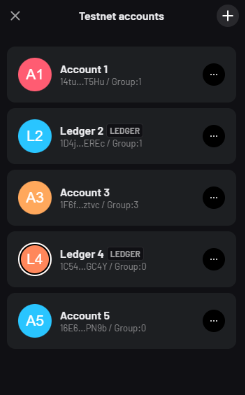

- Click on the Group selector and choose Group 0. Now you have a new address in Group 0!

(this also works on the mobile or desktop wallet — see [here](https://x.com/alephium/status/1825536444754264354))

### **How to request test \$ALPH tokens?**

Don’t have \$ALPH in your wallet?

You can ask for some right from the wallet!

- Click “Add funds” on the main page and then “Request \$ALPH.” You will receive 6Testnet \$ALPH in a few minutes.

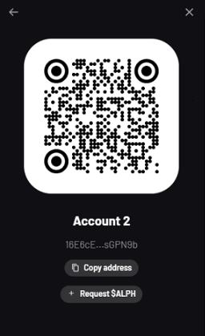

## 2 — How to connect to the bridge?

Hop on the wagon, and let’s go!

To connect to the bridge, go to [https://testnet.bridge.alephium.org/](https://testnet.bridge.alephium.org/)

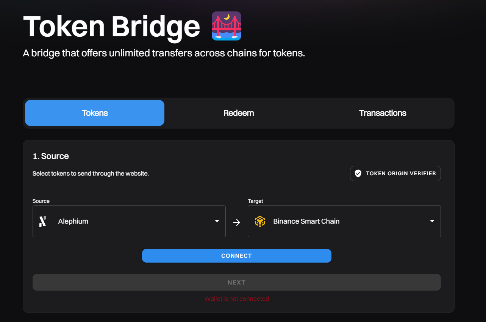

Once on the page, click on the “connect” button. A prompt will appear, and you can choose which wallet you want to use to connect to the bridge.

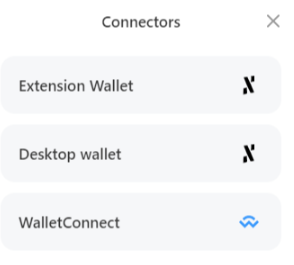

You can use the [Browser Extension, the desktop wallet or the mobile wallet](https://x.com/alephium/status/1820199125104906341).

After choosing your connection method, you can see your address below the two chains form.

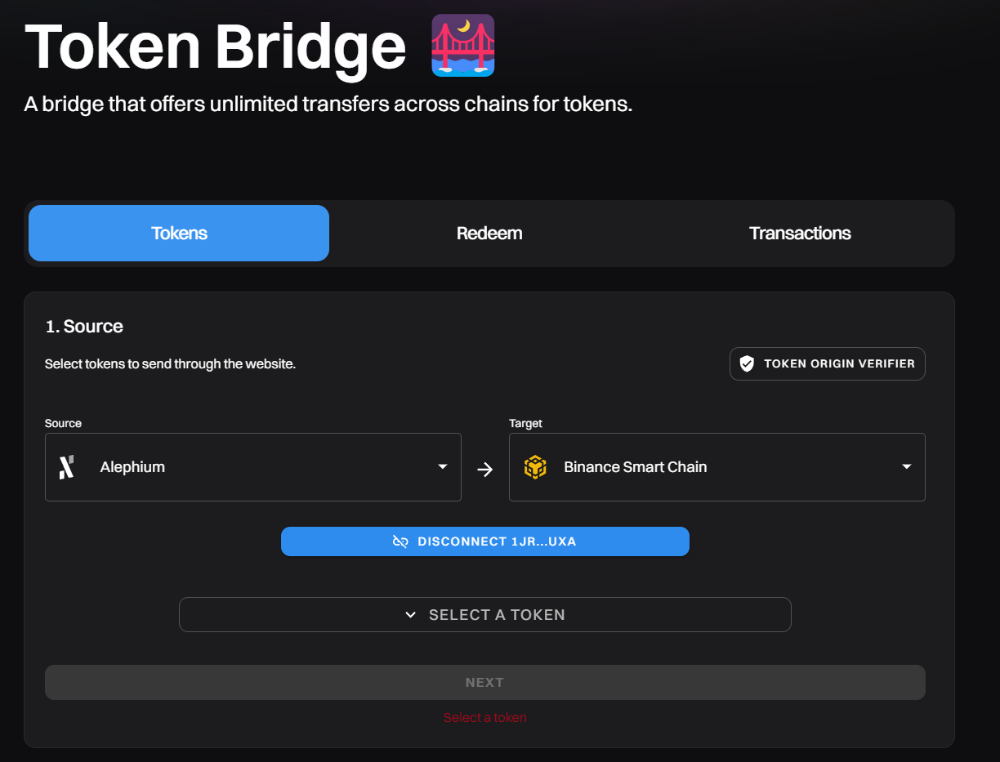

The token bridge helps to send a token from one network to another. Now that you’re connected on Alephium’s side, it is time to connect to the other side: The BSC Testnet.

## 3 — How do you connect to the BSC Testnet?

To connect to the BSC Testnet, you will need a wallet. [Metamask](https://metamask.io/) is one of the available choices and will be used in this example.

🚨 When _using Metamask, before starting the process, go to the “advanced settings” and make sure that the “show test networks” toggle is activated!_

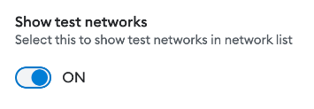

If you don’t have the BSC Testnet in your wallet, go to the [Chainlist website](https://chainlist.org/?search=BSC&testnets=true) to add it. Then, connect your wallet, ensure the “include testnet” checkbox is checked, and click the “Add to Metamask” button.

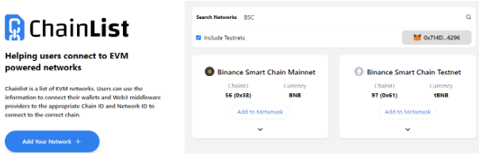

If you have it installed but are on a different chain, you must change to the BSC Testnet.

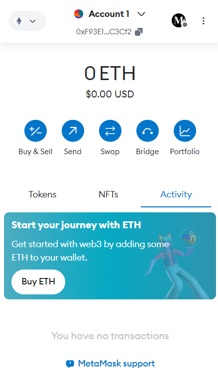

Click the “Ethereum Mainnet” icon and select the “Binance Smart Chain Testnet” as the network.

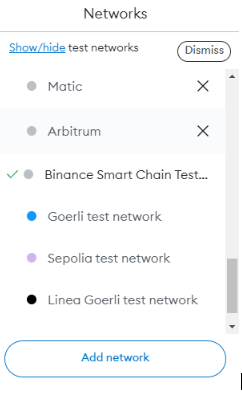

You will see that the network name has changed to “Binance Smart Chain test network.”

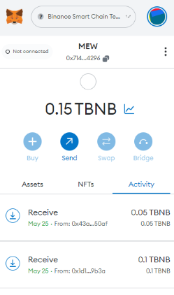

You will need enough test BNB to pay the gas fee for your incoming transaction on the BSC Testnet (and send it to the Alephium Testnet).

You can get 0.05 BNB per day from [https://faucet.quicknode.com/binance-smart-chain/bnb-testnet/](https://faucet.quicknode.com/binance-smart-chain/bnb-testnet/)

After receiving the tBNB funds, your Metamask wallet can pay the transaction fee for the bridge on the target chain.

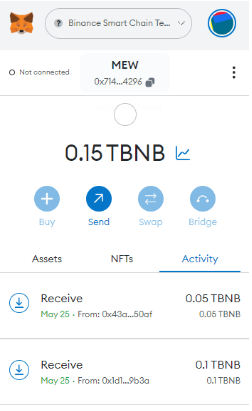

## 4 — How to bridge an asset from Alephium to BSC Testnet?

With your Alephium wallet connected on the bridge page, select the destination network to the BSC testnet.

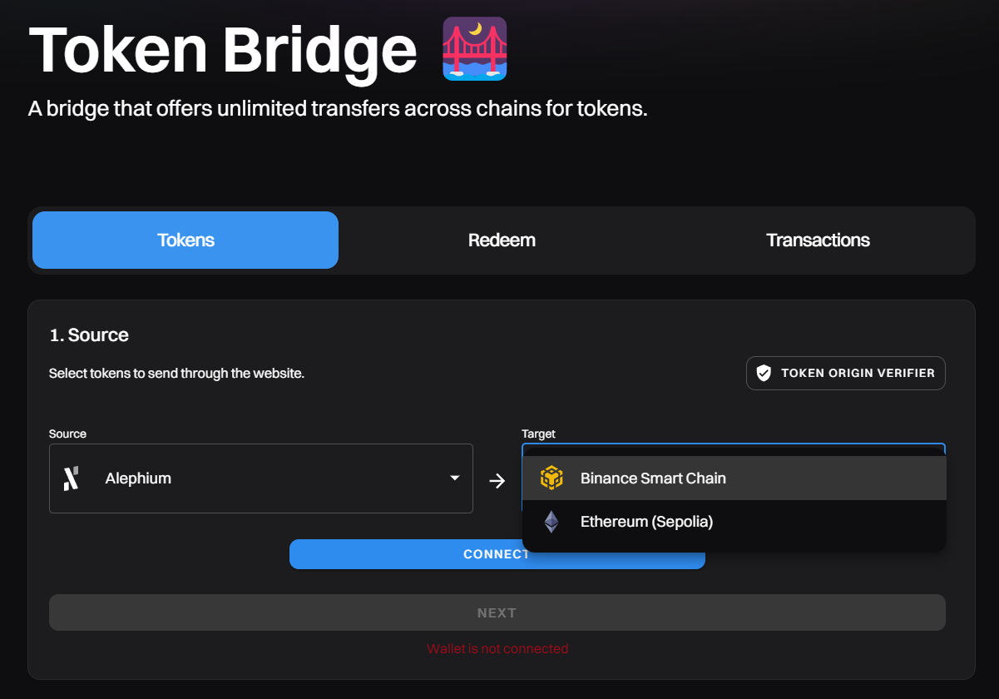

Select the asset you want to bridge from Alephium to BSC Testnet.

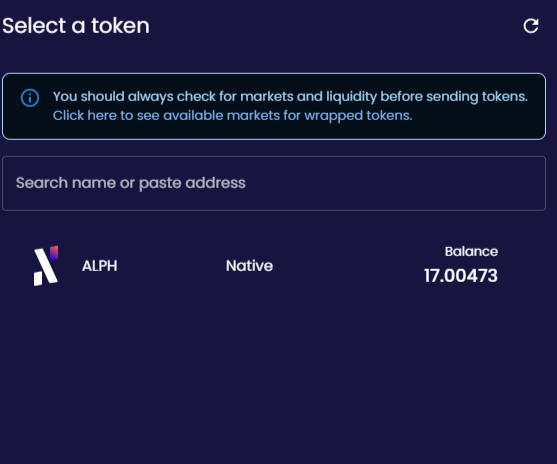

After choosing the amount, click on “Next.”

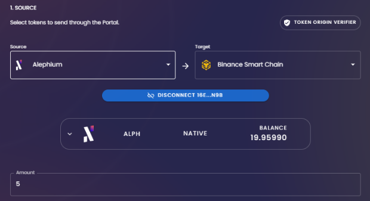

Click “Connect” to connect your BSC Testnet address to the bridge.

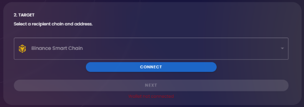

After you are connected to the BSC Testnet, the “next” button will become available.

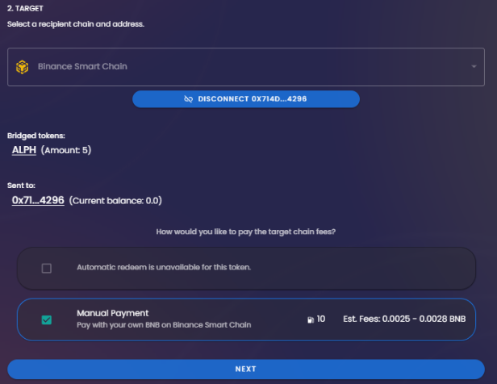

The page will show the address you are connected to on the BSC Testnet and the current balance of Alephium (Wormhole). This is the bridged \$ALPH in the BSC Testnet.

Once you’re ready, click on “Transfer.”

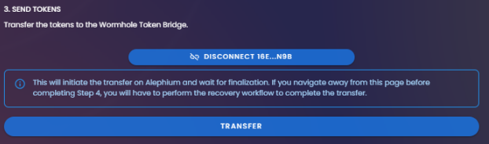

A pop-up will request your confirmation.

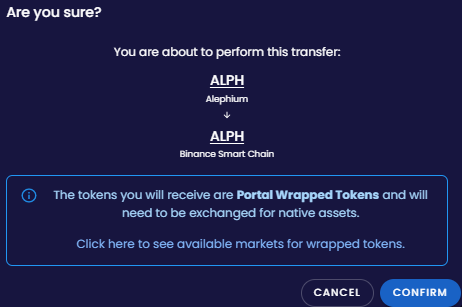

Your wallet will show the transaction for review. If everything is fine, click on “Sign.”

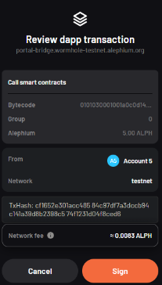

The transaction will take a fair amount of time (at least a few minutes! Please be patient)

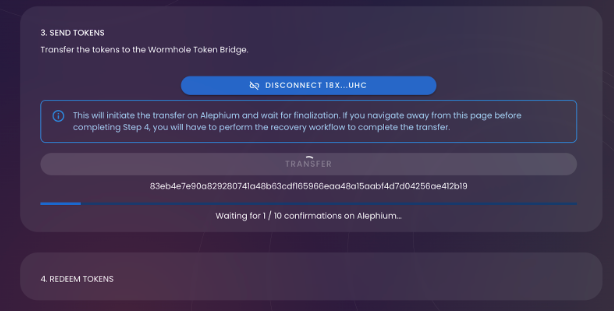

After you get the confirmation that the transaction has been completed, you can redeem your ALPH on the BSC Testnet. To do so, click on the “Redeem” button.

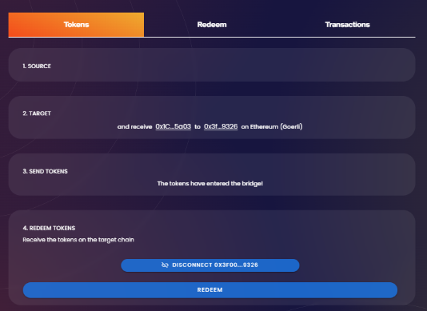

Your BSC testnet wallet will then show the transaction for your review. If everything is fine, click on “Confirm.”

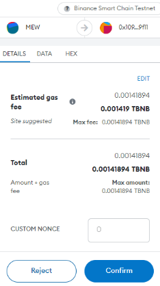

When the transaction is confirmed on the blockchain, you can check the assets in your wallet.

## 5 — **Using the “Redeem” section of the bridge**.

If, for some reason, you left the bridge page before redeeming your tokens, you can always get your transaction hash from [https://testnet.alephium.org/](https://testnet.alephium.org/). Then, click “Redeem” on the bridge page, paste the tx hash into the “source TX” field, and click “Recover.”

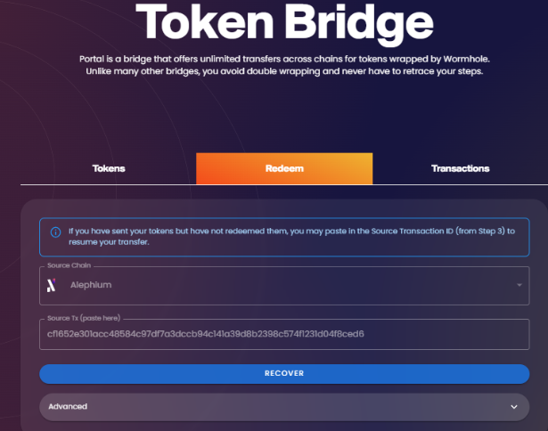

You will be sent to the redemption section and can proceed with the transaction.

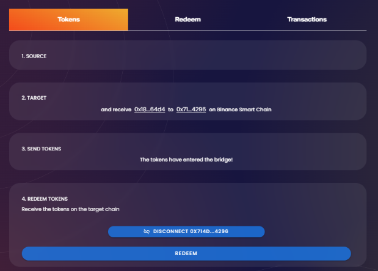

Your BSC testnet wallet will then show the transaction for review. If everything is fine, click on “Confirm.”

## 6 — **How to add ALPH to your Metamask on BSC Testnet**

After redeeming your tokens, you will be able to see the transaction on BSCscan and click on the “Add to Metamask” button to add the token on your wallet.

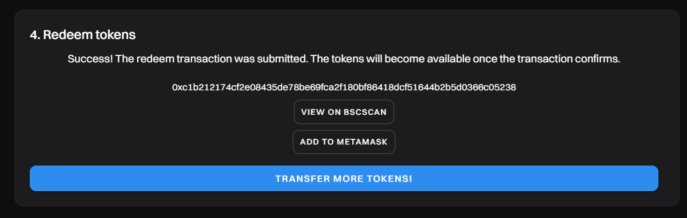

In case you didn’t do that, you can also do it manually:

Click “Import Tokens.” This will open a pop-up window.

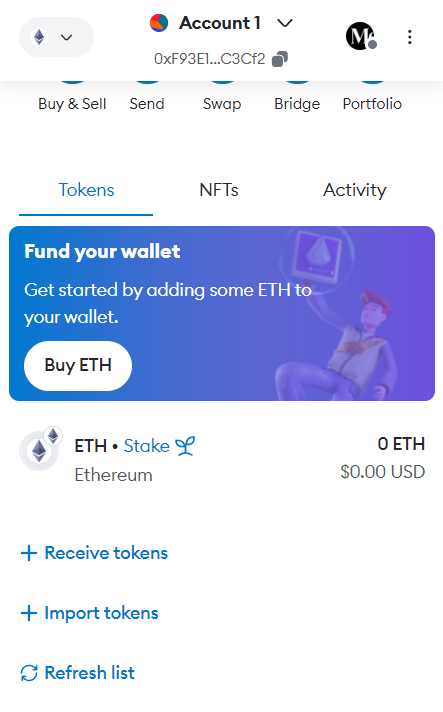

Insert the following information:

> _Token Contract Address: 0x16424C25D27aBf5d93212feFdfD179B843c51f5A_

> _Token Symbol: ALPH_

> _Decimals: 18_

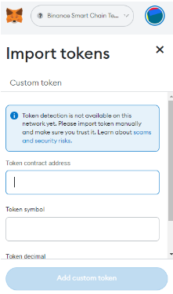

Now, the token is displayed in your wallet.

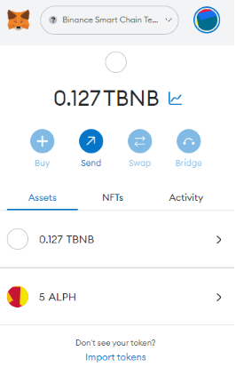

## 7 — How to bridge an asset from BSC Testnet to Alephium?

🚨 _Before starting the process, ensure you are connected to the BSC Testnet!_

With your BSC Testnet wallet connected on the bridge page, select the asset you want to bridge from BSC Testnet to Alephium.

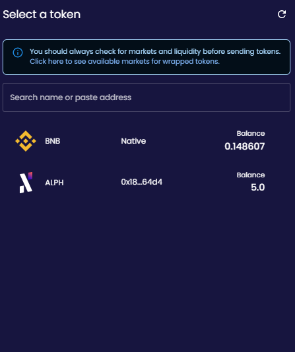

For this test, we will bridge tBNB to Alephium. After selecting BNB and clicking the “next” button, the bridge page will ask you to connect your Alephium Wallet.

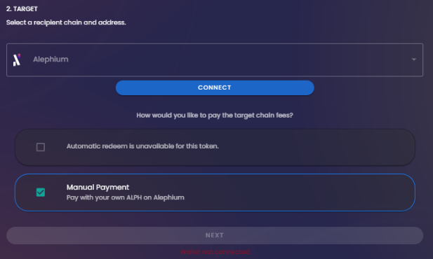

Make sure that your wallet is connected to the Testnet, and choose one option from the prompt:

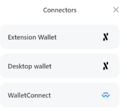

You can use the Browser extension wallet, the Desktop Wallet, or the WalletConnect methods.

You will be asked for a connection. Review the information and approve, clicking on “Connect.”

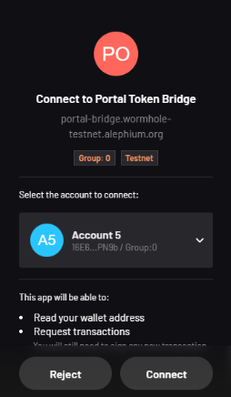

With the wallet connected, the bridge page unlocks the “next” button to proceed with the transfer.

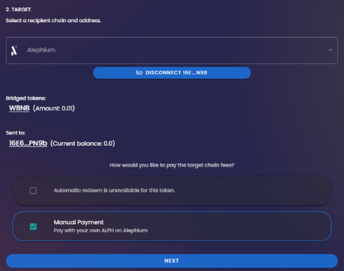

The next step is to send the token from the BSC testnet side. Click on the “transfer” button.

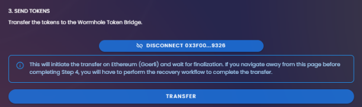

A confirmation screen will appear. Review the transaction and click on the “Confirm” button.

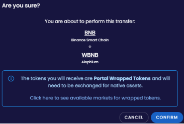

This will send the information to your BSC testnet Wallet. Review all information and click on the ‘Confirm’ button.

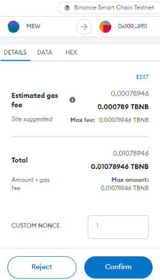

There is a waiting period. After that, you can redeem the WBNB in your Alephium wallet. Then, click on the “redeem” button.

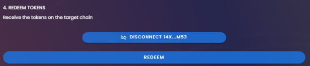

Your Alephium Wallet will show you a transaction to sign. Review and information and click “sign.”

You can verify the transaction at [https://testnet.alephium.org/](https://testnet.alephium.org/)

## **8 — Using the “Redeem” section of the bridge**.

If, for some reason, you left the bridge page before redeeming your tokens, you can always get your transaction hash from [https://testnet.alephium.org/](https://testnet.alephium.org/), and then click “Redeem” on the bridge page, paste it into the “source TX” field, and click “Recover.”

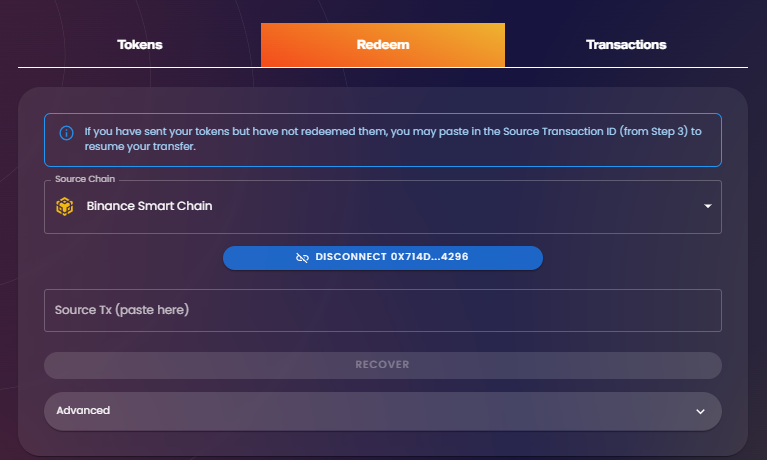

This finishes the basic tutorial. Please give us your feedback in the \# 🎨dev-dapp channel on [Discord](/discord)!

---

If you need help or have extra questions, you are welcome to reach out in the \# 🎨dev-dapp channel on [Discord](/discord), or in the Alephium [Telegram](https://t.me/alephiumgroup) channel. Don’t forget to follow [@alephium on Twitter](https://twitter.com/alephium) to stay up-to-date.
