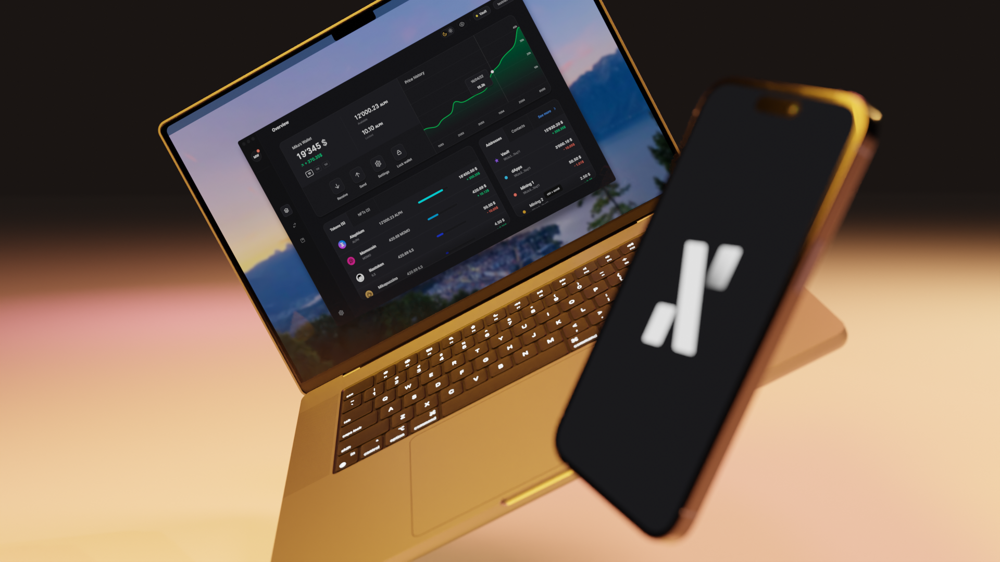

_An intermediary update on the road to the Leman Upgrade_

_The_ [previous announcement](/news/post/announcing-the-leman-network-upgrade-c01a81e65f0e) _addressed the reasons for the upcoming_ **\*Leman Network Upgrade\*\***. This update covers what happened since then and the remaining steps to a successful upgrade (including for users, miners, and node operators).\*

### What is Alephium doing?

A lot of [work has been done on the full node code](https://twitter.com/alephium/status/1589991470676615168), and the SDK went into a huge refactor in the past few weeks. This brings the mainnet closer to the network upgrade. The devnet and testnet are already Leman-compatible for a while now.

An [NFT project prototype](https://alephium-nft.softfork.se/my-nfts) has been deployed on the devnet. [A community project](https://xoxo.art) is developing an NFT platform; it is expected to be released on the testnet soon!

`video: https://www.youtube.com/watch?v=UkpsI1JenNM`

The **Alephium-Ethereum Bridge** is now fully functional on the devnet and has been deployed to the testnet. It is now possible to make token transfers using the [Bridge Portal](https://portal-bridge.wormhole-testnet.softfork.se/.). Track & follow its performance and metrics on this [website](https://monitoring.wormhole-testnet.softfork.se/d/-GcztLMnz/wormhole-testnet-v2?orgId=1&amp;from=now-5m&amp;to=now).

**What are the next steps?**

However, there is much more to be done! Currently, Alephium is busy completing the development of full node code, especially improving the mempool. This includes validating recent changes to the full node, SDK and APIs in the devnet & polishing the functionality and dev experience of the VM and language.

The core team is working hard to build more dApps prototypes to showcase Alephium’s smart contract capabilities. We are leveraging the latest technologies and best practices to ensure that our dApps are secure and reliable. Currently, we are developing a decentralized exchange (DEX) to demonstrate this, and it will be deployed soon.

That is happening in parallel with extensive testing to ensure that everything is working properly. This will involve more testing on the Testnet, as well as monitoring the behavior of the network.

Once every issue has been addressed, Alephium will set a **tentative date for the Leman Network Upgrade.**

On the **front-end development**, a full write-up on the roadmap is coming very soon! You’ll know everything about the desktop & mobile wallet and the browser extension!

### What can YOU do?

**Miners and mining pools:** please upgrade your [node to the latest version](https://github.com/alephium/alephium/releases) and keep an eye on future announcements.

**Users**: the next step is to upgrade your [wallet to the latest version](https://github.com/alephium/desktop-wallet/releases). That will ensure that you keep pace with the preparation for the Leman upgrade.

**Developers** interested in the Leman Upgrade, and testing on the devnet (to use the NFT platform or to bridge tokens to/from ETH Goerli testnet), please reach out in the [#dev-general](https://discord.gg/6xqt5PTz7c) channel at Alephium’s discord server to start interacting with the core team and the new code! And you’ll find much to get started in our documentation [here](https://docs.alephium.org/dapps/getting-started/)!

### Let’s talk soon!

In addition to the written announcements, Alephium will host dedicated Tech Talks to discuss the Leman Network Upgrade in more detail and AMAs sessions for each stakeholder in the coming months.

These events will provide an opportunity for you to ask questions and learn more about the upgrade process and what it means for you.

Join [Cheng Wang](https://twitter.com/wachmc) & [Hongchao Liu](https://twitter.com/hongchao) for the first Leman Tech Talk in january (date TBA soon!).

You can follow the evolution of the code on [Github](https://github.com/alephium), follow the news on [Twitter](https://twitter.com/alephium) & [Medium](https://medium.com/@alephium) or come interact onboard on [Discord](https://discord.com/invite/GEbcpajCJG) & [Telegram](https://t.me/alephiumgroup).
