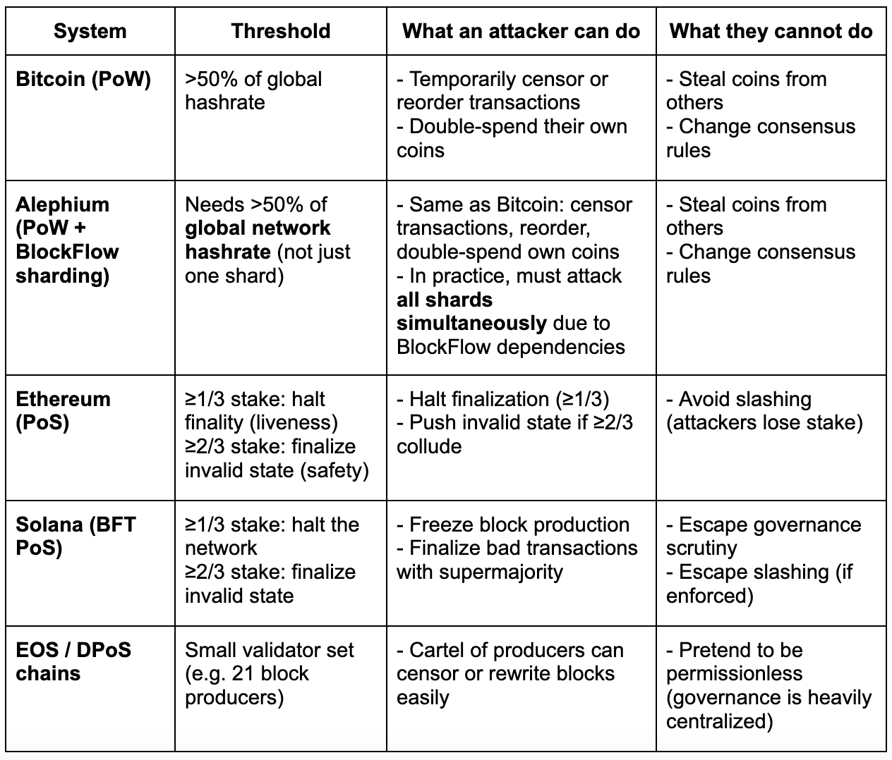

TL;DR NC = Crypto-Astrology.

**Welcome. This is the first column article by Alexandre “Polto” Poltorak, our Legal & Strategy Advisor. He’s taken the time to explore one of the most divisive metrics of blockchain measurement and provide his opinion.**

*Note: The views and opinions expressed in this column are those of the author and may not reflect the official stance of Alephium.*

—

When **Vitaly Ginzburg**, Nobel Prize laureate in physics, received his award, he was suddenly overwhelmed with calls from journalists. Many were from low-quality outlets, and he quickly realized he needed a filter to save his time.

His method was brilliantly simple: he would ask, “*Does your newspaper publish a horoscope section?*” If the answer was **yes**, he would politely **end the call**.

Ginzburg’s reasoning was that any publication printing horoscopes had already revealed it was **not scientifically minded**, and therefore not worth engaging with.

I see the so-called “**Nakamoto coefficient**” in the same light.

## What is the Nakamoto Coefficient?

The Nakamoto coefficient (NC) is defined as the **minimum number of independent entities required to accumulate majority control over a given subsystem** of a blockchain (e.g., mining, validation, governance). Analysts often take the minimum across subsystems and call that “the chain’s NC.”

This can lead to flashy but misleading claims such as, “*Bitcoin is 20× less decentralized than Solana.*”

## The Bitcoin Example

As of 2025, the two largest mining pools combined control more than 50% of hashrate on a rolling basis. By that **narrow definition**, Bitcoin’s mining-pool NC is ≈2 (sometimes 3, depending on the snapshot).

### The Crucial Nuance:

* **Pools ≠ miners**: Mining pools are payout coordinators, not owners of hardware. The underlying hashrate comes from thousands of independent operators who can repoint their machines to a different pool in minutes.
* **Stratum v2 (the next-gen mining protocol)**: This goes further, allowing miners themselves, not pools, to select transactions for blocks. This reduces the potential for pool-level censorship even if a few pools dominate payouts.

This is where the NC metric truly misleads. By simply counting pools, you get the impression that “two entities” could attack Bitcoin. 

### The reality:

* **Mining pools do not own the hashrate.** They aggregate it. If a pool attempted censorship or a double-spend attack, miners could—and almost certainly would—repoint their machines to honest pools within minutes.
* **Economic and social costs are prohibitive.** Pools depend on miners’ trust and on users treating their blocks as valid. Any malicious behavior would destroy their business overnight.
* **Decentralization exists at multiple layers.** Independent miners, [full node operators](https://docs.alephium.org/full-node), [wallet](/wallets) developers, exchanges, and ultimately users, all enforce Bitcoin’s consensus rules. No pool, no matter how large, has the authority to unilaterally override that.
* **Pools come and go.** New pools regularly appear, old ones disappear, and miners freely migrate between them.

The **effective NC of Bitcoin is much higher than 2, 3, or even the total number of pools**, because the pools do not actually control the network. Instead, they coordinate miners who can walk away at any time.

## The Solana Example

On Solana, the NC is usually defined as the minimum number of validators whose combined stake ≥ 33%. 

### Why 33%? 

In a BFT-style PoS system, one-third of stake can halt the network’s liveness (preventing new blocks).

#### Public Estimates of Solana NC Vary

* Around 33 (reported in 2023).
* Sometimes closer to ~19, depending on how validator entities are counted.

It’s important to note that this threshold (1/3 liveness) is not equivalent to Bitcoin’s 51% threshold in PoW. The failure modes are different.

## Failure Modes: Not All Blockchains Break the Same Way

Another key problem with the Nakamoto coefficient is that it assumes “majority control” has the same meaning across all blockchains. In reality, the **failure modes are completely different** depending on the consensus design.

Here’s a quick comparison table:

### Why Does This Matter?

* In **Bitcoin**, the realistic risk is censorship or double-spending *of attackers’ own coins*, but miners can leave malicious pools within minutes.
* In **Alephium**, [BlockFlow’s](https://docs.alephium.org/misc/Content/#blockflow) cross-shard dependencies mean an attacker **cannot simply control one shard**. They must attack **all shards together** with the majority hashrate, otherwise their fork won’t be valid. This makes attacks harder.
* In **Ethereum and Solana**, a coalition of stakers can **halt liveness** with just one-third of stake (a very different type of risk).
* In **Delegated PoS** systems like EOS, the validator set is so small that collusion is trivial, even if the NC number looks “bigger.”

In short, **different systems break in different ways.**

Collapsing these nuanced realities into a single Nakamoto Coefficient number erases important details. There are other crucial dimensions of decentralization, such as client diversity, governance structures, geography, and developer ecosystem, all of which are invisible to the NC metric.

## The Horoscope Test

This brings me back to Ginzburg’s filter. For him, the presence of a horoscope was a telltale sign that a newspaper lacked scientific rigor.

For me, the **Nakamoto coefficient is the horoscope section of crypto metrics**.

### My Feelings about NC

* It’s not pure nonsense, but when it’s used as the **cornerstone of an argument**, it signals that the analysis is **not scientifically minded**.
* A **quick horoscope test** for identifying which sources (such as crypto comparison sites) are worth our attention, and which are not.

## How This Impacts Alephium

Why spend time on the Nakamoto coefficient at all? Well, at some point, you may see it used in charts or articles to claim that [Alephium](https://docs.alephium.org/mining), like Bitcoin, looks “less decentralized” than flashy PoS chains.

The reality is simpler:

* Alephium deliberately chose the **same fundamental security model as Bitcoin**: Proof-of-Work with a UTXO ledger.
* Our innovation, BlockFlow sharding, was designed to scale **without giving up that model**. Cross-shard dependencies mean an attacker still needs **\>50% of the network’s total hashrate** to succeed, not just control of one shard.
* Mining pools, as in Bitcoin, are only **coordination layers**. Miners can switch pools at will.

So when someone applies the Nakamoto coefficient to Alephium and concludes that “it looks centralized,” they are missing the point. NC collapses decentralization into a single number, while Alephium’s design ensures that **the same economic majority rule that secures Bitcoin also secures Alephium, and at scale.**

In short, we **did not trade decentralization for scaling.**

## Final Thoughts

Decentralization isn’t one-dimensional. It cannot be reduced to a single number without stripping away the most important context.

So the next time you see a bold chart claiming Bitcoin is 20× less decentralized than Solana, and it's because of the Nakamoto Coefficient, just remember Ginzburg’s filter.

**That’s a horoscope**. *Time to hang up the phone*.
