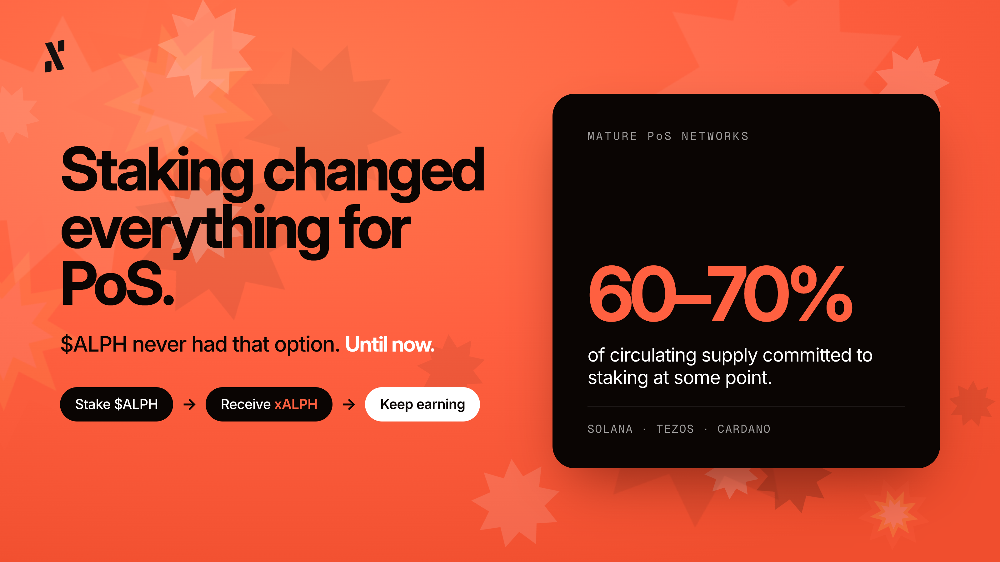
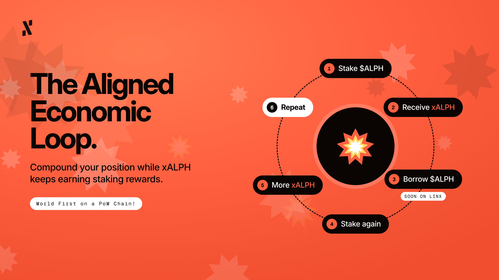
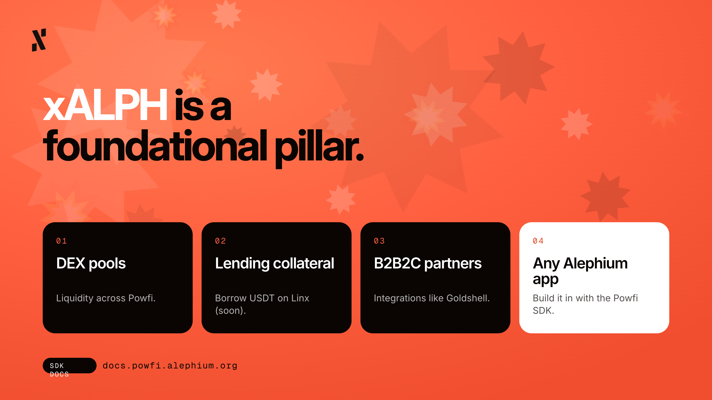
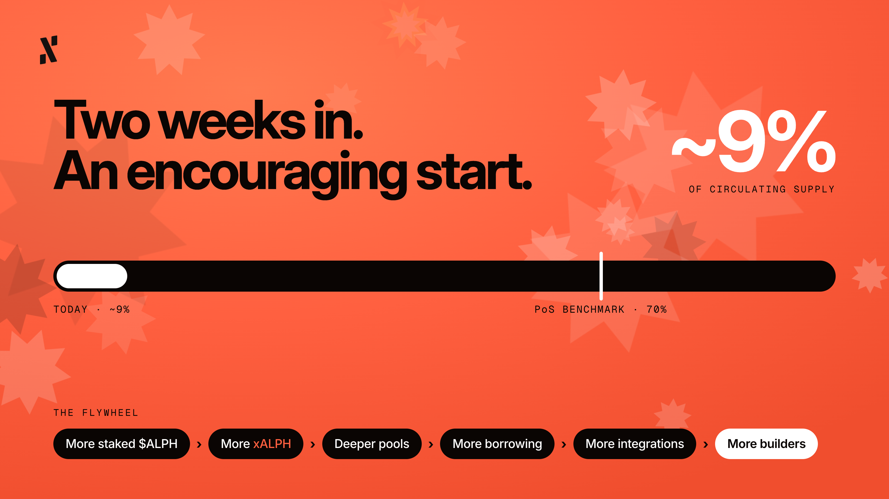

*By Pepper, Head of Marketing at Alephium*

The thoughts and opinions shared in this article belong to the author and may not reflect the official stance of Alephium

- - -

Powfi is live. Hooray! I am just as delighted as you are.

The DEX is running, liquidity is moving, $ALPH is being staked (in a big way!) people are swapping, fees are being earned and collected, and influencers are talking about Powfi on socials. 

However, my dear Alephium community, this is not the end. It might be cliché, but it’s really just the beginning. Powfi and its infrastructure were necessary for Alephium to reach a new level of potential, bringing it closer to achieving true product market fit and making a genuine case for PoW as the gold standard for DeFi (which we know it is).

So, with Powfi now on mainnet, I believe a quiet revolution is underway. This is a movement that has nothing to do with price ranges or swap fees, and absolutely everything to do with what happens when you go ahead and stake your $ALPH.

## Staking Changed Everything For PoS

Now it’s our turn.

The Proof-of-Stake world has been fanatical about staking for years, and perhaps with good reason. Look at some of the networks that matured, like Solana, Tezos, and Cardano. Most of them eventually saw between 60% and 70% of their circulating supply committed to staking (at one point or another). That is a pretty astonishing signal that confirms and validates belief in a network, proving people want to participate in it, earn from it, and contribute to its long-term security (and success).

$ALPH never had that option.

**Until now.**

As you know, xALPH is Powfi's liquid staking token (a kind of receipt, if you like). The process is that you stake your $ALPH, receive xALPH, and keep earning staking rewards while your capital stays productive. By productive, I mean there’s no lock-up forcing you to choose between security and utility. If you need to exit in less than 30 days, just use the ALPH/xALPH pool*. The infrastructure was built to serve you, not constrain you. The devs built with you and your DeFi needs in mind, at every step of the way.

\**The official unstaking process releases your ALPH linearly over 30 days, while you can claim the unlocked portion at any time for a fee. For an instant exit, swap on the ALPH/xALPH pool at the market price.*

## The Aligned Economic Loop Redefines Capital Efficiency

Since xALPH is liquid, it will be able to do things that traditional staked assets cannot, like looping.

1. Stake $ALPH. 
2. Receive xALPH. 
3. Use xALPH as collateral to borrow $ALPH (coming to Linx in the future). 
4. Stake that again. 
5. Receive more xALPH. 
6. Repeat.

Farming loops will compound your position while your collateral appreciates (as it is a yield-bearing asset). This model exists in DeFi already, we didn’t invent it, but it has never been done on a PoW chain. That’s the biggest distinction here, so if they aren’t already, I suggest other PoW chains start paying close attention.

On Linx, xALPH will come to function as borrowing collateral for USDT. The collateral will be safer, cheaper to borrow against, and actively growing in value as staking rewards accumulate. 

Our logic suggests that this is an incredibly opportunistic way to max out your capital efficiency on Alephium.

## xALPH is a Foundational Pillar

xALPH wasn’t built to be used once and forgotten.

It was designed to be everywhere:

* In the DEX pools. 
* As collateral across lending markets. 
* Via B2B2C integrations with partners (i.e. [Goldshell](https://x.com/goldshellminer/status/2104848655891214531))
* Integrated into any application in the Alephium ecosystem that wants to give its users a productive way to hold $ALPH. 

The composability is deliberate, and highly attractive. Every ecosystem partner we’ve spoken to wants to offer $ALPH staking to their users. Not eventually, but right now. The demand was there before the product existed, and that is a good sign by any measure. With that in mind, we recently published the [Powfi SDK docs](http://docs.powfi.alephium.org), giving builders all they need to open their terminals and start coding a Powfi integration.

## The Number That Puts Things Into Perspective

That 60%-70% figure I mentioned earlier is a kind of benchmark for just how much circulating supply the top chains are able to lock into a staking platform. If 70% of $ALPH's circulating supply were to eventually move into staking, in line with what mature PoS networks have demonstrated, we are talking about a fundamental shift in how capital flows across this network. Just two weeks after Powfi’s launch, we are at ~9% of the circulating supply staked, a highly encouraging start.

More staked $ALPH > more xALPH in circulation > deeper pools > more borrowing activity > more composable integrations > more reasons for developers to build on top of Powfi's infrastructure.

The flywheel is real, and your staking efforts will get it spinning.

The Aligned Economic Loop is no longer just a brave vision for Alephium’s future, because it is now live, running on mainnet, and has delivered the world’s first genuine PoW liquid staking. From where I am sitting, this layer is just the base of what we are eventually building towards.

Head to <https://powfi.alephium.org> and try it for yourself.

Thanks for reading,

Pepper.

