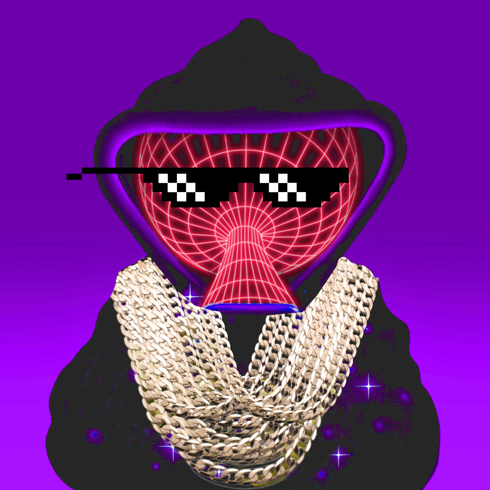
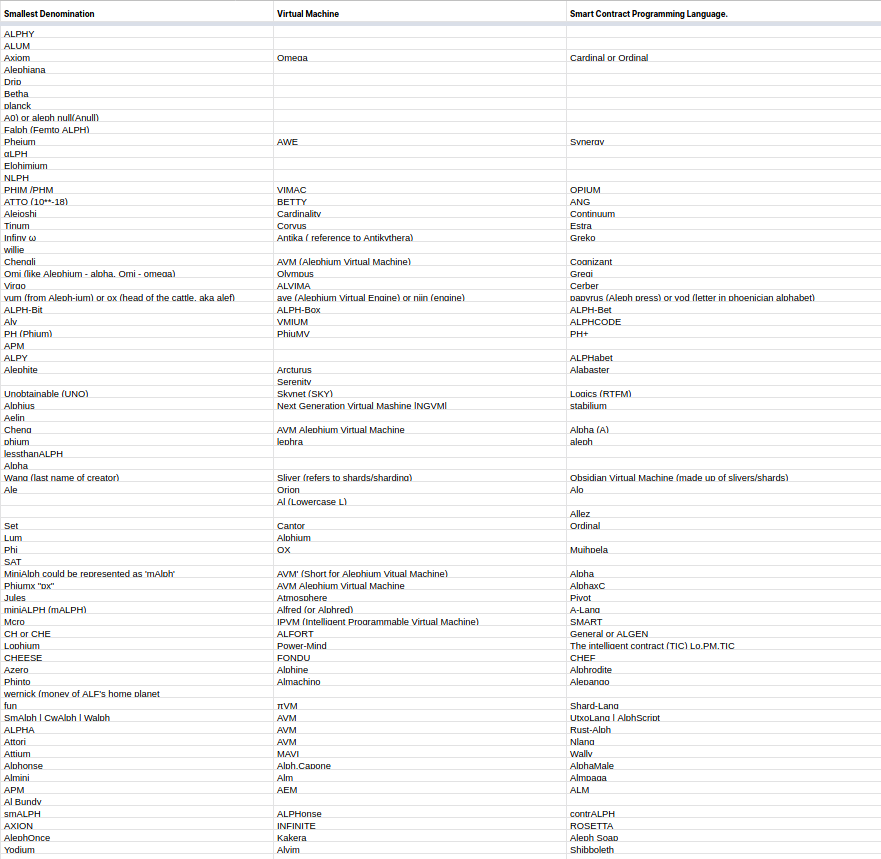

#### The team has spoken & the favorite name suggestions are 🥁

### Team’s Favorites

#### Smallest Denomination

**Set _(digdug#5494) — 40 ALPH (40 \* 10¹⁸ Sets)  
_**Relating to the math behind Aleph, namely the [Set Theory.](https://en.wikipedia.org/wiki/Set_theory) Easy on the tongue. Phonetically close to both “Cent” and “Sat’”. The fact that one of the team members’ first name is Set has nothing to do with it!

<figure id="9ae3" class="graf graf--figure graf-after--p">

<figcaption>El Setto was here 7️⃣</figcaption>
</figure>

#### Virtual Machine

**Alphred _(eyettea#6915) — 0 ALPH  
_**Eyettea is a team member and we are not entitled to rewards. More ALPH for the others! \o/ However, the name Alphred immediately stuck! It was an obvious match for everyone. And Batman’s butler, [Mr. Pennyworth](https://en.wikipedia.org/wiki/Alfred_Pennyworth) would agree! 🦇

#### Smart Contract Language

**Ralph _(psua#1101) — 40 ALPH  
_**The initial suggestion was Rust-Alph, but now that we had Alphred in the house, this made a lot more sense than its literal transcription. Thus there was Ralph! A language to build the dApps of them all! 🦾

---

We were frankly impressed with the quality of the suggestions. Even the unexpected ones are quirky, witty or plain interesting.

We picked additional winners in two more categories: _Funniest_ and _Naming competition gone wrong._

### Funniest

#### Smallest Denomination

Unobtainable (UNO) \*(ChemD#0304) — \***_20 ALPH_**

#### Virtual Machine

Alph.Capone \*(Xav29280#6200) — \***_20 ALPH_**

#### Smart Contract

contrALPH \*(Mr. GP — metapool.tech#8271) — \***_20 ALPH_**

---

### Naming competition gone wrong

#### Smallest Denomination

CHEESE \*(KwKw#2306) — \***_10 ALPH_**

#### Virtual Machine

Skynet (SKY) \*(ChemD#0304) — \***_10 ALPH_**

#### Smart Contract Programming Language

AlphaMale \*(Xav29280#6200) — \***_10 ALPH_**

---

**We’d also like to reward two honorable mentions: Chengli** (zocker#6039) and **Wernick** (greentin#0379) who will get **5 ALPH** each. _Wernick_ sent the older of us back to our childhood. It is the currency of Alf’s home planet, a TV-show from the 80s. _Chengli_ touched the hearts of the Swiss team-members.

<figure id="618e" class="graf graf--figure graf-after--p">

<figcaption>ALPH!</figcaption>
</figure>

**The awarded participants will be contacted by the team during the next round of community reward distribution which will take place by the end of February.**

We’re impressed and humbled by the creativity, imagination and engagement of our community! According to you, if we were a cartoon character we’d be Betty Boop. If we were a Greek god, we’d be running on OLYMPUS. If we’d be a particle, we’d be a PLANCK, and if we’d be spiritual we’d be ELOHIMIUM.

<figure id="f210" class="graf graf--figure graf-after--p">

<figcaption>All the names that were submitted</figcaption>
</figure>

We are grateful to have such a wonderful community and would like you to know we were moved by all the amazing naming proposals we’ve received.
