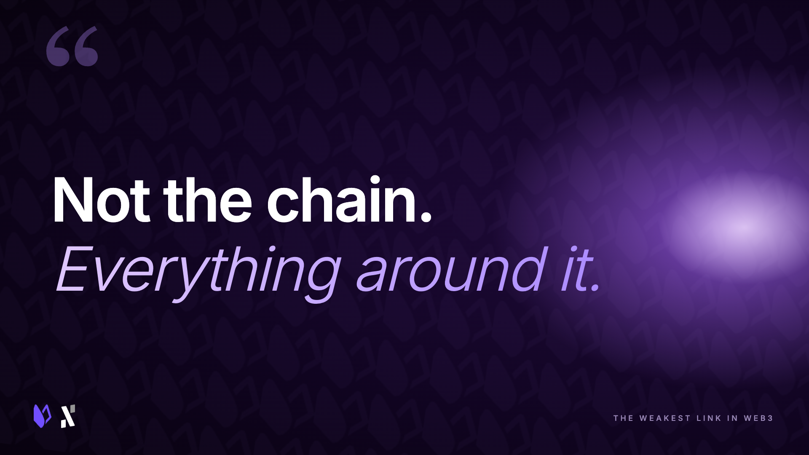
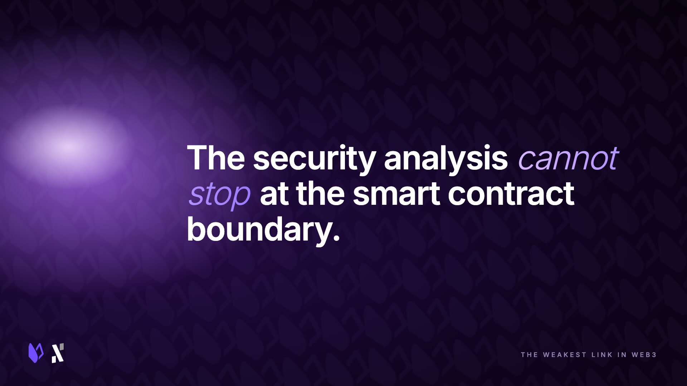
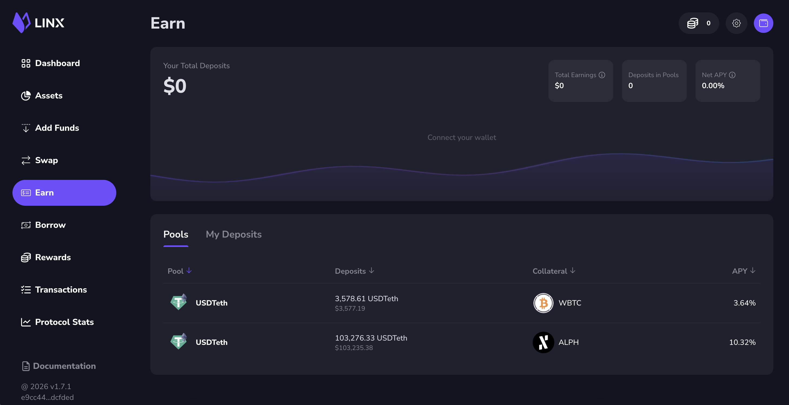

*Column by [Radu](https://x.com/raduC22), Co-Founder of [Linx Labs](http://www.linxlabs.org)*

The decentralization argument has dominated blockchain discourse for over a decade. And rightly so. [Consensus mechanisms](https://docs.alephium.org/frequently-asked-questions/#what-makes-polw-special), validator distribution, token governance, block finality... these have been the battlegrounds where credibility is won and lost.

But there is a quieter problem that builders who ship real products encounter long before any of those theoretical guarantees are tested. It lives not in the protocol, but in everything we stack on top of it to make the protocol actually usable.

Charles Hoskinson [recently described](https://www.mexc.com/news/1052147) this as a "make or break" problem for dApps. The industry defends decentralization while depending on centralized off-chain infrastructure to deliver the actual user experience. Days later, the KelpDAO incident made the point more concrete, with compromised RPC nodes and cross-chain messaging becoming the real failure surface. 

> *“Once a distributed ecosystem centralizes around a platform for convenience, it becomes the worst of both worlds. Centralized control but still distributed enough to become mired in time.” - Charles Hoskinson, Founder of Cardano.*

**Remember, it’s not the chain that’s the issue, it’s everything around it.**

## The Infrastructure Illusion

To ship a usable dApp today, developers typically assemble a dependency graph with a [wallet](https://alephium.org/wallets/) connection layer, RPC endpoints for reading chain state, an indexer for historical data, a [bridge](https://bridge.alephium.org/) or two if cross-chain liquidity is involved, and a relayer to handle cross-chain messaging. Each component is sourced from somewhere, configured with defaults that someone else chose, and trusted to behave correctly under conditions that the developer did not fully design for.

Each layer in that stack is another trust assumption. Each default configuration is a decision that was made for you. And each external integration is a surface that an attacker can probe, not necessarily to break any single component, but to chain small weaknesses into something much larger.

Building [Linx](https://app.linxlabs.org/), a decentralized lending and borrowing protocol on Alephium, I have thought about this dependency graph constantly. When a user deposits collateral or takes out a loan, the underlying chain (Alephium) handles the state transitions. But the experience they have getting there, and the reliability of the data powering liquidations, touches infrastructure that is not on-chain. 

> *The security analysis cannot stop at the smart contract boundary.*

I repeat:

## Off-Chain Components Are First-Class Attack Surfaces

The KelpDAO situation is worth examining precisely because it does not fit the familiar exploit narrative. There was no audited contract with a missed edge case. The failure came from off-chain infrastructure that the protocol depended on but did not fully control.

This matters because the security review culture in Web3 has not caught up with the actual attack surface. Audits focus on contracts. Bug bounties focus on contracts. But the RPC node feeding your oracle data, the relayer processing your cross-chain message, the indexer your front end queries for position state... These are in scope for an attacker even if they are out of scope for your audit firm.

If you are building applications that move value, the question is no longer:

> "Is the chain decentralized?" 

It is now:

> "Is the product's dependency graph decentralized, verifiable, and resilient under stress?"

Those are different questions, and the second one is considerably harder to answer honestly.

## What Cleaner Architecture Actually Looks Like

*Part of why I chose to [build on Alephium](https://alephium.org/get-started/) was the opportunity to reduce this dependency surface at the base layer.* 

A single-chain environment with native asset handling, a purpose-built virtual machine, and a programming model designed to make unsafe patterns harder by default are not marketing differentiators. We accept them as architectural decisions that reduce the number of external trust assumptions a builder has to make.

That has a direct bearing on what Linx can offer users. Fewer moving parts means fewer failure domains. Fewer failure domains means more predictable behaviour under stress, which is exactly when a lending protocol needs to behave predictably.

The community response has been better than we anticipated, and I think some of that is simply because users can feel when something was built cleanly. They may not articulate it in those terms, but trust is partly intuitive. With so many trust assumptions asked of users, this is critical.

## The Next Wave of dApp Tooling

The shift that is coming, and in some places is already here, will look like this:

* Chains should be able to do more on their own. Every time a builder reaches for an external tool to fill a gap the base layer cannot handle, they are adding a dependency they do not control.
* Programming models that make unsafe patterns harder by default. The burden should not sit entirely with the developer to design around footguns.
* Composable infrastructure that does not create centralized chokepoints. Modularity and decentralization are not in tension if the design is thoughtful.
* Security reviews that treat off-chain components as primary attack surface. Not an afterthought appended to the contract audit.
* End-to-end analysis being treated as a critical process. Risk assessment should look at the entire dependency graph, from start to finish. 

The winning developer experience will feel simpler. But that simplicity will be the result of cleaner architecture, not risk buried behind a vendor dashboard.

There is a meaningful difference between those two things, and it is the difference that will separate the protocols still standing in five years from the ones that made the incident post-mortems.

*Radu is the Co-Founder of Linx Labs, the home of Linx App (above), Alephium’s #1 dApp for decentralized and permissionless lending and borrowing.*
