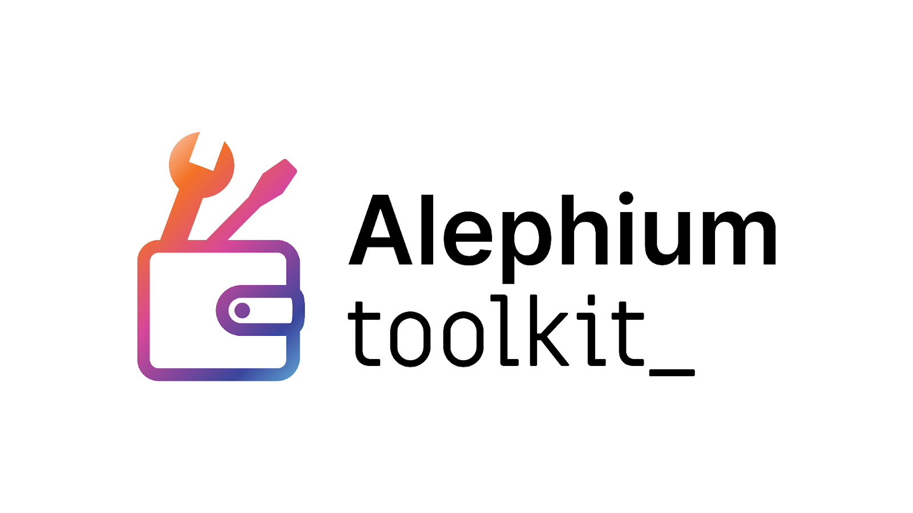
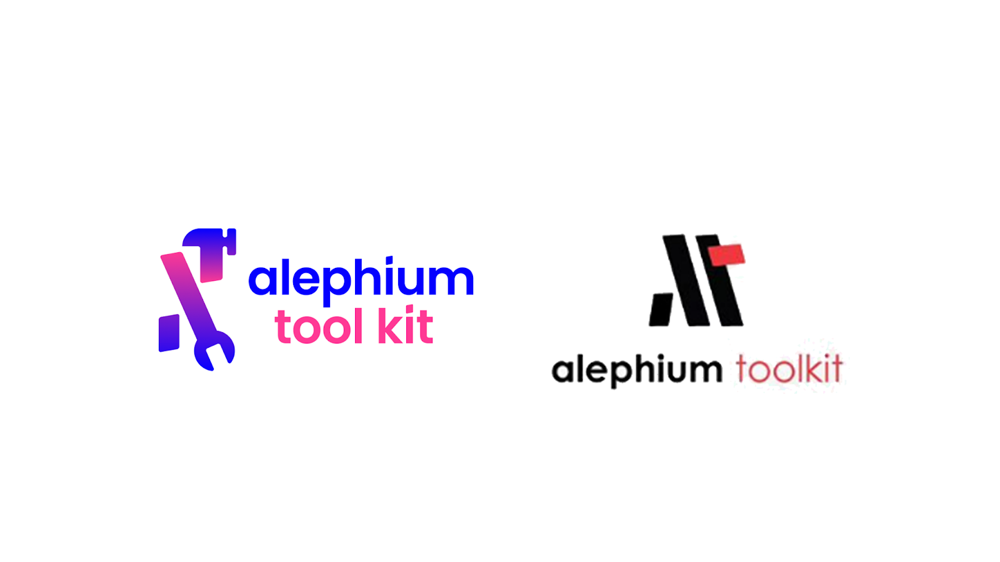
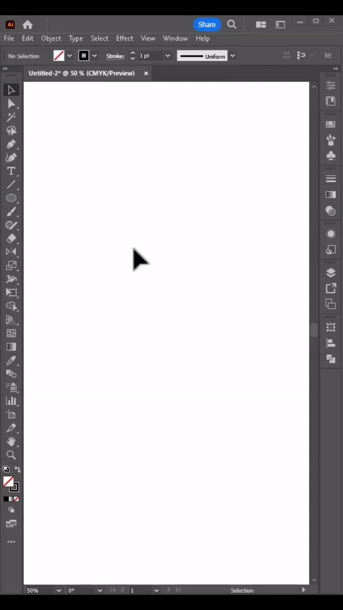
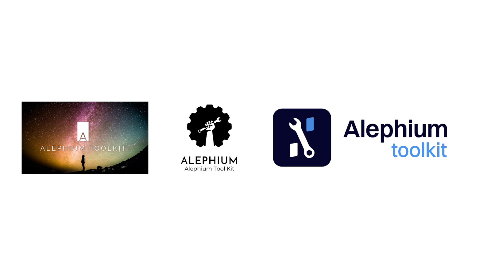

_Following the_ <a href="https://medium.com/@alephium/alephium-multisig-gui-is-here-4b23bec7e2f" ><em>release of the Multisig GUI</em></a>_, Alephium launched a_ <a href="https://medium.com/@alephium/design-contest-a-logo-for-the-toolkit-website-f7bf7801b03c" ><em>design contest</em></a> _to find a logo for the_ <a href="https://alephium.github.io/alephium-toolkit/" ><em>toolkit website</em></a>_! And now, we announce a winner, 2 runner-ups and special mentions!_

**Thank you!**

We are very grateful to all participants, as more than 20 designs were proposed by 19 different participants in the Toolkit logo design contest!

Between careful minimalism and colourful illustration, the range of propositions has been rich & diverse!

After careful review, the jury, composed of several core contributors of Alephium, selected the winner and runner-ups! Together they’ll walk away with our undying gratitude and 1’500 \$ALPH!

#### **The winner**

This is an elegant design. The pictogram itself is precise and easily understandable, the font work is very clean and readable, and the colour gradient is on-brand. The underscore adds an interesting element to the mix, merging the software idea with the hardware nature of the illustration.

Congratulations on a nice design! We’ve already put it on the website <a href="https://alephium.github.io/alephium-toolkit/" >here</a>.

Edgar walks away with 1’000 \$ALPH!

#### **The runner ups**

On the left, <a href="https://twitter.com/headroomcapital" >Headroom</a>’s logo has a cool, fresh, figurative vibe with an unconventional color scheme!

On the right, Studio22’s proposal (of two) has intriguing geographical minimalism & properties. Plus, the creator did a really cool screencap of their other creation!

Here as a GIF: (see it better & with music <a href="https://www.linkedin.com/feed/update/activity:7110907927535710210" >here</a>)

Each of them walks away with 250 \$ALPH!

#### **Special mentions**

We vibed with the energy of <a href="https://twitter.com/NRGResonance" >NRG’s</a> proposal! Although out of brief, its focus on the infinity of possibilities rather than the tools itself has been pleasing for us.

TheMiddleMembr’s logo, a raised fist with a wrench, reminded us of the political implications of what our community is building over the long run!

And Mika’s proposal is, as always, creative, clean, efficient and fresh!

They get a special mention but no \$ALPH, as this is a purely honorific category 🙂

Winners will be contacted next week!

Thank you all for your submissions!

Hosting this competition was a blast for us, and we trust you had as much fun as we did. We’re always seeking innovative ways to tap into the community’s creativity and would love to hear your ideas for upcoming events like this. Don’t hesitate to share your thoughts in the <a href="https://discord.gg/s82ZXRw4Dc" >Suggestions channel on Discord</a>.

_Follow [Alephium](/) on_ <a href="https://github.com/alephium/" ><em>Github</em></a>_,_ <a href="https://twitter.com/alephium" ><em>Twitter</em></a>_. Join the conversation on_ [Discord](/discord)_,_ <a href="https://t.me/alephiumgroup" ><em>Telegram</em></a> _or_ <a href="https://www.reddit.com/r/alephium" ><em>Reddit</em></a>_._
