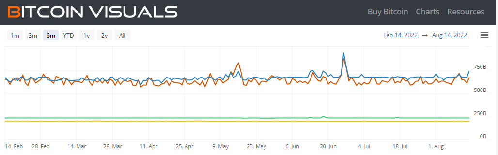

A Technical Promenade, part 2

_This is part of a series of regular articles on key concepts for understanding [Alephium](/) in particular and blockchains in general. If you’re pondering on which chain to build your dApps, if you’re a curious crypto-traveler, or a fellow decentralization enthusiast, welcome!_

In our [previous post](/news/post/block-time-and-block-size-16e37292444f), we explored **Block Time and Block Size** concepts and their nuances. Now is the time to dive into the depths of the calculation of transaction speed with Transactions Per Second (TPS). Here again, each blockchain has its own way of calculating it, and we are going through some of these particularities. Come along with us in this new chapter of our technical promenade…

### Now, what is TPS?

Dali did the math to get the “Maximum Speed of Raphael’s Madonna”…

This fancy acronym you might see very often in new Layer 1 and/or Layer 2 advertising means “Transaction Per Second.” This measure comes from the [database systems](https://en.wikipedia.org/wiki/Transactions_per_second) environment, and it’s a helpful metric to measure how many transactions theoretically can happen in one second in a given system.

“Theoretically” is the keyword here, and we should always take this number with a (big) grain of salt. Let us give you an example of your beloved credit card on the Visa network. “Theoretically,” Visa can handle [65’000 transactions per second](https://www.visa.co.uk/dam/VCOM/download/corporate/media/visanet-technology/aboutvisafactsheet.pdf), but [it runs closer to 1’700 TPS](https://news.bitcoin.com/no-visa-doesnt-handle-24000-tps-and-neither-does-your-pet-blockchain/) on an average day… You can see the same “theoretical” difference in early blockchain announcements vs. later blockchain measurements.

Now, stick around, let’s do some math:

The TPS is calculated like this: TPS = Number of transactions per block / Block time in seconds.   
But first, we need the number of transactions per block… and that depends on which blockchain you are!

The number of transactions per block on a “data amount” blockchain (such as Bitcoin, Zcash, etc…) is the Block Size in bytes divided by the average transaction size in bytes. This depends on various factors (type of transaction, number of signers, types of signatures, etc…).

For example, let’s compute Bitcoin’s number of transactions per block and TPS.

Source: [Bitcoin Visuals](https://bitcoinvisuals.com/chain-tx-size)

First, we need to compute the number of transactions per block:  
Number of transactions per block = Block size in bytes / average transaction size in bytes

The average transaction size for the last six months is roughly 600 bytes, so the equation goes like this:   
1’249’168.59 Bytes ([average block size](https://www.blockchain.com/charts/avg-block-size)) / 632.53 [(average transaction size](https://bitcoinvisuals.com/chain-tx-size)) = 1’974.88 (average transactions per block)

Then, to get to the TPS, we just divide that number by the average block time in seconds.

TPS = 1’974.88 (average transactions per block) / 600 (block time in seconds) = 3.29 (transactions per second)

Disclaimer: This is how it works in theory, in practice, there are complexities such as [Segwit transactions](https://www.exodus.com/news/segwit-explained/) and [virtual bytes](https://en.bitcoin.it/wiki/Weight_units) (vb) measurements that might make the actual numbers a bit different than those you see here, but it’s close enough.

Cheat code: Skip the maths, and just go to a blockchain explorer, and they give you [the live data](https://blockchair.com/bitcoin). You can also [check this chart,](https://blockchair.com/bitcoin/charts/transactions-per-second) and you’ll see our result is right in line with historical data: TPS on Bitcoin usually fluctuates between 2 and 4 TPS. One of the best websites to have all this data in the smallest details is [mempool.space](https://mempool.space/fr/).

Edward Hopper, had a very different vision of “Gas” in the forties…

On a “gas limit” blockchain (Ethereum, Avalanche… or Alephium), we have a completely different beast than with Bitcoin because here, what people pay for as fees is not block space, but computational cost.

On the one hand, each action on Ethereum’s network has a cost in gas. Gas is the measure of the computational effort needed by the network to process the transaction. To give you a sense of perspective, the cheapest, simplest type of transaction costs 21’000 gas. And a complex DeFi transaction can easily cost more than a million gas.

On the other hand, the gas limit per block is 30M gas (max), but on average, the target [gas actually consumed per block is 15M](https://blockchair.com/ethereum/charts/average-gas-used). So, if all transactions were the simplest kind, we would have a theoretical limit of 30M (absolute max gas limit) / 21’000 (minimum gas transaction) = 1,4k transactions per block.

And from there, since the block time is, on average, 14,5 seconds, it would give us a hard max limit of 93 Transactions per second. But in fact, since most transactions are not the simplest/easiest to compute and therefore cost much more gas, and since the target gas limit per block is half of the 30M maximum, we observe that on average, the **TPS on Ethereum is around 15 Transactions per second**.

But let’s keep in mind some nuances! Despite looking simple, these formulas have some complex components to compute, and definitions are often non-trivial and sometimes make for complicated comparisons. For example, what is considered to be a transaction? Only tokens movements between addresses? Smart contract calls? Consolidation of UTXOs? Different blockchains define & count transactions in different (and sometimes opposite) ways.

One interesting example of this is Solana, on which:

- [10–15% of transactions fail and have to be discounted](https://mirror.xyz/0xFC03995eeaf129459C760729661CAa43308293B7/yNOU-vVmRsOpJ3oV30_AS1T2-1-w92aGQlGXQiA1fQ4), so their TPS count has a “success rate.”
- 25–30% of transactions are votes for the next validator, meaning they have to separate [“TPS” and “non-vote TPS”](https://analytics.solscan.io/public/dashboard/8d888828-baae-47b9-948b-d087e5de1411) to have a usable metric of how many transactions can effectively happen.

It’s essential to stay careful when using TPS comparisons because we’re often dealing with averages (for example, a smart contract call can be way bigger than a simple P2P transaction), and the word “transaction” can have a slightly different meaning from one blockchain to another. Also, some transactions can contain… multiple transactions (see this on [Cardano](https://datastudio.google.com/reporting/3136c55b-635e-4f46-8e4b-b8ab54f2d460/page/p_wxcw6g0irc), which, for now, handles up to 2 TPS )!

Another issue with relying on TPS to evaluate the network speed is that it considers only one element of what is regarded as a valid transaction. It measures the time to broadcast the transaction to the network but not the time needed for this transaction to be considered **finalized.** A project may have impressive TPS based on a reasonable definition of transactions, but finality may take longer to be achieved…

### Next step: “What is finality?”

In part 3, as we saw that speed is not enough to declare a transaction as final, we will explore the concept of finality and how each blockchain defines if and the period of time needed for it. [Our next article will cover TTF (Time To Finality)](/news/post/time-to-finality-17d64eeffd25). Stay tuned on our [Twitter](https://twitter.com/alephium), [Discord](https://discord.gg/h7cXXy4FEY), [Telegram](https://t.me/Alephium_Announcement), or [Reddit](https://www.reddit.com/r/Alephium/) to see it fresh off the press!
