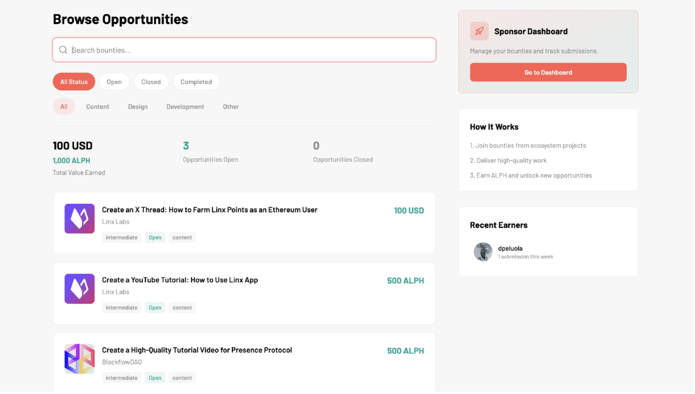
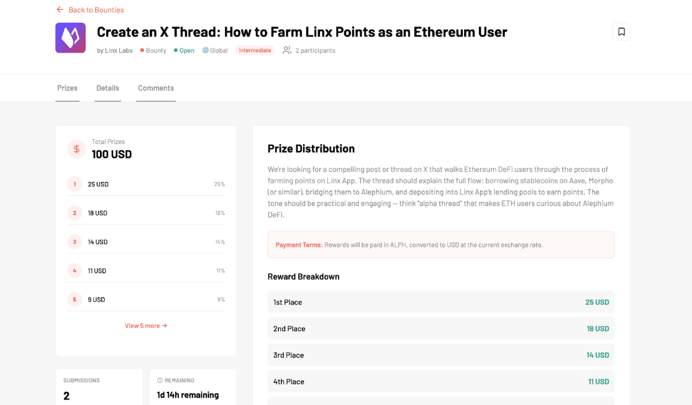
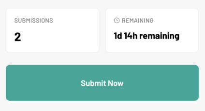
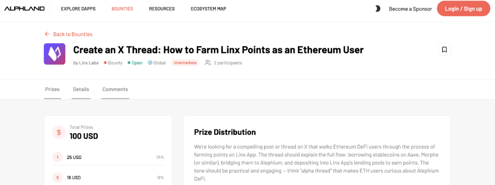
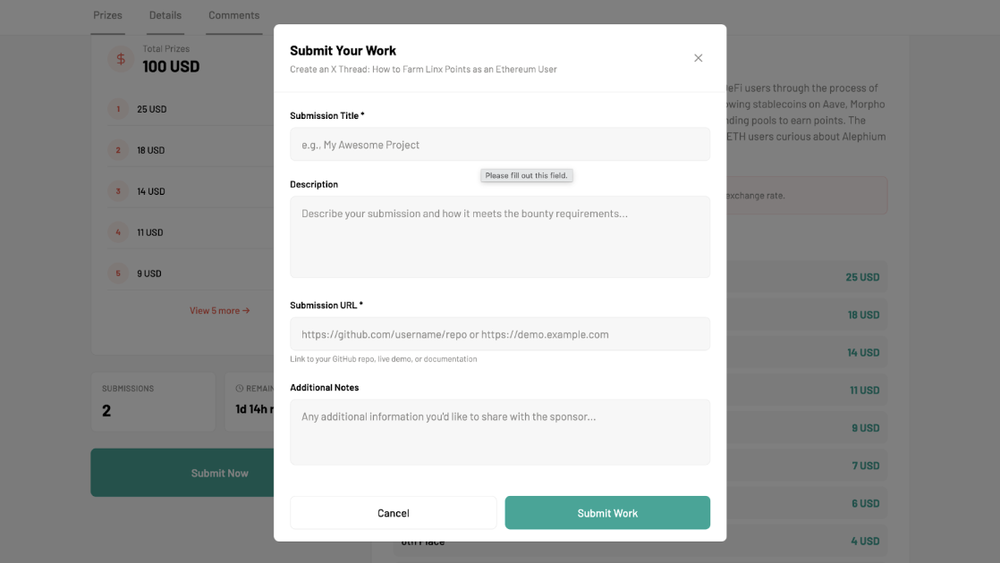

Welcome to the Alphland platform and Bounties guide!

This guide will walk you through everything you need to know so that you can browse, participate in, and earn rewards from bounties in the Alephium ecosystem.

## What Are Bounties?

Bounties are paid tasks posted by ecosystem projects on Alphland. They cover a range of categories from content creation to design and development. By completing bounties, you earn rewards in $ALPH (Alephium's native coin), helping grow the ecosystem while getting compensated for your work.

Note that while all bounties are paid in ALPH, some listings may be displayed in a USD value. These will be paid in ALPH at the current exchange rate upon successful completion of the bounty.

### How it works (in 3 steps):

1. **Join** bounties from ecosystem projects
2. **Deliver** high-quality work
3. **Earn** ALPH and unlock new opportunities

### **Step 1: Browse Available Bounties**

Go to [alph.land/bounty](https://alph.land/bounty) to see all available opportunities.

On this page, you will find:

* **Search bar:** Type keywords to quickly find bounties matching your skills.
* **Status filters:** Filter bounties by status: All, Open, Closed, or Completed.
* **Category filters:** Narrow results by type: All, Content, Design, Development, or Other.
* **Stats overview:** See the total value earned across the platform, the number of open opportunities, and the number of completed bounties.
* **Bounty cards:** Each card shows the project logo, bounty title, sponsor name, difficulty level (e.g. Intermediate), status badge (e.g. Open), category tag, and the reward amount.

On the right sidebar, you'll also see the Recent Earners (community members who recently completed bounties).

### Step 2: Open a Bounty and Review the Details

Click on any bounty card you may be interested in to open its detail page:

At the top you'll see:

* **Bounty title** and the **sponsor** (the project that posted it).
* **Tags**: type (Bounty), status (Open), scope (Global), and difficulty (Intermediate).
* **Number of participants** already working on it (e.g 2 participants).
* A **bookmark icon** to save the bounty for later.

Prizes Tab shows:

* **Total Prizes:** The total reward pool (e.g. 500 ALPH or 100 USD).
* **Prize distribution:** A visual breakdown showing how rewards are split across places (1st, 2nd, 3rd, etc.).
* **Reward Breakdown table:** Exact amounts for each placement.
* **Payment Terms:** How and in what currency you'll be paid. Usually, rewards are paid in ALPH.

On the left side you'll also see:

* **Submissions:** How many people have already submitted.
* **Remaining:** Time left before the deadline.
* **"Submit Now" button:** To submit your work when ready.

Details contains:

* **Description:** A full explanation of what the bounty requires.
* **Requirements:** Specific conditions you must meet (e.g. minimum follower count, content length, tags to use etc).
* **Deliverables:** A checklist of what your submission must include.

You will also find a comment section at the bottom. This is a discussion area where you can ask questions or interact with the sponsor and other participants.

### Step 3: Complete the Work and Submit

Before submitting your work, make sure you’re logged in. If not, click the orange button at the top right of the page and follow the steps to complete your profile.

Once your work is ready and you’re logged in, click the "Submit Now" button on the bounty detail page. A submission form will appear.

Fill in the following fields:

* **Submission Title (required):** Give your submission a clear name.
* **Description (optional):** Describe your work and explain how it meets the bounty requirements.
* **Submission URL (required):** Provide a link to your work (e.g. a GitHub repo, a live demo, a published post, or documentation).
* **Additional Notes (optional):** Any extra information you want to share with the sponsor.

When everything looks good, click "Submit Work" to send your entry.

### Step 4: Wait for Review and Earn Rewards

After submitting, the bounty sponsor will review all entries.

Here's what happens next:

* The **sponsor evaluates all submissions** based on the requirements and deliverables.
* **Winners are ranked** (1st place, 2nd place, etc.) according to quality.
* **Rewards are distributed** to the top submissions based on the prize breakdown.

## Tips for Success

We want you to win. Here’s how to improve your chances:

* **Read the requirements carefully:** Make sure you meet every condition before starting.
* **Check the deadline:** Always note the remaining time and plan accordingly.
* **Look at existing submissions:** The submission count can give you an idea of competition level.
* **Use the Comments section:** If something is unclear, ask the sponsor directly.
* **Quality over speed:** Sponsors rank submissions by quality, so take the time to deliver your best work.
* **Bookmark bounties:** Use the bookmark icon to save interesting bounties and come back to them later.

## FAQ: Bounties

**Q: Do I need an account to participate?**

A: Yes, you need to be logged in on Alphland to submit your work. You can log in with your gmail account or a another email address.

**Q: How are rewards paid?**

A: Rewards are typically paid in ALPH (Alephium's native coin). For bounties listed in USD, the amount is converted to ALPH at the current exchange rate.

**Q: Can I submit to multiple bounties at the same time?**

A: Absolutely! You can work on and submit to as many open bounties as you'd like. In the future, we may consider limiting the number of monthly bounty submissions to maintain high quality standards.

**Q: What happens if a bounty is closed?**

A: Closed bounties are no longer accepting submissions. You can filter by "Open" status to see only active opportunities.

*Happy hunting! 🚀 Start exploring bounties today at [alph.land/bounty](https://alph.land/bounty)*
