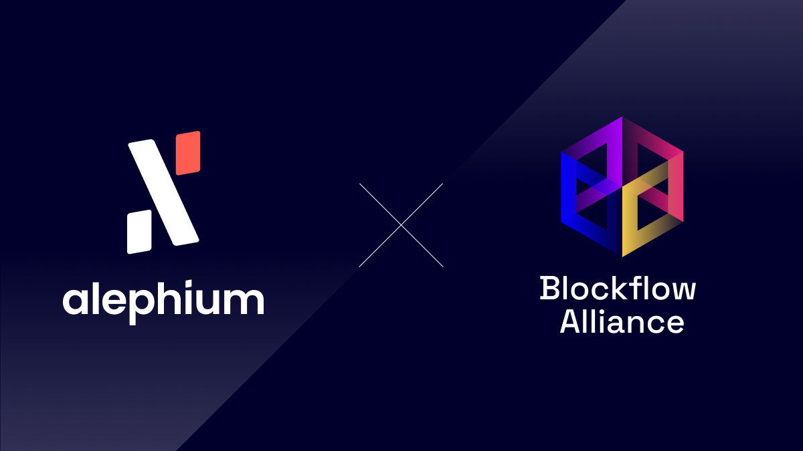

Daily, we strive to enhance our decentralized infrastructure, inspired by Satoshi Nakamoto’s vision for a permissionless future. We offer developers advanced tools, precise documentation, and direct access to our core team on Discord. Our commitment to user-friendly front-end tools reflects our investment in top-tier UI and UX.

But today, it’s about the community. And the community is going one step further, stronger, faster!

## **Welcome Blockflow Alliance DAO!**

The first community-run DAO has been announced yesterday, and has given itself the following objectives:

- Boosting Adoption and Usage
- Expanding the Community  
- Nurturing Development
- Promoting the Alephium Ecosystem

It is being built around well-known and highly respected community members, [cgi-bin](https://twitter.com/cg1_bin), [Oheka](https://twitter.com/Oheka32), [Diomark](https://twitter.com/diomark), [Ryannn](https://twitter.com/RyanRit91769208), [hEAdroom](https://twitter.com/headroomcapital) & [Waldi](https://twitter.com/zkitbeats).

Whether it’s by improving education and onboarding, expanding marketing efforts, leading independent listing efforts or contributing to external wallet integrations, such a community DAO can do many things.

It will require the community’s creativity and efforts!

[General Chat](https://discord.com/channels/747741246667227157/1156214551939919962)**:** This channel will serve as a hub for community discussions on various topics related to the DAO.

[DAO Suggestions](https://discord.com/channels/747741246667227157/1156240220530938017)**:** This channel will act as the governance center, where proposals can be submitted, and community members can cast their votes.

If you are interested, join the two dedicated Discord channels: A [General chat](https://discord.com/channels/747741246667227157/1156214551939919962) will serve as a hub for community discussions, and a [Suggestions channel](https://discord.com/channels/747741246667227157/1156240220530938017) will be the governance centre of the DAO, where community members can vote!

The DAO is a multisig, and [its address is visible here](https://explorer.alephium.org/addresses/oBfmYWmmcBqrfCLzsLPYM9YiNs38JZDHYpiqkDtSm4QuPfyTFavbTtTeGztjUn6E61k7VSC6FtiGj6yqBiaeFgfPANVHYBUZr5vRoKhGtVRXHNyCHSPoKN1ha2HGwLqT2uwJQsFWWLtczqJzD1ae8bXAgRnceyF1NSzBTB9CtQK5cRcxotZzDC6tz6GNaLq4SoFDhWm2St2mXwQ8RPn5KwrZ7t8QurgnbH8aP9Sve9SBTRWZBqwHZ1LWoGhG3LKmx2vNXyGiX).

The Blockflow Alliance DAO has applied for a grant with Alephium, via the grants & rewards program for \$ALPH out of the ecosystem funds. This request is being reviewed as we speak, and after careful consideration and the usual process, a decision will be made and announced.

This first DAO is a pioneer toward a future with multiple DAOs focused on different aspects of the expansion of the Alephium Universe! If you have ideas, skills, stamina & enthusiasm, [join our grants program](https://github.com/alephium/community/blob/master/Grant%26RewardProgram.md)!

**We are extremely grateful to have such engaged and capable community members, and we can’t wait to see what comes out of it. This marks an important milestone for Alephium and its ecosystem.**

_Follow [Alephium](/) on_ [Github](https://github.com/alephium/)_,_ [Twitter](https://twitter.com/alephium)_. Join the conversation on_ [Discord](/discord)_,_ [Telegram](https://t.me/alephiumgroup) _or_ [Reddit](https://www.reddit.com/r/alephium)_._
