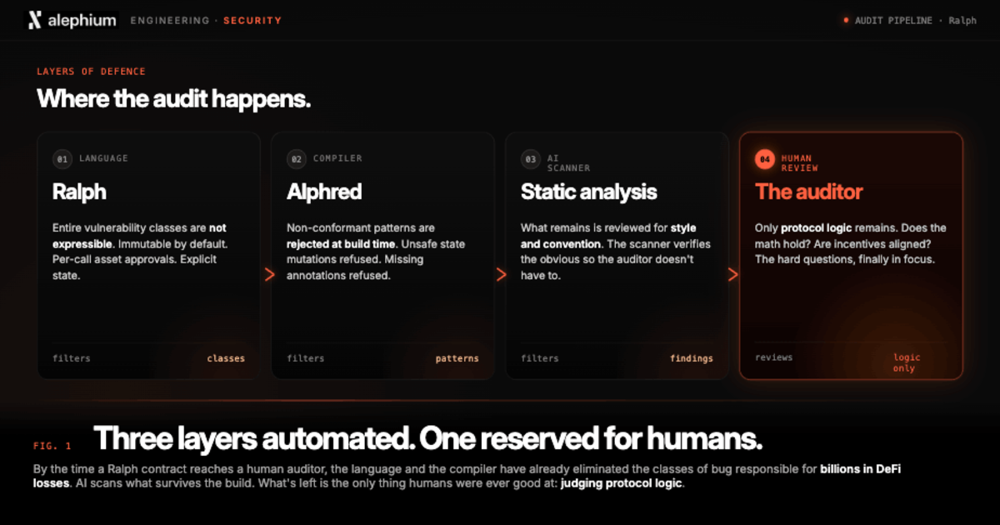
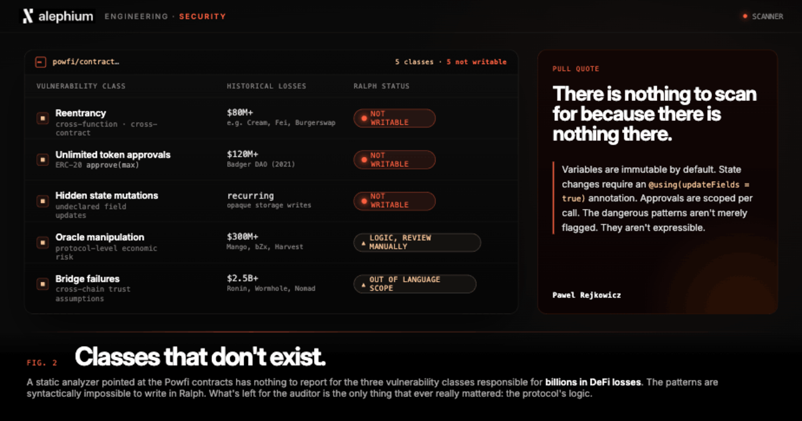

*Article by Pawel Rejkowicz, Smart Contract Engineer at Alephium*

*The views shared by Pawel may not represent the official stance of Alephium.*

- - -

The threat landscape for smart contracts has changed so much in the last few years. A structurally unsafe stack used to be a completely manageable risk, but now it has become a systematically exploitable one. From my perspective, the window for relying on audits alone is closing faster than most builders care to realize.

I have spent the last 6 months writing and auditing the smart contracts for Powfi, Alephium's upcoming concentrated liquidity DEX and ALPH liquid staking platform. I’ve also been working hard on the Powfi SDK. When you are building financial infrastructure that will hold real value, you must think carefully and practically about failure modes. Not just the obvious ones. All of them.

What I want to share is not a postmortem, but rather a view from inside the building, showing what it looks like when the language you are working in refuses to let you write the dangerous patterns in the first place. By the end of this article, you’ll understand why that distinction is one of Alephium’s most critical advantages.

## The Threat Landscape Has Shifted

For most of DeFi's history, the security model worked roughly like this. 

1. You wrote your contracts
2. You sent them to an audit firm
3. They found some issues
4. You fixed them
5. You shipped.

Job done. The assumption underneath that model was that vulnerabilities required expertise to find. A good auditor could spot what a less experienced developer missed.

**That assumption is eroding rapidly.**

AI-powered security scanners can now read an entire contract codebase in seconds. They do not get tired. They do not miss the same pattern twice. They can identify reentrancy vectors, approval misconfigurations, and oracle manipulation surfaces at a scale and speed that no audit team can match.

**The critical point is that attackers have access to the same tools.**

As I said, a structurally unsafe stack used to be a risk you managed. Now it is a systematically exploitable one, so the gap between "we got audited" and "we are architecturally safe" has never mattered more. Unfortunately, most industry builders are still largely building as if audits are the answer. I hate to burst their bubble. 

Close to a [billion dollars](https://alephium.org/news/post/ignore-at-your-own-peril-but-defi-needs-pow-immediately/) was lost to exploits in the first four months of 2026 alone, primarily through:

* Reentrancy attacks
* Unlimited token approvals
* Bridge failures
* Oracle manipulation

Of course, these are not novel vulnerabilities, they’ve been around for a while. They appear in the same postmortems, year after year, because the EVM architecture that underlies most DeFi makes them possible to write. Auditing can catch them in an instant, but it cannot remove the possibility that they exist. 

This is fundamentally a language issue. Duży (big) problem.

## Security in the Language, Not the Report

This is the design philosophy behind Ralph, Alephium's smart contract language, and the one I have been working on throughout the Powfi build.

The most important thing to understand about Ralph is that several of the vulnerability classes responsible for the largest losses in DeFi history are not catchable by an AI scanner on a Ralph codebase. 

**They are not catchable because they cannot be written**. I know that, because I’ve tried and tried and tried. It’s part of my job.

Let’s take reentrancy as an example. In Solidity (the programming language for EVM chains), reentrancy requires the developer to manage state carefully, call external contracts in the right order, and apply guards correctly. Auditors look for it. Scanners look for it. Attackers look for it. With Ralph, functions that interact with contract assets can only execute once per transaction by design. The re-entry point does not exist. 

**There is nothing to scan for because there is nothing there.**

Everytime you want to transfer a ERC20 token, you actually have to face the risk of reentrancy, because you have to call a potentially harmful contract (even if whitelisted, it can be upgraded or cracked in the future). On Alephium you have native tokens with asset permission systems built in, which does not require users to call unknown contracts.

The asset permission system follows the same logic. In Solidity, the standard ERC-20 approval model allows a contract to be granted unlimited access to a user's tokens. This is the mechanism behind dozens of large exploits, including the [Badger](https://cryptobriefing.com/120m-lost-badgerdao-defi-hack/) attack that cost $120 million. 

In Ralph, approvals are scoped at the function call level. The syntax makes this explicit:

> **// Ralph requires explicit asset authorization per call**
>
> **// Only the specified token and amount can be accessed**
>
>  **transferToken!(caller, contractAddress, tokenId, amount)**

You cannot grant unlimited access because the language does not support the concept. A scanner looking for unlimited approval vulnerabilities on a Ralph contract finds nothing, because the pattern is syntactically impossible.

Variables in Ralph are immutable by default. If a function updates contract state, it requires an explicit annotation:

> **@using(updateFields = true)**

This is enforced by the compiler. Every state-changing operation in a Ralph contract is explicitly declared, which means every state-changing operation is explicitly visible, to the developer, to an auditor, and to an AI scanner. There are no hidden state mutations.

## What This Meant in Practice Building Powfi

Writing Powfi's contracts in Ralph changed how I thought about the security review process. Instead of asking myself, "Did we protect against reentrancy in this function?" I am asking "Does this function's asset annotation correctly scope what it needs access to?" 

The vulnerability class is removed from the conversation, and so the conversation becomes about correctness rather than defence.

**That is a meaningful change for builders.** 

When you are building a concentrated liquidity market maker with a liquid staking component, the contract logic is already complex enough. Not having to simultaneously defend against a class of attacks that are structurally impossible frees up cognitive space for the problems that are genuinely hard.

This also changes what an audit looks like. An auditor reviewing Ralph contracts is not hunting for the standard EVM vulnerability checklist. They are reviewing the logic, the economic design, the edge cases in the specific protocol. That is a better use of an expert's time, and it produces a more useful output.

## The Direction of Travel

AI security tooling is improving fast and will continue to do so. The contracts most at risk are those written in languages where dangerous patterns can exist, because those are the contracts that will be found, automatically, at scale, and exploited before a human has reviewed the output.

Architectural safety is not a luxury for teams with the time to think about it. It is becoming the baseline requirement for anyone building infrastructure that holds value and expects to keep holding it.

Ralph was designed with this in mind. The security is in the language. When AI reads every line of Powfi's code, it will find a concentrated liquidity DEX and a liquid staking protocol. It will not find the vulnerabilities that have cost this industry billions, because those vulnerabilities were never possible to write.

That is the only answer to an automated and scalable threat. Not a better scanner, but a safer foundation and language.

## Final Thoughts

*One caveat worth adding, because I would not be completely comfortable without it.* 

Ralph eliminates entire classes of vulnerabilities at the language level, and that matters enormously. But architecture is not a guarantee of correctness. Logic errors, flawed economic design, and novel attack vectors that nobody has seen before do not care how good the language is. 

Building on a safer foundation changes the threat profile significantly, but it does not remove the need for rigour, careful review, and a healthy scepticism about your own assumptions. I have spent months on Powfi's contracts and I am still sceptical. That is not a bad thing. In security, scepticism is probably the most useful trait you can have.

- - -

*Pawel Rejkowicz is a Smart Contract Engineer and Auditor at Alephium and the author of the Powfi smart contracts. He has a strong foundation in complex, real-time systems. His fascination with computers began in school, where he learned from books at his local library. After a decade of experience in critical systems, he transitioned into the blockchain space. Pawel quickly made an impact, conducting his first Solana audit with just a few days of experience and still identifying critical vulnerabilities.*
