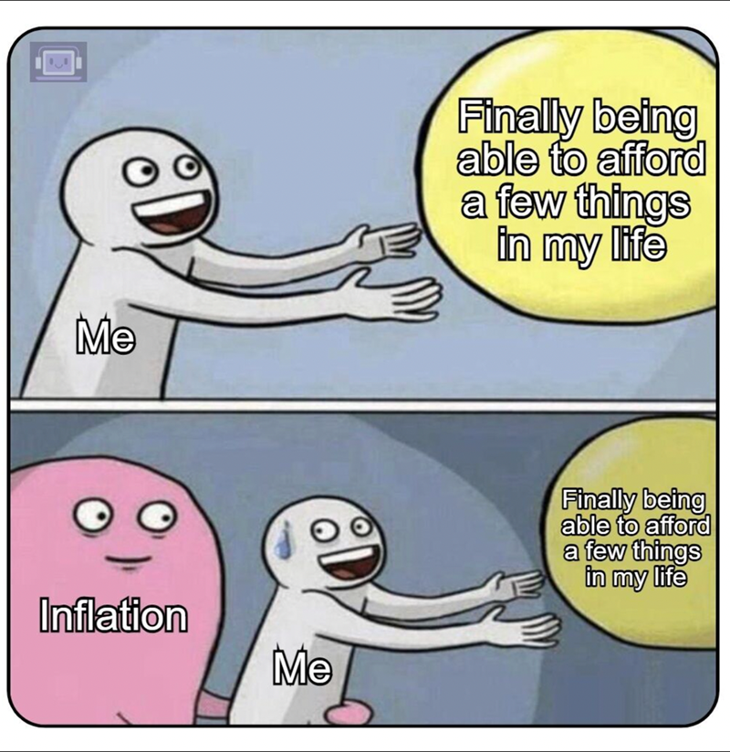
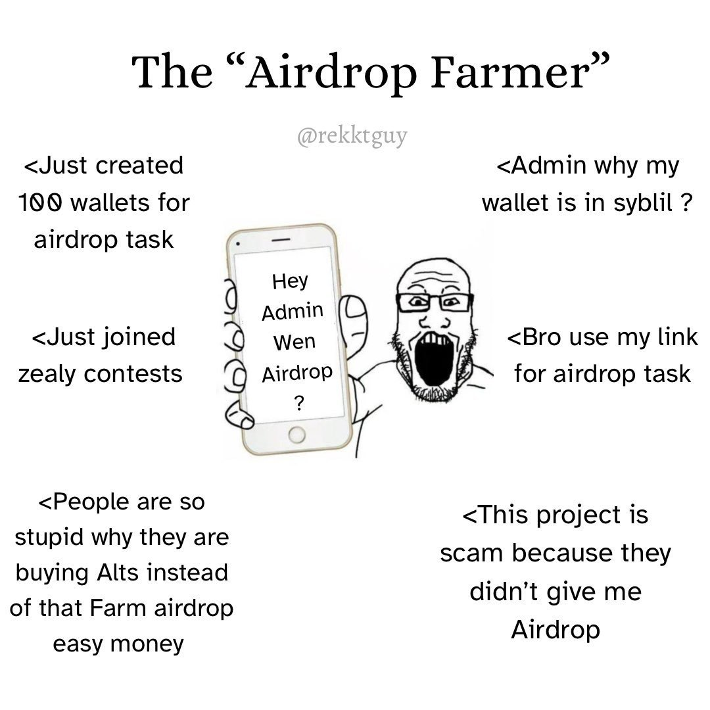

**Op-ed by Pepper, Marketing & Growth, Alephium.**

*Hello and welcome! This is the 2nd column article from Pepper, our Head of Marketing & Growth. His last article focused on the danger of centralized, corporate-backed L1s under development. This new op-ed follows that up with even more context on the realities of life as a permissionless L1.*

**Note:** The views and opinions expressed in this column are those of the author and may not reflect the official stance of Alephium.

- - -

 *"A society grows great when old men plant trees in whose shade they know they shall never sit"*. - By the end of this article, this quote will make sense.

For a while now, I’ve been talking about the threat of Web2-ism and corporate development in Web3, how it’s a Trojan Horse, and why it threatens decentralization. I’m not the only one. Far more [knowledgeable](https://thedefiant.io/news/research-and-opinion/crypto-web3-experts-question-corp-chains-like-tempo) figures have joined in and are beating the [same drum](https://www.dlnews.com/articles/markets/stripe-tempo-blockchain-could-fail-says-libra-creator/). However, during this commentary, I realized that I’ve been talking about ideology and Web3 purism, overlooking the fact that most people are here for something much bigger. **Money**.

So, let’s do it, let’s talk about economics, philosophy, and some things in-between. 

After 8 years in Web3, I can see that the blockchains that are still present and relevant are generally the ones that have built intelligently and strategically upon their structural integrity. The chains that were transient and built on short-term incentives are harder to find (apart from their dead Twitter/X profile and/or an error 404 website).

For me, the key differences between these two types of L1 are impossible to ignore, so let's start there.

## Spotting the Difference

The first litmus test is simple. Ask this:

*“Is the economic engine of this blockchain inflationary or fee-generating?”*

Most emerging L1s, particularly Proof-of-Stake variants, tend to default to the inflationary model (big number go up). It’s easy to see why they do this. There’s a lot of fun to be had in the crypto casino. But, it’s also a choice that fundamentally compromises long-term financial viability (and continued business operations).

Alephium has spent four years ensuring the structural integrity is absolute, so that its [Phase Two](/news/post/from-scalable-infrastructure-to-aligned-economics/) economics could be fee-generating and offer new deflationary mechanisms. It’s something that attracted me to this project from the moment I first came across it. And, even though I’m much later than many of you, and your journey with Alephium has been drastically different from mine, I see good signs. 

I see a network and team that wants to create scarcity (burns and buybacks) and become stronger with every interaction and transactions (rewarding loyal stakers with generated fees). Also, there aren't many purely inflationary blockchains or coins out there, so we have to accept that a careful balance is generally the best approach.

## The Financial Dilution of the Inflationary Model

We’ve all seen that inflation is the most prevalent economic model for securing and incentivizing Layer 1 (and some Layer 2) projects. That system relies on continuously minting and distributing new tokens to reward validators and stakers. In the short term, it creates incentive alignment, but in the long run it is structurally flawed and only leads to financial dilution.

*What happens when a bear market comes? What happens when VCs move their interest over to the latest trend? What happens when your rivals start looking shinier than you?* These inflationary chains essentially rely on being able to maintain attention, investment, and new wallet holders, something that is only getting harder in a saturated market.

### A Closer Look at the System

For every user or investor who buys and holds a token, the network silently (yet persistently) introduces new supply. This erodes the value of all existing tokens over time, regardless of network adoption, investment, partnerships, good marketing, or utility. 

There are typically two outcomes for this kind of systemic pressure:

1. Unsustainability.
2. Extractive behaviour.

#### Unsustainability

Any project must continuously attract enough new capital to absorb the perpetually increasing token supply, effectively turning the network into a financial Ponzi scheme reliant on outward growth rather than internal value. Can “*big number go up”* indefinitely, forever? Typically no.

#### Extractive Behavior

The model incentivizes short-term speculation rather than long-term network participation. Participants are motivated to "farm" the inflationary rewards (from activities like airdrops) and immediately sell them, increasing sell-side pressure on the native asset.

If an L1's security model is predicated on printing tokens, it is inherently unaligned, extractive, and destined for eventual collapse once the external hype or demand wanes. Big problem.

Credit: @rekktguy

## Alephium's Antidote: The Aligned Ecosystem Loop

**Alephium's Phase Two,** “Aligned Economics”, could be seen as a critique of this purely inflationary system. In reality, I think it’s more of an adjustment, or an alternative path. Take some of the good aspects of it, then mix in deflationary aspects too. This only works, however, if your technical foundation is robust.

By dedicating years to improving the core infrastructure (Phase One), Alephium’s devs have secured the necessary foundation to launch an economic engine that is structurally sound and sustainable for the long haul.

This is the **Aligned Ecosystem Loop** we’ve been speaking about, a design that ties the token's value to verifiable usage, ensuring the network is sustained by its activity, not its supply. In this way, $ALPH becomes more clearly a utility coin (as it has always been), supports the ecosystem from the ground up, and helps to extend the chain’s trajectory over a much longer period.

### Fee Generation vs Inflation

Let’s consider that fee generation and inflation are not completely opposing mechanisms but complementary tools, used with different weights and at different stages of a blockchain’s life cycle. 

It could be argued that all blockchains, including Bitcoin, rely on both transaction fees (fee-generating) and block rewards (inflationary). As Bitcoin eventually runs out of block rewards, the hope is that its ecosystem will be mature enough to sustain itself through transaction fees alone.

The challenge for most newer chains is that their designs are heavily skewed toward inflation, with insufficient organic fee generation. Our goal is to strengthen the fee side of the equation somehow on top of the transaction fee.

## 1. Fee-Generating, Not Inflating

The core building blocks of Alephium's Phase Two are the Core dApp (CLMM DEX) and ALPG staking. Its utility is designed to reverse the financial decay of inflation. There's a good chance it can do that.

**Usage Fuels Deflation**: Every transaction on the Core dApp will generate swap fees. 100% of these swap fees will then be utilized for $ALPH buybacks, burns, and staking rewards. This creates a powerful, persistent deflationary force that structurally increases the value of the remaining tokens.

**PoLW Deepens Scarcity:** This deflationary mechanism is deepened by Alephium's unique PoLW ([Proof-of-Less-Work](/news/post/tech-talk-1-the-ultimate-guide-to-proof-of-less-work-the-universe-and-everything-ba70644ab301/)), which further links network security and transaction fees to token scarcity. However, this feature is not yet active.

The economic health of the Alephium blockchain would thus be directly tied to the scarcity created by its own utilization. Any $ALPH holder who wants the chain to succeed would then theoretically be encouraged to use it more, engage with the ecosystem and its array of dApps, and align with the long term position shared by the team. This is not financial advice, it’s just how I see it.

## 2. Your Coin, A Productive Asset

In the inflationary model, passive holding leads to financial loss. In Alephium's aligned model, staking leads to more productivity.

**Yield from Utility:** The fees generated by the Core dApp will be redistributed to xALPH stakers. How I understand it, this mechanism turns $ALPH from a passive holding into a productive asset that earns yield directly from the protocol's verified utility. Essentially, those who stake $ALPH for the long term should want the chain to be more active as they also benefit from it.

**Decentralizing Growth:** Furthermore, this utility model ensures alignment by using funds to empower community initiatives (DAOs) and decentralize the growth of the entire ecosystem. In 80 years when Alephium’s emissions schedule changes, the team won’t be around to see it (unless Bryan Johnson's Blueprint miraculously works). This blockchain has been designed for both current and future generations to understand it, utilize it, and benefit from it.

This complete system ensures that as the ecosystem grows, liquidity strengthens, utility expands, and the value accrues directly back to long-term participants.

## The Foundation for the Next Century

Remember that quote at the start? *\- "A society grows great when old men plant trees in whose shade they know they shall never sit". -* Does it make more sense now?

While corporate L1s chase short-term integrations and fast-money trends, Alephium is building for decades, centuries, and generations. 

Our initial chapter proved that Proof-of-Work can scale by solving the trilemma with innovations like native sharding and the [security-first sUTXO model](/news/post/an-introduction-to-the-stateful-utxo-model-8de3b0f76749/). The second chapter proves that PoW can sustain. We’ve said this countless times across all our communications, because it is the core of our ethos. I'll continue tweeting it out.

By choosing a fee-generating, anti-inflationary economic model, Alephium has engineered a financial structure that guarantees endurance, security, and alignment. This may prove to be the key difference between a project designed to thrive during a single bull market and one built to outlast the next century.

For individuals like myself who are here in Web3 because they believe in the values of decentralized finance, self-ownership, censorship resistance, and more, then Alephium is the right chain for you.
