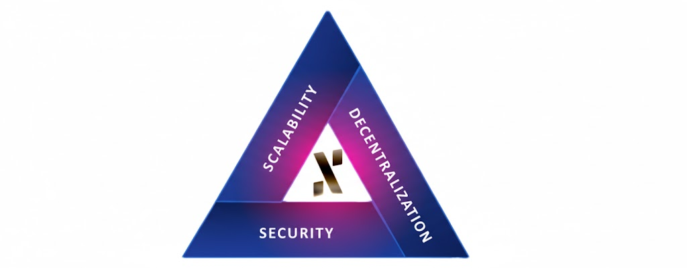
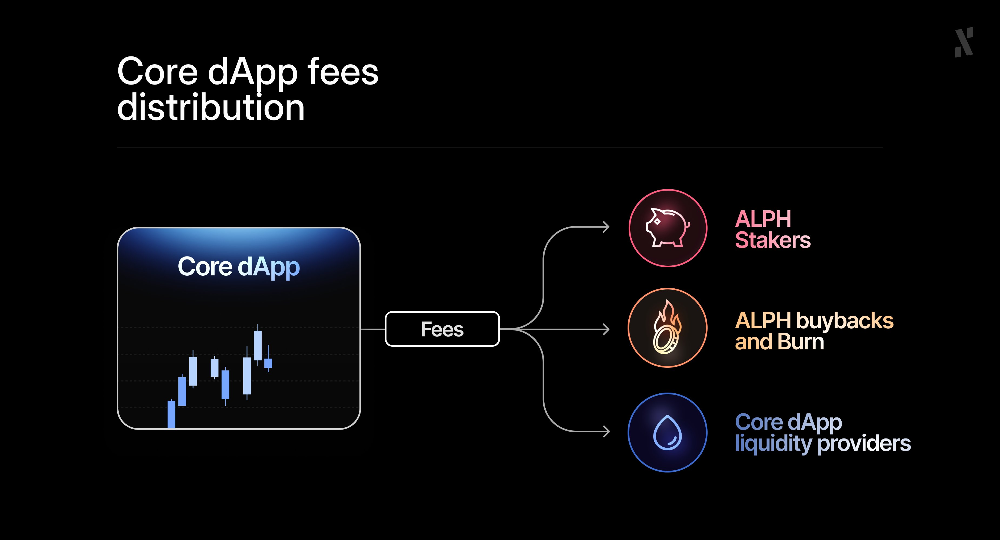

**Preface:** Please read the [Phase 2 article](/news/post/from-scalable-infrastructure-to-aligned-economics/) for context.

*TLDR; The integrity of our L1 eliminates endemic platform risk, securing our place in the DEX boom. Perfect timing, as we continue to build a protocol-owned DEX and $ALPH staking.*

Crypto is defined by cycles. As the latest one recedes, a clear trend has emerged: **the infrastructure layer is everything**. As well as clear growth in Layer 1 (L1) development, there is a notable shift in investor and developer demand. They’re looking for ecosystem stability, economic stability, and credible neutrality.

This re-fascination with L1s arrives alongside another exciting trend: **the continued dominance and rapid evolution of decentralization exchanges (DEXs)**. 

## Who is Winning at the DEX Races?

Uniswap [dominated](https://defillama.com/dexs) DEX trading volume last month with $162bn, outpacing PancakeSwap ($103bn) and other exchanges. Meteora and Pump reportedly saw the strongest growth, with 82.5% and 34.2% gains [respectively](https://x.com/CryptoDiffer/status/1975446711402389619).

Hyperliquid recently became the most profitable company in the world, [per employee](https://www.bitget.com/news/detail/12560604931687), at $102m each, overtaking Tether. Aster DEX, built on Binance Smart Chain, also smashed $1bn per day in trading volume, soon after launch, with bullish tweets from Changpeng Zhao inspiring its rapid growth.

This environment of immense financial activity raises critical questions for serious participants. In a market saturated with fragmented liquidity, complex Layer 2 (L2) solutions, and the arrival of centralized, [corporate L1s](/news/post/do-we-really-need-more-centralized-l1s/), **why is an established Proof-of-Work (PoW) chain like Alephium more relevant than ever?**

The answer is *simple*. We believe our infrastructure eliminates the inherent risks of other platforms, positioning us to become a genuine challenger with a unique offering in the ongoing DEX boom.

**Let’s explore even further.**

## When DEX and L1 are Inseparable

An essential lesson from the recent DEX volume charts is that a decentralized exchange is only ever as strong as the base layer it is built on. The DEX and the L1 are inextricably connected.

When we observe the [DEX leaderboard](https://x.com/CryptoDiffer/status/1975446711402389619), with Uniswap defined by its Ethereum foundation, PancakeSwap by the BNB Smart Chain ecosystem, and high-growth contenders like Meteora and Pump by Solana's architecture, an undeniable truth is plain for all to see. **A DEX's resilience, speed, and cost are dictated by its host chain's deepest architectural decisions**. A DEX on a congested and fragmented L1 inherits congestion and fragmentation... 

A DEX on a highly-centralized L1 inherits censorship risk. **Nobody wants that either.**

**Alephium’s Phase Two** is a direct response to this reality. 

By launching the Core dApp natively and as a protocol-owned DEX, we are ensuring that our liquidity hub is built on a foundation that is secure, scalable, and economically aligned. For us, the DEX boom is further validation that **the quality of the foundation matters most** and that we are coming at the right time.

## Phase One: The Uncompromised Foundation

To understand Alephium’s forward vision, people must acknowledge the foundation laid during our first chapter. While many critics proclaimed that Proof-of-Work could not scale, Alephium proved them wrong. It scales. People also said you couldn’t build fully fledged smart contract capability on the UTXO model. Alephium did it.

Thanks to deliberate and principled engineering choices, we offer infrastructure that is live, tested, and production-ready. This foundation has [solved](/news/post/danube-upgrade-one-step-closer-to-the-web3-we-were-promised/) what was thought to be the once-impossible trilemma of delivering scalability, security, and decentralization:

* **Seamless Sharding:** [BlockFlow](/news/post/an-introduction-to-blockflow-alephium-s-sharding-algorithm-bbbf318c3402/) was built into the protocol from day one, delivering next-gen performance without the overhead of fragile L2 solutions or complex zk-proofs.
* **Security-First Contracts:** The unique [sUTXO model](/news/post/an-introduction-to-the-stateful-utxo-model-8de3b0f76749/) enabled security-first smart contracts, a major shift that prevents common exploits at the Virtual Machine (VM) level and allows true token ownership.
* **UX as a Protocol Primitive:** User experience (UX) and developer experience (DevX) improvements were treated as core components of the protocol, ensuring simple integration and fast confirmations.

This robust foundation, established over several years while the market was entertaining other hype cycles, now provides the necessary platform to launch a truly sustainable economy. Alephium has been engineered for endurance.

## Phase Two: The Core dApp as an Engine, Not a Product

*Let’s quickly recap what we already know about Phase 2.*

Now that the technical infrastructure is proven, we enter our second chapter: [activating aligned economics](/news/post/from-scalable-infrastructure-to-aligned-economics/). This is where the foundation evolves into a self-sustaining, composable ecosystem designed for long-term resilience.

At the heart of this evolution is the Core dApp, a **Concentrated Liquidity Market Maker (CLMM) DEX**, with plans to evolve into order books and eventually perpetuals. Crucially, this is a protocol-owned, open-source benchmark designed to be the **native growth engine for the entire ecosystem**. It will grow the entire pie for all ecosystem projects.

The Core dApp is our answer to the challenge of adding value to the network while maintaining decentralization. This vision is defined by three key differentiators:

* **Fee-generating rather than inflationary:** The Core dApp (DEX) will generate swap fees, some of which will then be used for $ALPH buybacks and burns, activating new deflationary mechanisms.
* **Aligned rather than extractive:** The model ensures the success of the protocol directly benefits the community.
* **Composable rather than siloed:** The core liquidity is designed to interlock with other dApps, driving value across the [ecosystem](https://www.alph.land/).

### The Aligned Ecosystem Loop: How Liquidity Flows In

The most powerful aspect of our Phase Two strategy is the **Aligned Ecosystem Loop.** This simple, yet powerful, mechanism ensures the network gets stronger as it is used:

* **Usage generates fees:** Every transaction on the Core dApp generates swap fees.
* **Fees sustain the ecosystem:** The portion of the swap fees entitled to the Core dApp will be used exclusively to buy back $ALPH. Of the remainder, 50% will be distributed to $ALPH stakers and the other half will be burned. This creates genuine deflationary pressure and rewards long-term conviction.
* **Stakers decentralize growth:** Stakers align incentives around adoption and governance, further decentralizing growth momentum through ecosystem initiatives and DAOs.

We believe that the outcome will be a **growth flywheel** where liquidity is consistently recycled into strengthening the native asset ($ALPH) and funding community-driven development, providing stability and long-term viability.

This core liquidity will not be siloed. Instead, it will serve as the engine that drives the growth of complementary ecosystem projects. Liquidity generated by our Core DEX will be composable and flow into ecosystem dApps, enhancing their Total Value Locked (TVL) and utility. 

When the core liquidity of the chain strengthens, all ecosystem projects, large and small, will benefit instantly and proportionally. That kind of equitability is core to a healthy Web3 ecosystem.

## The L1 Foundation: Security and Scalability Uncompromised

The fundamental reason we believe **we are poised to thrive in the DEX boom** is that our infrastructure layer eliminates many of the risk factors endemic to other platforms. What does that mean in practice? Let’s take a closer look, particularly at our VM and sharding. 

### Security by VM: Exploit-Proof Smart Contracts

In DeFi, security is the ultimate premium. The losses accrued from smart contract exploits on other chains are staggering, but our unique architecture on Alephium solves this problem at the lowest level.

#### The Problem Elsewhere

The most common and devastating DeFi hacks, such as reentrancy attacks and exploits caused by two-step token approvals, are baked into the standard Account-Based model used by most competing L1s.

#### Alephium’s Solution (sUTXO)

Our innovative sUTXO model and [purpose-built VM](/news/post/meet-alphred-a-virtual-machine-like-no-others-85ce86540025/) introduce built-in safeguards that make these exploit vectors impossible by design. The logic enforces security-first smart contracts, allowing developers to focus on innovation instead of perpetually mitigating critical vulnerabilities.

This fundamental security offering makes Alephium a dependable foundation for institutional-grade DeFi and high-value applications.

### Scalability by Sharding: Solving Congestion and Fragmentation

The second existential threat to DEXs is congestion, which translates directly to unpredictable fees and slow trade finality.

#### The Problem Elsewhere

As demand surges (during a meme coin frenzy or high-volume trading day, for example), monolithic chains bottleneck, leading to skyrocketing fees and frustrating trade delays. 

Competing L2 solutions also create fragmentation, forcing users to bridge assets across multiple networks.

#### Alephium’s Solution (BlockFlow)

Alephium bypasses this limitation with our **native BlockFlow sharding**. This technology enables parallel transaction processing, helping the network to scale its capacity. Crucially, we achieve this **without fragmentation**, delivering a single-chain experience for users and developers. 

BlockFlow guarantees low, predictable fees and fast confirmations, essential for any efficient DEX.

## Final Conclusion: PoW That Sustains

The market is currently seeking certainty in an uncertain world, demanding credible neutrality, high performance, and fundamental security. 

**The sheer volume of DEX activity confirms the need for a robust and highly [decentralized](/news/post/the-nakamoto-coefficient-a-horoscope-metric-for-blockchains/) settlement layer.**

Alephium’s two-chapter journey provides the definitive answer. In the first chapter, we proved that Proof-of-Work can scale. In the second chapter, we will prove that PoW can sustain.

Resilient by design, aligned by principle, and built to last. We offer the only remaining PoW chain that is both economically aligned for long-term growth and technologically secure enough to handle the next century of decentralized finance. 

**Build here, and you are betting on this foundation.**
