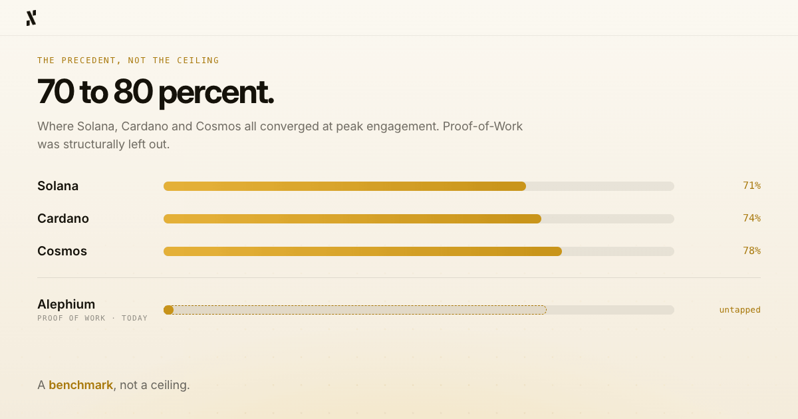
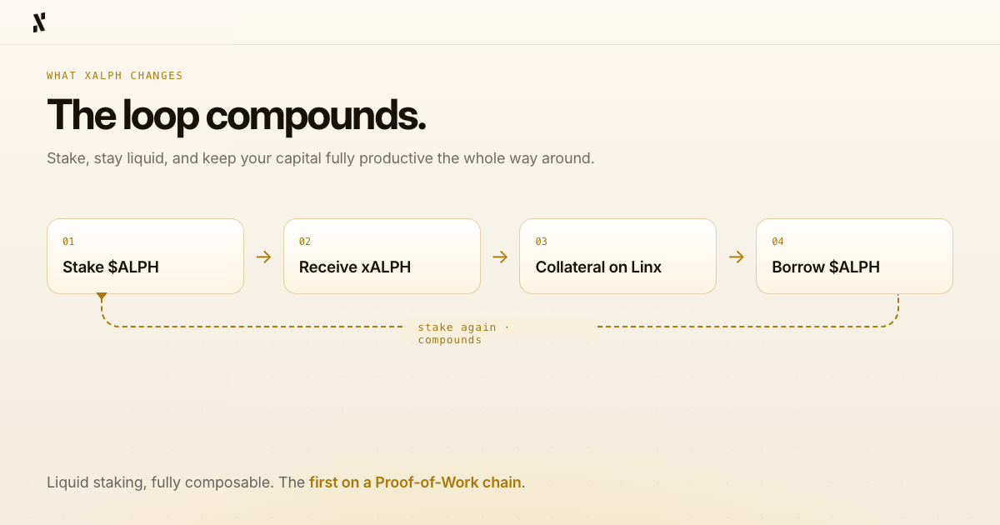

*By Pepper, Head of Marketing at Alephium*

*The thoughts and comments made in this article are those of the author, and may not represent the official views or position of Alephium.*

- - -

Proof-of-Stake and staking go hand-in-hand (the name is a big clue). For some years now, the most compelling argument for the quality of a PoS chain was not its transaction speed or the availability of developer tooling. Instead, it was the percentage of locked supply. The bigger the figure, the more attention it would get (and vice versa)

That obsession is rational, as it serves as a very useful signal. In my opinion though, it’s a much, much stronger signal than the yield percentage being offered.

When [Solana](https://streamflow.finance/blog/state-of-solana-staking) (now ~68%), [Cardano](https://web3.bitget.com/crypto-news/cardano-staking-evolution-self-custody-for-ada-holders) (now >60%), and [Cosmos](https://www.coinbase.com/earn/staking/cosmos) (now ~64%) all converged on roughly the same participation rate, with 70 to 80 percent of circulating supply committed to staking (at peak engagement), it was not a coincidence. After all, each chain is unique in its architecture and approach to incentive structures. 

I believe that the figures achieved were closer to proof of something more fundamental, that **people who believe in a network want to participate in it, earn from it, and put their conviction on the chain**. Even more, they want to do it in a way that compounds over time. 

Staking is that belief made legible and accessible, and when done right, it seems that a majority of network participants really do want to stake. Over the past year, as Head of Marketing here at Alephium, which is, as we know, a Proof-of-Work chain, I’ve observed that belief build in the community. All that’s left now is for the infrastructure to catch up, which it soon will, with the impending release of Powfi.

## Proof-of-Work Was Structurally Left Out

I can tell you, from a marketing perspective, what the PoW staking gap has looked like from the inside.

The community and ecosystem partners made it clear that they wanted it, regularly, much to my delight. The demand was so obvious and persistent that it has further driven my own conviction in what Powfi will bring to Alephium. To add even more fuel to that flame, consider the fact that meaningful, composable liquid staking simply doesn’t exist on any other PoW chain. We are breaking new ground here, and that level of ambition for a chain of our size is a bit of an underdog story.

For PoW chains, miners do a lot of the heavy lifting. This makes hashrate the default participation mechanism, while the broader community of holders and believers (those not running rigs) have had historically limited productive options to express their conviction on-chain (and earn from it).

That left an enormous amount of potential participation sitting dormant, and it’s why I feel incredibly fortunate that I joined Alephium 3 days after the [Phase 2: Aligned Economics announcement](https://x.com/alephium/article/1958886335202435548) was made. My entire tenure here has been side-by-side with the creation and delivery of this exciting DEX and staking platform. To join at that significant moment and finally see Powfi through to a successful launch will be a terrific personal milestone. For the loyal community, I can only presume that it will have even more impact, meaning, and purpose. 

Here’s how I try to measure and rationalise the potential. If you apply the 70 to 80 percent precedent I mentioned earlier to $ALPH's circulating supply, the scale of what was going unrealised is massive. So, more than just a speculative figure, that band becomes a data-driven observation about the psychological response of active communities and how they behave when the infrastructure exists to support them and their active conviction.

## What xALPH Changes for Alephium

As we now know, xALPH will serve as Powfi's liquid staking token, and it will do something that has never before existed on a Proof-of-Work chain. 

*“Stake your $ALPH, receive xALPH, and keep earning staking rewards while your capital stays fully productive”.* 

There will be no strict lock-up forcing you to choose between network participation and liquidity, because if you decide to exit before the 30-day window, you can just use the ALPH-xALPH liquidity pool. The infrastructure is designed to serve the participants, rather than constrain them. Actually, xALPH has been engineered to go considerably further than just serving the community.

Since xALPH will be liquid, it can be used as collateral. Stake $ALPH, receive xALPH, use xALPH as collateral on [Linx](https://app.linxlabs.org/), borrow $ALPH, and stake again. Your original position will be yield-bearing throughout the loop, so your collateral appreciates as staking rewards accumulate. **The loop compounds.** 

This looping model exists in DeFi already, we didn’t invent it, but this design has never been available on a Proof-of-Work chain before (at least not to my knowledge and research, but happy to be proven wrong). That’s why Powfi and xALPH are special.

For Linx users, xALPH will also unlock USDT borrowing, meaning safer collateral, cheaper borrowing terms, and a position that grows in value while you hold the loan. What does this mean for the community and users? From where I’m sitting, it will clearly drive more logical capital efficiency, rather than just providing leverage for the sake of it.

## The Demand Signal That Told Us Everything

The most telling indicator I’ve seen didn’t come from a market research report, but from our own team conversations. When the penny dropped, the vision ahead was as clear as day.

Almost every ecosystem partner we’ve spoken to recently has said the same thing, that they want to offer $ALPH staking to their own users. As soon as Powfi is live, they’ll be able to use the SDK to integrate it. For our core contributors who have worked tirelessly on this project, the demand signal arrived before the product was ready. That’s always encouraging.

Partners, builders, and devs were asking us about xALPH integration even before we hit testnet. In my experience from over a decade in tech, when appetite precedes the product, you are building into a genuine market gap rather than hoping one opens up. The Product-Market Fit (PMF) is therefore baked right into the tech, allowing devs to build with even more alignment and user consideration.

This is, naturally, a great position to be in on the development side, as it reinforces the conviction behind Alephium's tech stack. The infrastructure was always there, with the sUTXO model, BlockFlow sharding, the possibility for over 20,000 transactions per second without fragmentation, and smart contract security that eliminates entire categories of exploit at the virtual machine level. All that was missing was the economic layer that would let the community put their conviction to work.

*xALPH will deliver that layer, and, like many of you reading this, I’m buzzing for it.*

## The Precedent, Not the Ceiling

I want to finish by referencing the 70%-80% staking figure one last time. On all chains that reached these high conviction levels, **staking numbers did not materialise overnight**. 

So, we are managing our expectations for growth and alignment, and believe our patient community will too. It took other chains time to grow this figure, and that growth took place alongside other new infrastructure, deeper integrations, and emerging community methods for putting their staked positions to work.

Cardano offered a friction-free delegation model, Cosmos delivered governance yield dynamics, and Solana made native staking simple. For each of these chains, they found a path that reached the desired destination while meeting the needs of their community, a point where the proportion of circulating supply committed to staking hit notable levels.

Unlike every chain that got there before us, we have the added advantage of being the only Proof-of-Work network to offer it. For the holders, the believers, and the long-term participants who have always wanted a way to earn from the network they believe in, xALPH will bring about positive change.

*By the way, we aren’t looking at that 70 to 80 percent figure as a ceiling, but a benchmark.*
