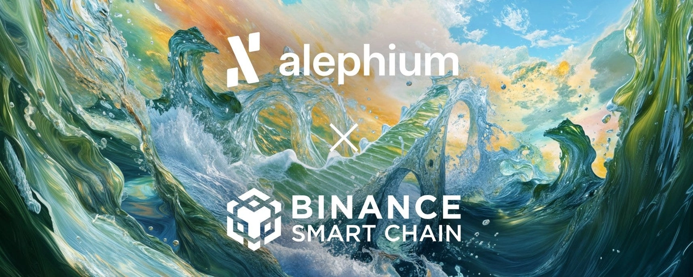
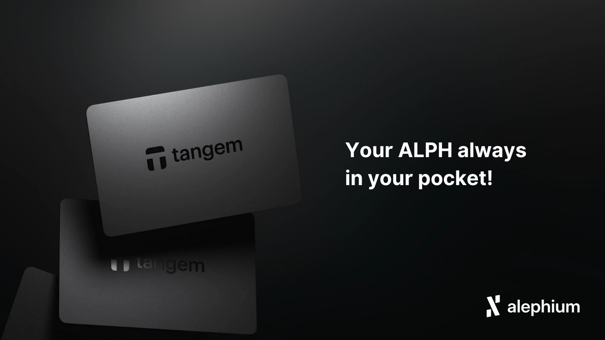

On Saturday, 8th November, Alephium reached four years “on-chain”. 

To mark the occasion, take a look at twelve articles from the past 12 months that demonstrate our commitment to building, delivering, forging exciting partnerships, and continuing to innovate in the decentralized world.

## 1. Alephium <> BNB Chain (BSC)

For a non-EVM chain such as Alephium, building bridges to other active networks is incredibly important. It has been almost one year since the BSC bridge went live.

[Read the full article.](/news/post/the-bridge-to-bsc-is-live-a19d99625316/)

## 2. Alephium x GIGATONS

GIGATONS and Alephium forged a strategic partnership to accelerate the transition to a sustainable future. This announcement was a major moment in the past year and continues to excite many community members.

[Read more on the GIGATONS website.](https://www.gigatons.com/newsroom/alephium-strategic-partnership)

## 3. Alephium x CryptoXR Hackathon

Alephium hosted an exceptional hackathon in Auxerre at CryptoXR, pushing forward the future of Web3. Cheng and Hongchao were joined by Nicolas Bacca of Ledger on the judges' panel.

[Read the press release here.](https://www.cointribune.com/en/cryptoxr-2025-an-exceptional-hackathon-for-the-future-of-web3/)

## 4. Alephium x Hacken

Security is everything, and while Alephium is secure by design and engineering, it doesn't hurt to beef up security by having the right partnerships in place.

[Enjoy the full announcement here.](/news/post/alephium-partners-with-hacken-to-enhance-blockchain-security-2ad2f4d63db8/)

## 5. Alephium x DIA <> Oracles

Verifiable Random Function (VRF) Oracles arrived on Alephium thanks to an exciting integration with DIA. This seemingly simple feature is a game changer for a number of our dApps.

[Gain a full understanding here.](/news/post/dia-vrf-oracles-now-live-on-alephium-3837118a92f9/)

## 6. Alephium x Tangem Wallet

Cold storage wallets are the best way to secure your long term holdings. Now, with ALPH supported by Tangem wallet, you can do exactly that.

[Read more about this partnership news.](/news/post/alephium-now-supported-by-tangem-wallet-c0f4946559e2/)

## 7. Alephium x Onramper

One of the biggest barriers to Web3 is onboarding. We eased this issue with a brilliant partnership with Onramper.

[Get started here!](/news/post/making-alph-more-accessible-than-ever/)

## 8. Alephium + Danube Upgrade

Danube was the biggest upgrade Alephium has ever done, and marked one of the most important moments of the past 12 months.

[Learn everything about Danube here.](/news/post/danube-upgrade-everything-you-need-to-know-faq/)

## 9. Alephium x PrimeVault

Institutional access to DeFi has been one of the biggest trends of the last year, and is something we intentionally addressed through a partnership with PrimeVault.

[What does this mean for Alephium?](/news/post/primevault-x-alephium-unlocking-institutional-access-to-defi-on-proof-of-work/)

## 10. Alephium + Phase 2: Aligned Economics

After delivering Danube, we planned and announced the next major update. With a Core dApp (CLMM DEX) and $ALPH staking on the way, there's good reason to be excited about the future of coin utility on Alephium.

[Understanding Aligned Economics.](/news/post/from-scalable-infrastructure-to-aligned-economics/)

## 11. Alephium x EMCD

Not only did EMCD list $ALPH, but they also added ALPH mining pools to their all-in-one-app.

[Read more here.](/news/post/alephium-alph-is-now-live-on-emcd/)

## 12. Alephium Bridge + Redesign

Most recently, our frontend team redesigned and revamped the Alephium Bridge.

[Test it for yourself!](https://bridge.alephium.org/#/bridge)

## What’s next?

As for the next 12 months, the Core dApp, $ALPH staking, and other exciting developments are on the horizon.

Want to be part of our next milestones?

[Join the Alephium community](https://linktree.com/alephium).
