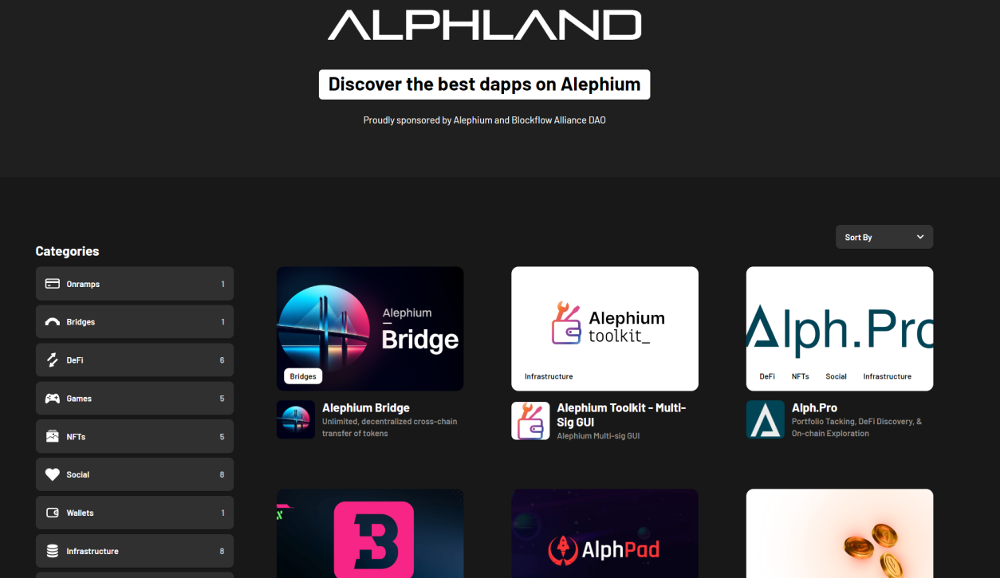
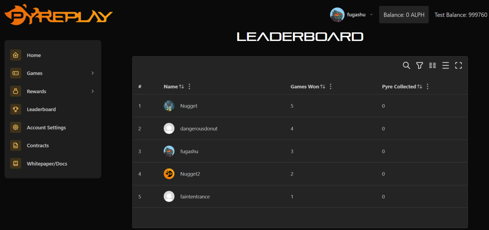
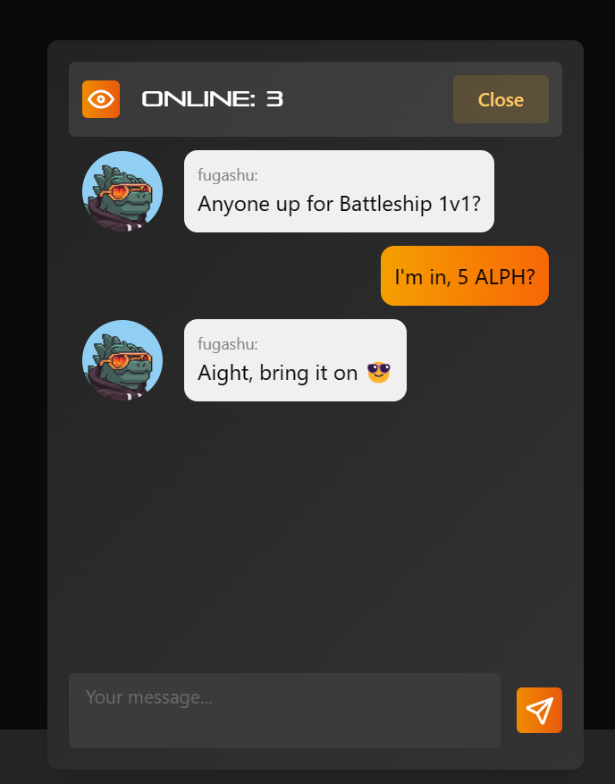

_Our ecosystem thrives with developers building amazing projects on top of Alephium, delivering a unique experience and providing real utility for users. In the Builders Highlight series, they share more about their projects, thoughts, and insights on why building on Alephium. You can find_ <a href="https://medium.com/@alephium/builders-highlight-sezame-wallet-ddb4aeb61881" data-href="https://medium.com/@alephium/builders-highlight-sezame-wallet-ddb4aeb61881"><em>#1</em></a>_,_ <a href="https://medium.com/@alephium/builders-highlight-alphpaca-nfts-99c69775f04c" data-href="https://medium.com/@alephium/builders-highlight-alphpaca-nfts-99c69775f04c"><em>#2</em></a>, <a href="https://medium.com/@alephium/builders-highlight-3-ayin-6be4a6bd4ec2" data-href="https://medium.com/@alephium/builders-highlight-3-ayin-6be4a6bd4ec2"><em>#3</em></a>, <a href="https://medium.com/@alephium/builders-highlight-4-no-trust-verify-9ea495ca826f" data-href="https://medium.com/@alephium/builders-highlight-4-no-trust-verify-9ea495ca826f"><em>#4</em></a>, <a href="https://medium.com/@alephium/builders-highlight-5-deadrare-d5ff90d6161e" data-href="https://medium.com/@alephium/builders-highlight-5-deadrare-d5ff90d6161e"><em>#5</em></a>, <a href="https://medium.com/@alephium/builders-highlight-6-what-the-duck-0aedc602ecfd" data-href="https://medium.com/@alephium/builders-highlight-6-what-the-duck-0aedc602ecfd"><em>#6</em></a>, <a href="https://medium.com/@alephium/builders-highlight-7-alphpad-bbd4f4a34fd5" data-href="https://medium.com/@alephium/builders-highlight-7-alphpad-bbd4f4a34fd5"><em>#7</em></a>, <a href="https://medium.com/@alephium/builders-highlight-8-ngu-money-f8bf05e36e99" data-href="https://medium.com/@alephium/builders-highlight-8-ngu-money-f8bf05e36e99"><em>#8</em></a>_,_ <a href="https://medium.com/@alephium/builders-highlight-9-mobula-f9c45dc6c691" data-href="https://medium.com/@alephium/builders-highlight-9-mobula-f9c45dc6c691"><em>#9,</em></a> _and_ <a href="https://medium.com/@alephium/builders-highlight-10-amolyus-39e03b6bd3f0" data-href="https://medium.com/@alephium/builders-highlight-10-amolyus-39e03b6bd3f0"><em>#10</em></a> _here!_

Today, we welcome <a href="https://twitter.com/fugashu_codes" data-href="https://twitter.com/fugashu_codes">Fugashu</a>! Hyperactive, and builder of many things! Starting with <a href="https://stats.alph.land/" data-href="https://stats.alph.land/">useful</a> <a href="https://stats.alph.land/" data-href="https://stats.alph.land/">ecosystem</a> <a href="https://visualizer.alph.land/" data-href="https://visualizer.alph.land/">tools</a> such as alph.land and the visualizer, he is now focused on a gaming platform called <a href="https://www.pyreplay.com/" data-href="https://www.pyreplay.com/">Pyreplay</a>.

Here, he shares with us some insights his life in Alephium’s ecosystem, tools & world, and his plans for the future!

#### Hi! Please tell us a bit about yourself. Who are you? Where are you? What do you do? (As a job, as a hobby, or in general!)

Hello! I’m a full-time developer based in Germany, and I have been working since 2020. Professionally, I develop embedded software for dialysis machines and teach C++ at a local university.

My interest in web development began as a hobby but has since evolved into a professional endeavour, particularly within the cryptocurrency sector. Outside work, I enjoy spending time with my family, hiking, caring for my houseplants, and playing Magic: The Gathering.

#### Can you tell us a bit about your journey in tech/crypto?

From a young age, I was captivated by technology, physics, and mathematics, which led me to pursue a career in engineering. My introduction to cryptocurrency came in 2017 during my computer science studies when a friend introduced me to Iota.

I quickly immersed myself in the field, built an Ethereum mining rig, invested spare funds, and explored the underlying technology. Post-graduation, I teamed up with a close university friend to develop dApps as a hobby, which led to the founding of our company, which delivers both Web2 and Web3 software solutions. We already developed an NFT marketplace, tokenized physical assets, and contributed to platforms like Immutable, Opensea, and Alephium.

#### How did you find out about Alephium? What did you find here that you didn’t find elsewhere?

I learned about Alephium through a German Telegram group that shares new blockchain projects. What initially attracted me was the user-friendly interface and robust toolset of Alephium’s platform.

After researching, I was impressed by its unique features, such as the <a href="https://medium.com/@alephium/alephiums-aps-eliminating-evm-token-approval-risks-5407e7e70a33#:~:text=Understanding%20Alephium%27s%20Asset%20Permission%20System&amp;text=One%20important%20feature%20of%20the,These%20transactions%20can%20support%20TxScript." data-href="https://medium.com/@alephium/alephiums-aps-eliminating-evm-token-approval-risks-5407e7e70a33#:~:text=Understanding%20Alephium&#39;s%20Asset%20Permission%20System&amp;text=One%20important%20feature%20of%20the,These%20transactions%20can%20support%20TxScript.">Asset Permission System</a> and the <a href="https://medium.com/@alephium/tech-talk-1-the-ultimate-guide-to-proof-of-less-work-the-universe-and-everything-ba70644ab301" data-href="https://medium.com/@alephium/tech-talk-1-the-ultimate-guide-to-proof-of-less-work-the-universe-and-everything-ba70644ab301">Proof of Less Work</a> concept, which are not typically found in EVM-based platforms. The strong academic contributions from Cheng and industry connections to Vitalik also significantly influenced my decision to build on Alephium.

#### You’ve been one of the big winners of the hackathon. How was your experience hacking in there? How’s the learning curve to get going? What took the most time to grasp?

<a href="https://medium.com/@alephium/hackathon-1-pioneers-submissions-76b869089ace" data-href="https://medium.com/@alephium/hackathon-1-pioneers-submissions-76b869089ace">Participating in the hackathon</a> was an amazing experience. I was particularly drawn to the challenge of visualizing Alephium’s sharding algorithm through a 3D interactive environment, a task that required me to learn <a href="https://threejs.org/" data-href="https://threejs.org/">Three.js</a> from scratch. Developing both the front-end visualizer and an efficient backend to manage real-time data was challenging, especially while juggling a full-time job.

On the backend, we set up a buffer to manage incoming blocks and introduced an open-source websocket that streams block data in real time. Initially, we encountered some challenges with the websocket intermittently blocking our Redis worker, which was quite troublesome.

After some investigation, we determined that the problem stemmed from the library we were using. I’m proud that we managed to deliver a functional product within two weeks and also secure a <a href="https://medium.com/@alephium/hackathon-winners-announced-68d55711b99d" data-href="https://medium.com/@alephium/hackathon-winners-announced-68d55711b99d">top prize</a> and the <a href="https://twitter.com/alephium/status/1771598954373038443" data-href="https://twitter.com/alephium/status/1771598954373038443">Bitmain special prize</a>!

#### **Tell us a little bit about your history with Alephium, because it’s been a little while you’ve been around! First you built alph.land, then the visualizer for the hackathon and since then you created both a NFT collection & are working on a game! Let’s start with alph.land… What’s your vision for its development?**

<a href="http://alph.land" data-href="http://alph.land">Alph.land</a> serves as a virtual information hub where newcomers can easily discover and explore ongoing projects within the Alephium blockchain. My vision for alph.land is to continue enhancing its functionality to better serve the community’s needs, with success indicators being frequent community engagement and new project integrations & pull requests.

#### What about the stats/visualizer? Your project has been commended for enhancing the understanding of the Alephium blockchain. What inspired you to focus on visualizing the blockflow sharding algorithm? Will you evolve it to visualize more things? Or was it a one-off for the hackathon?

<a href="https://stats.alph.land/" data-href="https://stats.alph.land/">The stats dashboard</a> was initially a proof of concept, and we plan to include more statistics in the future. A community member introduced me to the idea of the <a href="https://visualizer.alph.land/" data-href="https://visualizer.alph.land/">visualizer.</a> Having long been interested in 3D web development, I decided to dive in!

The results have been quite impressive, at least to me. As a teacher who enjoys sharing knowledge, I see this as a fantastic tool to help others grasp complex technical papers and algorithms through visual representation. While I may enhance or add more statistics to this project, my current focus is entirely on developing Pyreplay. :)

#### Tell us more about Pyreplay, which seems to be your most ambitious project! You started with a bang as your NFT collection minted really fast. Can you describe what pyreplay is, how do the NFTs interact with it?

<a href="http://pyreplay.com" data-href="http://pyreplay.com">Pyreplay</a> is envisioned as a competitive arcade platform where users can engage in various mini-games and classic arcade challenges. The overwhelming support from the Alephium community, evidenced by our NFT collection selling out in just four hours, was truly heartening. These NFTs not only offer holders reduced gameplay costs but also a share in the project’s revenue, embedding them deeply into the ecosystem of Pyreplay. Thank you to everyone who has supports me on this journey and believes in the same vision!

#### How do you see the future of the Pyreplay? What’s on your roadmap? What would be the Pyreplay moonshot?

The ideal future for Pyreplay is a vibrant and expanding community of players. Our roadmap includes scaling up the number of games and incorporating community tokens on Alephium. The ‘moonshot’ for Pyreplay would be establishing it as a leading platform in blockchain-based competitive gaming, with continual growth in our player base and game offerings.

#### What advice would you give to someone looking to build on Alephium, based on your experience? In your opinion, how can the Alephium ecosystem foster a more vibrant developer community?

The community is incredibly supportive, and you can find assistance in the dedicated Discord channels. My suggestion is straightforward: focus on projects that truly excite you.

When you have a genuine passion for your project, staying motivated and overcoming obstacles becomes easier. As Alephium is growing quickly, the documentation may not always be current, and there might be a need for additional helper functions, but this is a small price to pay for being involved so early on.

#### Where can we stay in touch with your project & with you? Is it possible to contribute?

I’m regularly active on Discord and Twitter, which are great platforms to connect with me.

Alph.land, Stats, and the Blockchain Visualizer are all open-source projects, and I always welcome contributions. Pyreplay is closed source (at least for now).

**Github repo links:**

<a href="https://github.com/CodeBaristas" data-href="https://github.com/CodeBaristas" rel="nofollow noopener">https://github.com/CodeBaristas</a>,

<a href="https://github.com/Fugashu" data-href="https://github.com/Fugashu" rel="nofollow noopener">https://github.com/Fugashu</a>,

<a href="https://github.com/Cojodi/alphland" data-href="https://github.com/Cojodi/alphland" rel="nofollow noopener">https://github.com/Cojodi/alphland</a>

**Websites:**

<a href="http://alph.land" data-href="http://alph.land">alph.land</a>

<a href="http://visualizer.alph.land," data-href="http://visualizer.alph.land,">visualizer.alph.land</a>

<a href="http://stats.alph.land" data-href="http://stats.alph.land">stats.alph.land</a>

<a href="http://docs.pyreplay.com" data-href="http://docs.pyreplay.com">docs.pyreplay.com</a>

Thank you, Fugashu, for your answers!

---

_Disclaimer: While Alephium is happy to support a growing developer community, it would like to clarify that it does not endorse, audit, or review any software presented in this series and encourages all users to make informed decisions and take personal responsibility for their actions._

Have you built something or have a nice idea and want to request a grant or reward? You can access the <a href="https://github.com/alephium/community/blob/master/Grant%26RewardProgram.md" data-href="https://github.com/alephium/community/blob/master/Grant%26RewardProgram.md">Alephium Community Grants &amp; Reward Program page</a> for more info!
