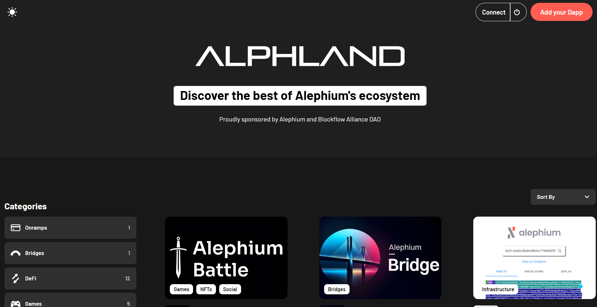
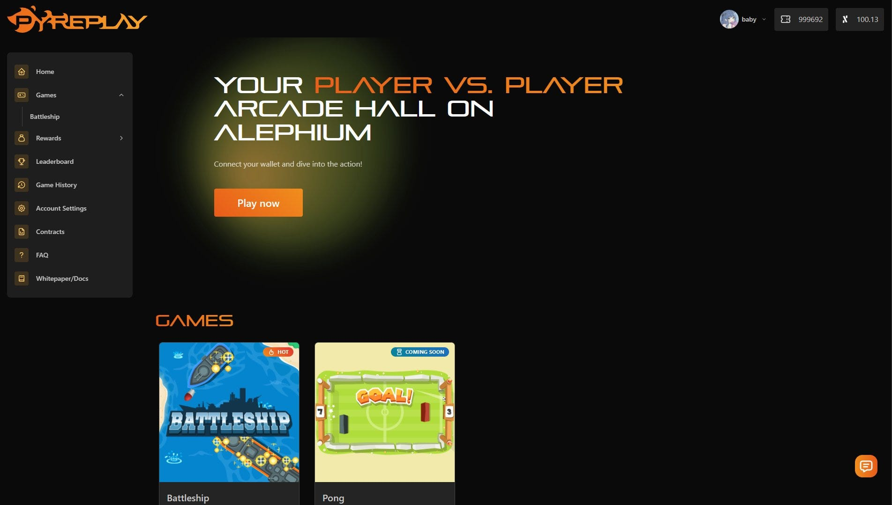
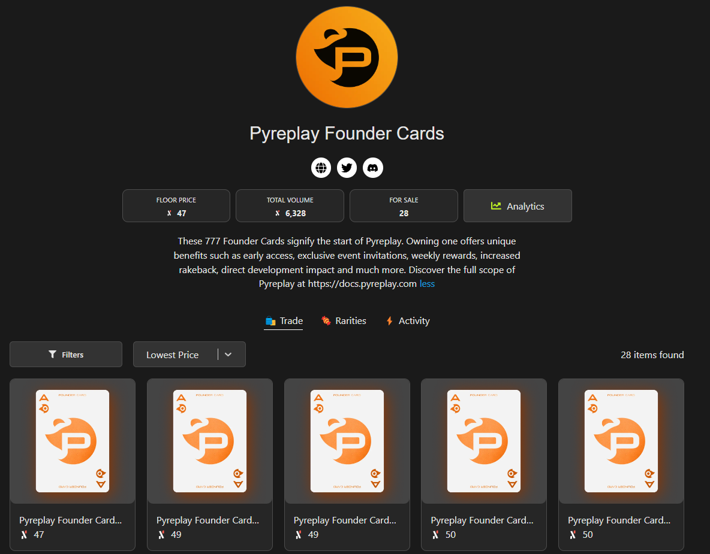

_This interview was conducted around the Athens Builders Meetup, which took place at the end of June 2024. If you’re just discovering Alephium’s ecosystem, it’s a great way to learn about all the main projects!_

Jonas, aka <a href="https://x.com/fugashu_codes" data-href="https://x.com/fugashu_codes">Fugashu</a>, and his partner <a href="https://x.com/notdimfred" data-href="https://x.com/notdimfred">Dmitrij</a> share their journey into crypto, their projects <a href="http://Alph.Land" data-href="http://Alph.Land">Alph.Land</a> and <a href="https://www.pyreplay.com/" data-href="https://www.pyreplay.com/">PyrePlay</a> on Alephium, and the supportive community that drew them to the platform. They also discussed their experience at the Alephium Builders meetup and their plans for PyrePlay’s future. Find the full (slightly edited) transcript below if you prefer reading.

`video: https://www.youtube.com/watch?v=LMgsXYtiY4M`

#### Who are you, and what do you do?

I’m Jonas, but you might know me better as <a href="https://x.com/fugashu_codes" data-href="https://x.com/fugashu_codes">Fugashu</a>. Since November last year, I’ve been building on Alephium, creating projects like <a href="http://alph.land" data-href="http://alph.land">Alph.Land</a> and <a href="https://www.pyreplay.com/" data-href="https://www.pyreplay.com/">PyrePlay</a>. I’m very active in the Alephium Discord community. My partner, <a href="https://x.com/notdimfred" data-href="https://x.com/notdimfred">Dmitrij</a>, handles the backend work and smart contract development for PyrePlay.

#### How did you get into crypto?

We got into crypto back in 2017 after a friend introduced us to Iota, a layer one blockchain. That sparked our interest, and we started digging deeper into blockchain technology. By 2019 or 2020, we were experimenting with Ethereum, and when the pandemic hit, we decided to dive into developing our own crypto projects.

#### How did you discover Alephium?

I found Alephium through some friends in a crypto group who recommended it. The website caught my attention immediately — it was clean and well-organized, making a great first impression. What really drew me in was the strong community support and the backing from the Alephium team. It felt like the right place for us to build.

#### What is Alph.Land?

Alph.Land is an aggregator for dApps built on Alephium. When you’re new to a blockchain, it can be hard to find out what projects are out there. Alph.Land solves that by providing a central hub where you can easily discover and interact with different dApps in the Alephium ecosystem.

#### Can you explain what PyrePlay is?

PyrePlay is a gaming platform on the Alephium blockchain. I’ve been a gamer since I was a kid, and I wanted to bring the fun of classic arcade games to the blockchain. With PyrePlay, players can compete against each other in quick games like battleship, wagering small amounts of \$ALPH. The idea is to create an arcade hall experience, but on the blockchain.

#### How do NFTs fit into PyrePlay?

We <a href="https://deadrare.io/collection/pyreplay-founder-cards" data-href="https://deadrare.io/collection/pyreplay-founder-cards">released NFTs</a> that act like founder packages. If you hold one of these NFTs, you’re basically part of the PyrePlay family. You’ll get a share of the platform fees, cheaper entry to games, and the satisfaction of knowing you’re helping to shape the development of PyrePlay.

#### What are your plans for the future of PyrePlay?

Right now, we’re focusing on integrating smart contracts into PyrePlay. We’ve got plans to roll out more games in the future, including multiplayer games like battle royales. Once the infrastructure is solid, we’ll be able to release new games more quickly.

#### How was your experience at the Alephium Builders meetup?

The Builders meetup in Athens was fantastic. It was great to finally meet the faces behind the avatars I’ve been chatting with. We had the chance to strengthen our connections and even make some new ones. It was an awesome experience to meet everyone in person and see the passion in the community.

What we really appreciate about Alephium is the strong community and the incredible support from the core team. They go out of their way to help developers succeed, which you don’t see everywhere. I’m excited to keep building here and to see where we can take PyrePlay.

---

**Links:**

**Alph.land**  
Website: <a href="https://www.alph.land/" data-href="https://www.alph.land/" rel="nofollow noopener">https://www.alph.land/</a>  
Visualizer: <a href="https://t.co/pUXfpQOUCp" data-href="https://t.co/pUXfpQOUCp" rel="noopener noreferrer nofollow noopener">https://visualizer.alph.land</a>

**Pyreplay**  
Website: <a href="https://www.pyreplay.com/" data-href="https://www.pyreplay.com/" rel="nofollow noopener">https://www.pyreplay.com/</a>  
Twitter: <a href="https://twitter.com/PyreplayDotCom" data-href="https://twitter.com/PyreplayDotCom" rel="nofollow noopener">https://twitter.com/PyreplayDotCom</a>  
Discord: <a href="https://discord.gg/BHUx8KqvSF" data-href="https://discord.gg/BHUx8KqvSF" rel="nofollow noopener">https://discord.gg/BHUx8KqvSF</a>

---

Dimi was a speaker at the Athens Builders Meetup!

`video: https://www.youtube.com/watch?v=iVoNJRzxLGU`

You can also find all the talks of the Athens Builders Meetup <a href="https://medium.com/@alephium/all-the-athens-meetup-presentations-f419195640ce" data-href="https://medium.com/@alephium/all-the-athens-meetup-presentations-f419195640ce">here</a>.

---

For any questions or feedback, reach out to us on [Discord](/discord) or <a href="https://t.me/alephiumgroup" data-href="https://t.me/alephiumgroup">Telegram</a>, and follow <a href="https://x.com/alephium" data-href="https://x.com/alephium">@alephium on Twitter</a> for the latest updates!
