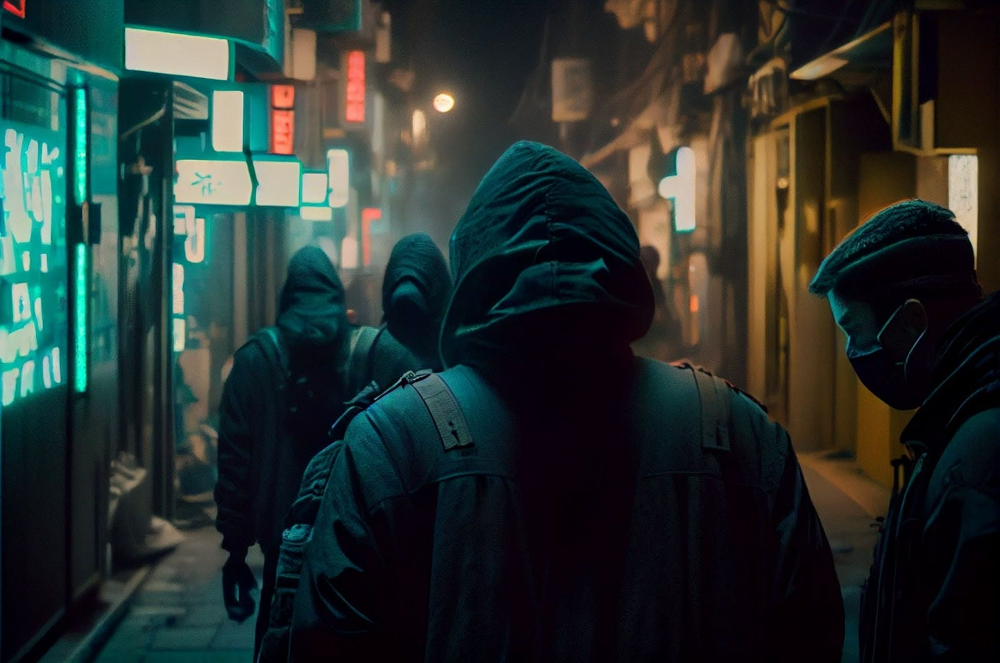

#### _Once in a while, the spotlight is put on one active member of the Alephium community. This is an opportunity to showcase community members’ contributions to the ecosystem, what drives them, and what they are passionate about! More episodes:_ <a href="https://medium.com/@alephium/community-highlight-wilhelm-k%C3%A4llstr%C3%B6m-aka-oracleuggla-81d3938c5692" data-href="https://medium.com/@alephium/community-highlight-wilhelm-k%C3%A4llstr%C3%B6m-aka-oracleuggla-81d3938c5692"><em>#1 here</em></a>_,_ <a href="https://medium.com/@alephium/community-highlight-cgi-bin-c102cc106f19" data-href="https://medium.com/@alephium/community-highlight-cgi-bin-c102cc106f19"><em>#2 here</em></a>_,_ <a href="https://medium.com/@alephium/community-highlight-3-digdug-48a7ec868504" data-href="https://medium.com/@alephium/community-highlight-3-digdug-48a7ec868504"><em>#3 here</em></a>_,_ <a href="https://medium.com/@alephium/community-highlight-4-montail-e24fd88882a0" data-href="https://medium.com/@alephium/community-highlight-4-montail-e24fd88882a0"><em>#4 here</em></a>_,_ <a href="https://medium.com/@alephium/community-highlight-5-txn-71c4fd76ffe8" data-href="https://medium.com/@alephium/community-highlight-5-txn-71c4fd76ffe8"><em>#5 here</em></a>, _and_ <a href="https://medium.com/@alephium/community-highlight-6-waldi-zkit-beats-37af1f6df3b8" data-href="https://medium.com/@alephium/community-highlight-6-waldi-zkit-beats-37af1f6df3b8"><em>#6 here</em></a>_._

**Today’s spotlight is shining on the very definition of an “Alephium OG”. Not only did they join the project’s community very early on, they instinctively began helping their peers to better understand the intricacies and specifics of the project. Oheka is the type of person that will not rest on trust as a given; only verifiable facts are meaningful to them. While this is not rare in the educated fringes of the crypto space, Oheka is generous about their findings. They continuously encourage their fellow Alephians to do their own research by showing the way into the knowledge base.**

#### What can we call you and where should we picture you ?

I can take different identities, but you can call me Oheka. I come from <a href="https://www.eff.org/cyberspace-independence" data-href="https://www.eff.org/cyberspace-independence">Cyberspace, the new home of Mind</a>.

#### Tell us about yourself/your persona.

I am an active contributor to some projects, especially in the area of <a href="https://en.wikipedia.org/wiki/Decentralized_autonomous_organization" data-href="https://en.wikipedia.org/wiki/Decentralized_autonomous_organization">Decentralized Autonomous Organization</a> and privacy. With the tireless and talented cgi-bin (whom I met in the Alephium community) we founded <a href="https://nym.notrustverify.ch/" data-href="https://nym.notrustverify.ch/">No Trust Verify</a>. With the whole NTV team, we actively support and contribute to the Nym Technologies mixnet, whether it’s with our infrastructure, educating and raising awareness of privacy issues, or developing projects like <a href="https://pastenym.ch" data-href="https://pastenym.ch">pastenym</a>. By the way, we would also be happy to contribute to the integration of <a href="https://github.com/alephium/desktop-wallet/issues/496" data-href="https://github.com/alephium/desktop-wallet/issues/496">Alephium’s native wallet into NymConnect.</a>

Outside the intangible boundaries of cyberspace, I am a hyperactive person with eclectic hobbies. As a Budōka, I enjoy spending time on the tatami studying and practicing Budō to sharpen the body and mind. Otherwise, as a big fan of the cyberpunk genre, I like to escape my mind through works like Neuromancer or Blade Runner. I also like to write and make graphic creations on the subject in my spare time.

#### How did you find out about Alephium?

I heard about it from Polto, and I watched Cheng Wang’s presentation about sharding that he gave at the <a href="https://www.youtube.com/watch?v=_SjtXp6F43k" data-href="https://www.youtube.com/watch?v=_SjtXp6F43k">36th Chaos Communication Congress</a>. I started to get more seriously interested in the project after <a href="https://www.youtube.com/watch?v=yq6A99DI1nk&amp;list=PL8q8n0BHJS1Pats4NTUrZ0who3BuqkZOY" data-href="https://www.youtube.com/watch?v=yq6A99DI1nk&amp;list=PL8q8n0BHJS1Pats4NTUrZ0who3BuqkZOY">Alephium’s first live AMA</a>.

#### What excites you about Alephium?

Alephium has a real value proposition with a unique approach to <a href="https://docs.alephium.org/glossary#sharding" data-href="https://docs.alephium.org/glossary#sharding">sharding</a> and <a href="https://docs.alephium.org/dapps/getting-started" data-href="https://docs.alephium.org/dapps/getting-started">smart contracts</a> based on the Bitcoin technology stack (Proof-Of-Work and UTXO) while addressing energy issues with its <a href="https://medium.com/@alephium/tech-talk-1-proof-of-less-work-ama-3d5afbf78c71" data-href="https://medium.com/@alephium/tech-talk-1-proof-of-less-work-ama-3d5afbf78c71">Proof of Less Work</a> algorithm.

In my opinion, the Alephium project proposes a new paradigm that is an interesting approach to the <a href="https://coinmarketcap.com/alexandria/glossary/blockchain-trilemma" data-href="https://coinmarketcap.com/alexandria/glossary/blockchain-trilemma">blockchain trilemma</a>: security — decentralization — scalability.

> The fact that it is based on the Bitcoin technology stack, the ease of <a href="https://medium.com/@alephium/running-a-blockchain-node-on-raspberry-pi-bac0a2afc208" class="markup--anchor markup--pullquote-anchor" data-href="https://medium.com/@alephium/running-a-blockchain-node-on-raspberry-pi-bac0a2afc208">running a full-node</a>, and its approach to sharding Alephium has all the qualities in hand to answer this.

In addition, I really appreciate the [transparency and the listening](/discord) of the Alephium team towards the community and its way of involving it.

#### How do you contribute to the Alephium ecosystem?

I try to bring my modest contribution by trying to promote the project, especially in the French sphere, and by making <a href="https://medium.com/@Oheka/tutorial-host-your-alephium-node-via-flux-2134def9b7d0" data-href="https://medium.com/@Oheka/tutorial-host-your-alephium-node-via-flux-2134def9b7d0">articles</a> & <a href="https://medium.com/@Oheka/le-front-end-de-la-mise-%C3%A0-jour-leman-d19049a3e0a0" data-href="https://medium.com/@Oheka/le-front-end-de-la-mise-%C3%A0-jour-leman-d19049a3e0a0">translations</a> in the language of Molière, especially on Medium.

In order to attract developers and future users, it is important for the project to have a global and inclusive communication. It is with great pleasure that I can contribute to make the project and its intrinsic qualities known and I invite motivated people to join the Alephians to contribute in this sense. You are very welcome!

#### What makes you excited about the future of Alephium?

In the short term, without much suspense, like many in the community, I am looking forward to the <a href="https://medium.com/@alephium/announcing-the-leman-network-upgrade-c01a81e65f0e" data-href="https://medium.com/@alephium/announcing-the-leman-network-upgrade-c01a81e65f0e">Leman network upgrade</a> which will be a catalyst for the development of the project. In the future, I look forward to seeing more and more developers come and build the dApps and thus grow the Alephium ecosystem.

#### You are involved in several projects. What they seem to have in common is a gravitation around data-privacy protection. How do you envision the role of blockchain tech in the advancement of data-privacy for everyone?

I think in some cases, blockchains could potentially limit the impact of privacy erosion by enabling the emergence of new interaction paradigms that are more respectful of digital sovereignty. Technology building bricks such as <a href="https://docs.alephium.org/dapps/getting-started" data-href="https://docs.alephium.org/dapps/getting-started">smart contracts</a>, <a href="https://en.wikipedia.org/wiki/Decentralized_identifier" data-href="https://en.wikipedia.org/wiki/Decentralized_identifier">DID</a>, <a href="https://en.wikipedia.org/wiki/Zero-knowledge_proof" data-href="https://en.wikipedia.org/wiki/Zero-knowledge_proof">Zero Knowledge Proofs</a> can enable anyone to interact with the digital world while deciding what personal information they want to disclose or not. Blockchains can also foster some synergy between privacy projects, allow them greater funding sovereignty and explore new forms of economic and participatory models.

#### This concludes \#7 of the community highlights. Thank you, Oheka for taking part in the Alephium journey and helping your peers find their way into the specifics of the project.

#### You can <a href="https://twitter.com/Oheka32/" data-href="https://twitter.com/Oheka32/">follow Oheka on Twitter</a>

---

We’ll be back with another episode of the community highlights in April 2023! **Meanwhile, you can follow** [Alephium](/) **on** <a href="https://github.com/alephium/" data-href="https://github.com/alephium/"><strong>Github</strong></a>**,** <a href="https://twitter.com/alephium" data-href="https://twitter.com/alephium"><strong>Twitter</strong></a>**. Join the conversation on [Discord](/discord)**, <a href="https://t.me/alephiumgroup" data-href="https://t.me/alephiumgroup"><strong>Telegram</strong></a> **or** <a href="https://www.reddit.com/r/alephium" data-href="https://www.reddit.com/r/alephium"><strong>Reddit</strong></a>**.**
