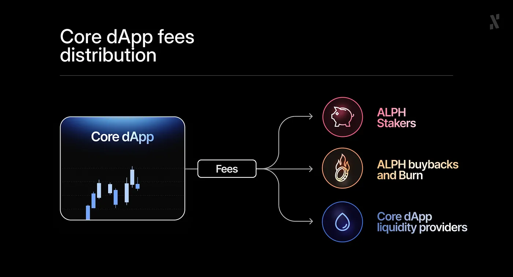
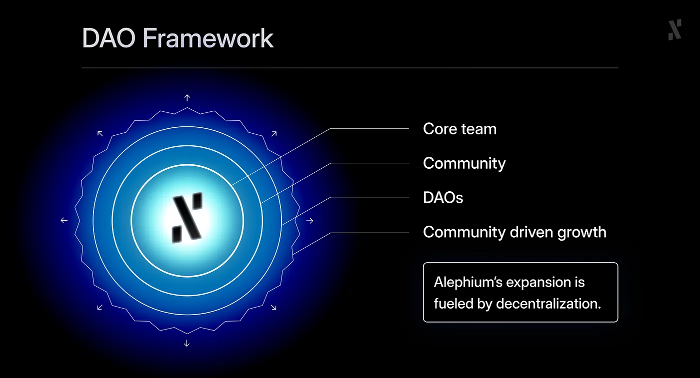
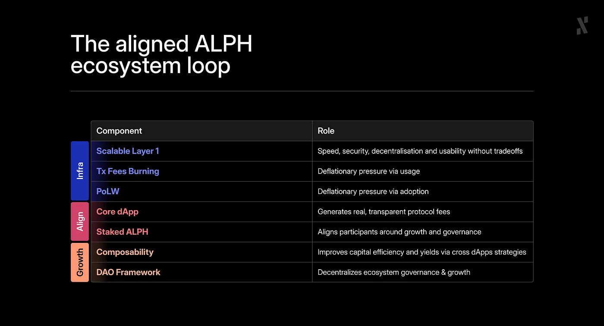
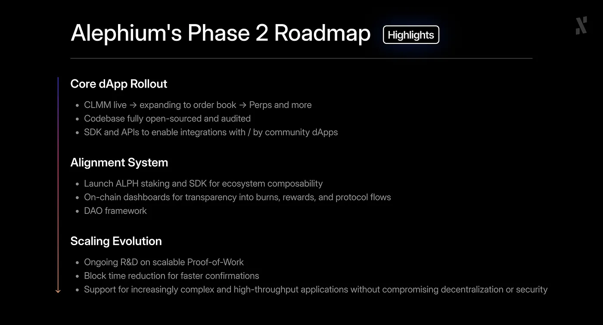

They said Layer 1 blockchains had to compromise: performance for decentralization, usability for security. Alephium chose a different path.

Phase One laid the foundation: a scalable, secure, and easy to use PoW infrastructure, complete with native sharding, the sUTXO model, and many network upgrades, Danube being the latest one. The network is battle-tested, performant, and ready for real-world adoption.

Now, with the infrastructure in place, Alephium enters its next chapter: Phase Two. This is where aligned economics, Core dApps, staking, composability and decentralization begin to connect, creating a self-sustaining ecosystem designed for long-term growth.

In this article, we will explore in detail what Alephium Phase 2 is, how we got here, and where we’re going next.

## Phase One: Scalable, Secure, Easy to Use Infrastructure

The foundation is already live and battle-tested.

While most Layer 1s abandoned PoW for complex, high-overhead PoS systems, Alephium scaled PoW. Efficiently. No tradeoffs.

* Native Sharding: built into the protocol from day one
* The Danube Upgrade: Next-gen performance without zk or Layer 2 complexity.
* The sUTXO Model: security-first smart contracts that stop re-entrancy and approval exploits at the VM level.
* UX as a Protocol Primitive: built-in DevX improvements, fast confirmations, and no fragmentation.

Alephium is already proving that Layer 1s don’t need to choose between decentralization, performance, and usability. It’s scalable, secure, easy to use, and ready for what comes next.

## Phase Two: Activating Aligned Economics

Now that the infrastructure is in place, Alephium is activating its second phase: a composable, fee-generating economic model that aligns protocol participants around real usage and long-term value.

It builds directly on Alephium’s existing core design:

* 100% of the blocks’ transaction fees are burned, directly linking usage to deflation.
* PoLW (Proof-of-Less-Work) will deepen this alignment by tightening supply as network security increases.

This is Alephium’s vision for a next-generation Layer 1:

* Fee-generating rather than inflationary.
* Aligned rather than extractive.
* Composable rather than siloed.

## Strategic Building Blocks

### 1. Core dApp

Alephium’s Core dApp will begin as a CLMM DEX, but as more than a product, as a protocol-owned, open-source benchmark for secure and composable liquidity, at scale.

Key features include:

* Built to evolve: CLMM → Orderbook → Perps → More.
* Open source, audited, institution-ready.
* Composable.
* Protocol-owned, 100% of the swap fees collected by the dApp will be redistributed:
* To the xALPH stakers
* For ALPH buybacks and burns

This isn’t a dApp competing for market share. It’s a native platform designed to drive adoption and growth across the entire Alephium ecosystem.

### 2. Staked ALPH (xALPH)

By staking and locking ALPH tokens into xALPH, participants gain access to:

* Fee sharing from the Core dApp.
* Composability with ecosystem dApps enables access to a wide range of xALPH DeFi strategies to generate additional yield.
* Additional reward sharing and perks (e.g. lower fees, boosted rewards) from the ecosystem composability.
* Governance, through the DAO framework.
* And much more.

### 3. Community Driven Ecosystem Growth

Alephium is also laying the groundwork so multiple community driven initiatives can emerge, each focused on different areas such as marketing, developer support, onboarding new builders or liquidity.

* Ability to leverage the ALPH stakers as voters.
* Funding more community-driven initiatives like the BlockFlow Alliance DAO.
* Focusing on key areas of growth e.g. marketing, developer support, builders onboarding, liquidity, etc.

As more community initiatives emerge, Alephium’s governance and funding become more decentralized, helping the ecosystem grow in a community-driven way.

### 4. Infrastructure Performance Enhancements

Alephium’s R&D continues to push forward:

* Block time reduction.
* UX/DevX enhancements.
* Support for increasingly complex and high-throughput applications.
* All while preserving the decentralization, security, and core principles of PoW.

## The Aligned Ecosystem Loop

This is the stage where everything begins to connect.

What started as separate building blocks: scalable infrastructure, deflationary economics, and ongoing R&D, is now reinforced by the introduction of the missing pieces: protocol-owned Core dApps and staking. With these in place, the system becomes complete.

Each component strengthens the others: infrastructure drives usage, usage fuels protocol fees and deflation, stakers align growth and governance, and DAOs decentralize decision making.

Together, they form the aligned ecosystem loop, a self-sustaining cycle designed for long-term resilience and community-driven growth.

## Roadmap Highlights

Our roadmap is a reflection of our vision, but its execution depends on real adoption and market conditions. For example, upgrading the CLMM DEX to an order book model will only make sense once trading volume and other KPIs reach sustainable levels.

In the same way, as we continue building, details may evolve, so we aim to keep the roadmap flexible, ensuring we prioritize what delivers the most value to the ecosystem while staying true to our long-term goals.

During this journey, we will keep the community updated on our progress, findings, and any adjustments along the way, so that growth remains transparent and collaborative.

Finally, please note that this roadmap is limited to Phase 2 items and does not reflect the full scope of activities.

## Final Thoughts

The first chapter of Alephium proved that Proof-of-Work can scale. We built the infrastructure, tested it in production, and showed that decentralization, performance, and usability can coexist.

Now begins the second chapter. Alephium’s phase 2 adds the missing pieces, and puts everything in motion: protocol-owned liquidity, staking, and the aligned incentives that bring more utility and yield to ALPH. These are the early but essential steps toward an economy that sustains itself over time.

The mechanics are simple but powerful. Usage generates fees. Some are burned, others are distributed to long term participants. Each part aligns and strengthens the ecosystem, creating a cycle that compounds as adoption expands.

We know ecosystems are built step by step, through real usage, real contributions, and real participation. That is how Alephium will grow, not through hype cycles, but through alignment, delivery, and endurance.

Alephium is not just PoW that scales. It is PoW that sustains, resilient by design, aligned by principle, and built to last.
